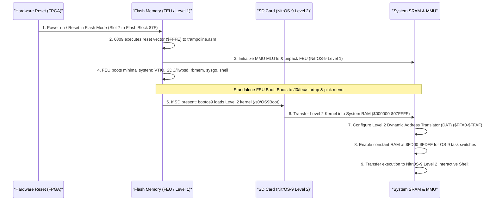
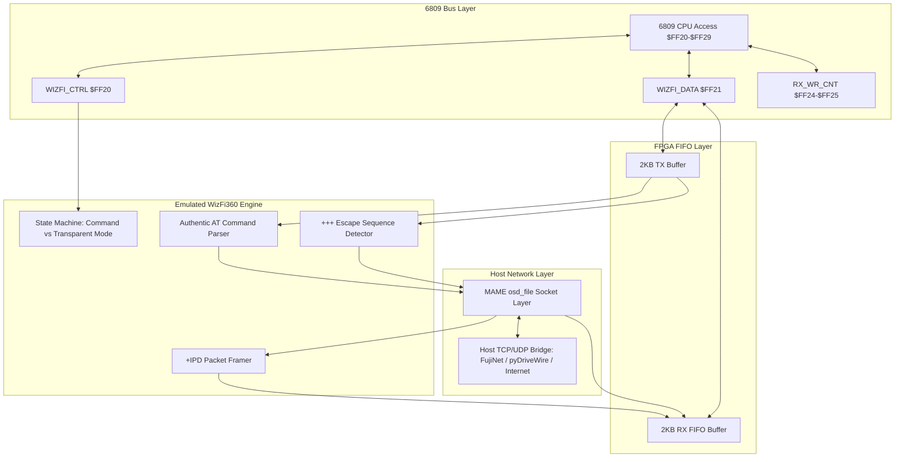
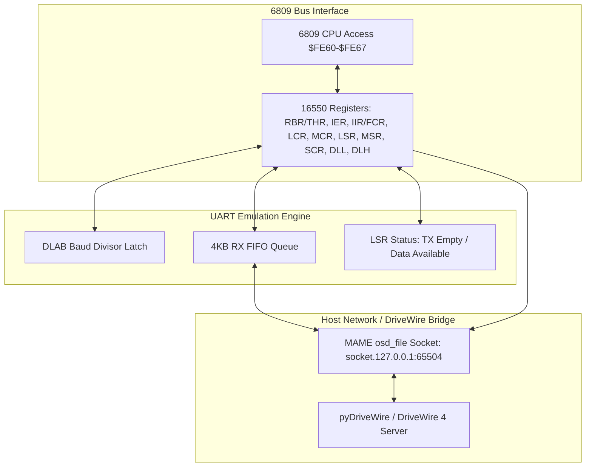
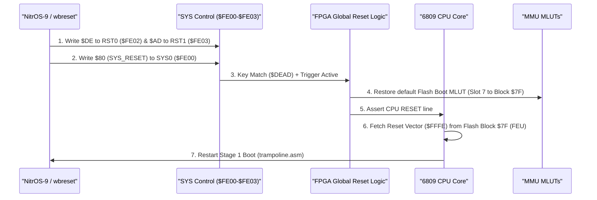

# Wildbits Jr2 (6809 Core) Technical Reference & Architecture Specification

---

## 1. Overview & System Specifications

The **Wildbits Jr2** (formerly known as the **Foenix F256 Jr2** / **JrJr**) is a modern retrocomputing platform powered by an FPGA-centric architecture on a compact Pico-ITX motherboard (100mm × 70mm). When loaded with the **FNX6809** firmware core (authoritative hardware baseline: **`wildbits_jr2_6809_v8_rc12`**, built 2026-09-06 12:33; parity kit built 2026-09-07 23:16), the system pairs a Motorola 6809 CPU core with the **TinyVicky II** graphics engine, a hardware Memory Management Unit (MMU), integrated audio synthesizers, high-speed DMA, an integer math coprocessor, and rich peripheral interfaces.

```
+----------------------------------------------------------------------------------------+
|                                 WILDBITS JR2 (FNX6809)                                 |
+----------------------------------------------------------------------------------------+
|  [6809 CPU @ 6.29 MHz] <---> [MMU (4x MLUTs + DAT)] <---> [512KB SRAM / 512KB Flash]   |
|            |                                                |                          |
|            v                                                v                          |
|  [TinyVicky II Video]                              [System I/O & Bus]                  |
|  - 80x30 / 80x60 Text (8x8 glyphs, DBL_Y/X)        - Dual SPI SD Card Ports (SD0/SD1)  |
|  - 3x 256-Color Bitmaps (320x240 / 320x200)        - WizFi360 2KB Hardware FIFOs       |
|  - 3x Scrolling Tilemaps (8x8 / 16x16)             - 16550 UART Serial Port (BAUDCE)   |
|  - 128x Hardware Sprites (8x8 to 32x32, 8 bpp)     - Dual Cartridge Ports (/c0, /c1)   |
|  - 4x Graphics CLUTs + 2x Text CLUTs               - PS/2 Keyboard & Mouse Ports       |
|  - Hardware Grayscale Mouse Cursor                 - bq4802 Real-Time Clock (RTC)      |
|  - Line Interrupts & Counters (SOL/SOF)            - WDC 65C22 VIA / Joysticks         |
|                                                    - VS1053b MP3 Decoder (12.288 MHz)  |
|                                                    - Onboard 8-Position DIP Switches   |
+----------------------------------------------------------------------------------------+
```

### Key Specifications
* **CPU:** Motorola 6809 soft core (FNX6809, Big Endian) running inside an onboard FPGA (**Xilinx Artix-7 35T**, `xc7a35tcsg324`), clocked at **6.29 MHz** (1/4th of the 25.175 MHz video dot clock oscillator; configured in MAME via `XTAL(25'175'000)` with internal ÷ 4). Optional DIP-switchable turbo stretch mode runs at **~1.4x speed (~8.8–9.0 MHz)** utilizing 24-tick shortened instruction fetch cycles (`TURBO_FASTWRITE`).
* **SRAM Bus Geometry (`FASTWR_LATE2`):** To accommodate the Jr2's external ISSI IS61WV102416FBLL-8BLI (1M × 16, 8ns) high-speed asynchronous SRAM (512 KB mapped into Blocks `$00–$3F`), write enable (`WE_n`) is delayed to ticks 9–11 of the 32-tick write frame (released at tick 12). This grants a full **15 ns address setup time**, eliminating display artifacts ("sparklies") during simultaneous background SD transfers and foreground bitmap compositing under turbo.
* **FPGA Configuration Memory:** 16 MB Micron MT25QL128 Quad-SPI Flash memory (`write_cfgmem -format mcs -size 16 -interface SPIx4`), programmed via [`wildbits_jr2_6809_v8_rc12.mcs`](file:///Users/richardlucente/tmp/parity_wildbits_jr2_v8_rc12/wildbits_jr2_6809_v8_rc12.mcs).
* **System Bus:** 21-bit physical address bus addressing up to 2 MB of physical address space.
* **CPU Address Space:** 16-bit (64 KB) paged into eight 8 KB slots via 4 hardware Look-Up Tables (MLUTs).
* **System RAM:** 512 KB onboard high-speed SRAM (Physical Blocks `$00 - $3F`, physical `0x000000 - 0x07FFFF`).
* **Flash ROM:** 512 KB onboard non-volatile Flash ROM (Physical Blocks `$40 - $7F`, physical `0x080000 - 0x0FFFFF` of the SST39VF chip). Contains the Level 1 First Execution Unit (FEU), `/f0` flash volume, and user flash drive `/f1`.
* **Expansion Cartridge:** Cartridge decode at Physical Blocks `$80 - $9F` (256 KB window) supporting `/c0` (based at `$80`) and `/c1` (based at `$90`), sharing the external bus and shaped write strobe with onboard flash and RTC.
* **Video Controller:** **TinyVicky II** outputting DVI/VGA at 60 Hz (640 × 480 text, 320 × 240 graphics) or 70 Hz (640 × 400 text, 320 × 200 graphics). Features verified timing closure across all triple-clock domains (video, 100 MHz, 200 MHz) with worst negative slack **+0.188 ns** and worst hold slack **+0.029 ns**, zero failing endpoints (`v8_rc12`, incorporating the K2 video-mode resynchronizer hold-path waiver).
* **Graphics Engines:**
  * Character text matrix (80 × 30, 80 × 60, 40 × 30, or 40 × 60) with dual 2 KB font banks pre-initialized with the **OS-9 Bannerfont** and color lookup tables pre-initialized with the **OS-9 Palette** directly in FPGA BRAM (`mif/Text_LUT_OS9_palette.coe` and `mif/Font_OS9_bannerfont.coe`), freeing >2 KB of system memory in bootfiles.
  * 3 full-screen 256-color bitmapped planes (320 × 200 or 320 × 240).
  * 3 hardware scrolling tilemap layers supporting 8 × 8 or 16 × 16 tiles across 8 concurrent tile sets.
  * 128 hardware sprites (8 × 8, 16 × 16, 24 × 24, or 32 × 32) at 8 bpp indexed color through 4 graphics CLUTs, line-buffered and scanned 127 down to 0 per scanline pair (sprite 0 composites on top).
  * 4 graphics Color Look-Up Tables (CLUTs), each with 256 24-bit RGB colors (stored as 32-bit `[Blue, Green, Red, Alpha]` entries).
  * Dedicated text Foreground and Background Color Look-Up Tables (16 colors each).
  * Hardware Gamma correction look-up tables (Red, Green, Blue).
  * Hardware grayscale mouse cursor (16 × 16) with pixel rendering gated on enable bit (`$FEA0` bit 0, `v8_rc11`+) and cursor position preserved across auto-hide (`wb/mouse_hide_unhide`).
* **Audio Subsystem:**
  * Triple **SN76489** Programmable Sound Generators (PSGs) emulated in FPGA (Left at `$0200`, Center/Mono at `$0208`, Right at `$0210` in Block `$C4`; software-configurable stereo/mono via `SYS1`). Driven by a 3,579,545 Hz clock enable.
  * Triple **MOS 6581 / 8580** Sound Interface Devices (SIDs) (Left at `$0000`, Center/Mono at `$0080`, Right at `$0100` in Block `$C4`; 9 synth voices with multi-mode analog filters). Driven by a 1,022,727 Hz clock enable.
  * **WM8776** Audio CODEC and 24-bit DAC at `$FE70-$FE72` for master mixing, equalization, and volume control (InitCODEC selects all 5 analog inputs via R21 = `$1F` / `$2A1F`, routing VS1053 outputs on AIN3..5; calibrated independently for Jr2 vs. K2 via `play`).
  * **VS1053b** Hardware MP3 / Audio Stream Decoder at `$FF50–$FF57`, clocked at **12.288 MHz** (24.576 MHz ÷ 2, within 12–13 MHz boot spec), equipped with a 2,048-byte SDI stream FIFO at `$FF57`, 16 SCI registers at `$FF50–$FF53`, dual-speed SPI (1.57 MHz default, 6.29 MHz fast), fixed register offset decoding (`v8_rc12`), and hardware DREQ flow control.
  * **SAM2695** General MIDI hardware synthesizer interface with **Edition 2 Control Register** at `$FF30-$FF35` featuring Tx/Rx FIFO-empty flags and hardware FIFO reset.
  * Hardware System Buzzer on `SYS0` (`$FE00` bit 4).
* **Storage & Peripheral Interfaces:**
  * Dual SPI SD Card controllers (SD, SDHC, SDXC). Port 0 (`$FE90–$FE91`, external Main SD slot on top of PCB), Port 1 (`$FF00–$FF01`, internal Micro-SD slot on bottom of PCB).
  * High-speed **WizFi360** (WIZnet WiFi) module interface backed by dual 2 KB hardware FIFOs (`$FF20-$FF29`) supporting **WizCon4** (4 independent concurrent packet-mode incoming telnet shells).
  * **16550** compatible UART (RS-232 serial) at `$FE60-$FE67` with 22.1184 MHz BAUDCE exact baud generator (Divisor 5 = 230,400 baud) and hardened DriveWire driver stack (`wb/DriveWireCompatible`).
  * PS/2 Keyboard and Mouse controllers at `$FE50-$FE54` (Jr2 primary keyboard interface).
  * **WDC 65C22** Versatile Interface Adapter (VIA0) at `$FEB0–$FEBF` driving dual Atari-style DE-9 joystick ports and user GPIO.
  * NES / SNES gamepad controller interface at `$FF80-$FF8F` (FNX4N4S interface).
  * **bq4802** Real-Time Clock (RTC) with battery backup at `$FE40-$FE4F`.
  * Commodore IEC serial bus port at `$FE80` (1541/1571/1581 compatible; optional NMI routing).
  * Onboard 8-Position Hardware Configuration DIP Switches at `$FF90` (Turbo stretch mode, Gamma default, Boot mode, and User switches).
  * USB-C debug & flash programming interface (FTDI FT4232H bridge).
* **Hardware Acceleration:**
  * Direct Memory Access (DMA) engine supporting 1D linear fill/copy and 2D rectangular block copy/fill with programmable source/destination strides at `$FEC0-$FED7`.
  * Hardware Integer Math Coprocessor (16 × 16 → 32-bit unsigned multiplication, 32 / 16 → 16-bit unsigned division/remainder, and 32-bit addition) at `$FEE0-$FEFB`.
  * Hardware Floating-Point Unit (FPU) accelerator at `$FFE0–$FFEF`.

---

### 1.2 Hardware Distinctions: Wildbits Jr2 vs. Wildbits K2

While both machines share the core TinyVicky II video engine, the FNX6809 CPU core, and the NitrOS-9 operating system, the physical **Wildbits Jr2** possesses distinct hardware characteristics that differentiate it from the **Wildbits K2**:

| Feature / Subsystem | Wildbits Jr2 (Physical Target) | Wildbits K2 (Companion Machine) |
| :--- | :--- | :--- |
| **Physical Form Factor** | Standalone Pico-ITX Motherboard (100mm × 70mm) | Integrated keyboard computer (wedge case) |
| **Primary Keyboard** | **PS/2 Keyboard** (`$FE50-$FE54`, Group 0 bit 2) | **Optical Keyboard** (`$FE10-$FE16`, Group 3 bit 2) |
| **Hardware Typematic Repeat** | None (software-paced in OS / PS/2 controller) | Hardware typematic engine in FPGA (`$FE14-$FE16`) |
| **Secondary VIA (`VIA1` at `$FFB0`)**| **Unpopulated** (VIA0 only at `$FEB0`) | Unpopulated on K2; present on older F256K mechanical models |
| **Blocks `$80–$9F` Decode** | **External Cartridge Port** (`/c0` @ `$80`, `/c1` @ `$90`) | **Internal Expansion SRAM** (256 KB at `$10_0000–$13_FFFF`) |
| **Network Interfaces** | **WizFi360 Wi-Fi only** (dual 2KB FIFOs at `$FF20-$FF29`) | **Dual:** WizFi360 Wi-Fi **+** WIZnet W6100 10/100 Ethernet |
| **VS1053b Audio Decoder** | **Populated:** Clocked at **12.288 MHz** (`$FF50–$FF57`, 24.576 MHz ÷ 2) | **Populated:** Clocked at **12.288 MHz** (`$FF50–$FF57`, 24.576 MHz ÷ 2) |
| **Case Logo LCD (`$FF70–$FF74`)** | **Unpopulated** (standalone motherboard) | **Populated** (front-panel SPI color Logo LCD) |
| **Hardware DIP Switches (`$FF90`)** | **Onboard 8-position DIP switch bank** | **Rear-chassis 8-position DIP switch bank** |
| **Machine ID Register (`$FE07`)** | **`$1A`** (26 decimal: Jr2 6809 core) | **`$16`** (22 decimal: K2 6809 core) |
| **External Bus Write Strobe** | **Shared single `WE` line** (Flash, Cartridge, RTC); shaped 45ns pulse in turbo | Dedicated / separate write lines; uses raw CPU strobe |
| **Physical Flash Chip** | SST39VF040 (512 KB physical, ID `$BFD7`) / SST39VF1681 window | SST39VF1681 (2 MB physical, 512 KB visible, ID `$BFC9`) |
| **SRAM Address Setup Geometry** | **`FASTWR_LATE2`** (15 ns setup, `WE_n` t9..t11) | Standard fast write (5 ns setup, `WE_n` t7..t9) |
| **Status Indicators** | Discrete Motherboard LEDs (`SYS0`/`SYS1`: Power, SD, L0, L1) | RGB programmable keyboard LEDs (`$FE06`, `$FE08-$FE0F`) |

> [!IMPORTANT]
> **Emulator Scope Enforcement:** The MAME emulator driver `wbjr2` specifically emulates the **Wildbits Jr2**. It must NOT instantiate the optical keyboard scanner, W6100 Ethernet, case Logo LCD, or internal expansion SRAM at `$80–$9F`. It must expose the PS/2 keyboard/mouse interface, the dual cartridge ports (`/c0`, `/c1`), the dual SD card ports (`SDC0` at `$FE90`, `SDC1` at `$FF00`), the VS1053b audio decoder at 12.288 MHz, the onboard physical DIP switches, the shared bus write strobe behavior, and report `$1A` in Machine ID register `$FE07`.

---

### 1.3 Parity Release Package & Firmware File Reconciliation

The official parity release kit for the Wildbits Jr2 (`parity_wildbits_jr2_v8_rc12.zip`, core built 2026-09-06 12:33; parity kit built 2026-09-07 23:16) contains the exact files required to configure the hardware, program non-volatile flash, and boot NitrOS-9 Level 2:

| File Name | Size | Target Hardware Entity | Function / Memory Destination |
| :--- | :--- | :--- | :--- |
| **`wildbits_jr2_6809_v8_rc12.mcs`** | 6,165,628 B | Micron MT25QL128 Quad-SPI Flash (16 MB) | **FPGA Configuration Memory.** Intel MCS-86 formatted bitstream with synchronization word `0xAA995566`. Automatically loaded by the FPGA upon power-on. |
| **`f0` through `f4`** | 8,192 B ea. (40 KB total) | SST39 Parallel Flash (Sectors `$38–$3C`) | **FEU System Image (`/f0`).** Read-only RBF volume holding FEU utilities, `sysgo`, and the interactive startup menu. Corresponds to MMU blocks `$78–$7C`. |
| **`booter_0` through `booter_2`** | 8,192 B ea. (24 KB total) | SST39 Parallel Flash (Sectors `$3D–$3F`) | **Hardware Reset Booter & Trampolines.** Mapped to MMU blocks `$7D–$7F`. Block `$7F` supplies the 6809 hardware reset vector at `$FFFE`. |
| **`bulk.csv`** | 74 B | `fnxmgr.py` / FoenixMgr Utility | **Flash Allocation Map.** Directly maps blocks `f0`–`f4` to flash sectors `$38–$3C`, and `booter_0`–`booter_2` to sectors `$3D–$3F`. Preserves sectors `$00–$37` (`/f1`). |
| **`foenixmgr.ini`** | 84 B | `fnxmgr.py` Utility | Flashing tool parameters: `port=COM4`, `flash_address=3F0000`, `cpu=6809`. |
| **`install.bat`** | 211 B | Windows Batch File | Invokes `python ../fnxmgr.py --port COM4 --flash-bulk bulk.csv`. |
| **`l2_wildbitsjr2.dsk`** | 134,212,608 B (~128 MB) | External SPI SD Card (Port 0) | **NitrOS-9 Level 2 System Disk Image.** Formatted RBF filesystem incorporating all hardened drivers (`dwio_serial`, `wizfi` WizCon4, `rbmem`, `vtio` slot safety, DriveWire stack, VS1053 plugins). |
| **`*.md` Release Reports** | 2.5–10.6 KB | Documentation | Comprehensive engineering reports covering VS1053b bridge rework and clocking, video constraints closure, fast writes, flash hardening, DriveWire hardening, WizCon4, and MMU slot safety. |

#### Disk Image Reconciliation (rc11 vs. rc12 Parity Baseline):
Inspection of `l2_wildbitsjr2.dsk` reveals deliberate maintenance and modernization updates in `v8_rc12`:
* **Added Subsystems & Assets:**
  * `/SYS/VSPLUGINS`: Dedicated binary DSP plugins (`switcher.plg`, `rtmidistart.plg`, `rtmidistop.plg`, `vs1053b_patches.plg`).
  * `/SOUNDS`: 15 sample digital audio tracks for testing MP3, OGG, WAV, AAC, and format 0 MIDI playback.
* **Pruned K2 Hardware Utilities (Enforcing Platform Isolation):**
  * K2-only Ethernet and display utilities were explicitly removed from the Jr2 distribution disk: `CMDS/lcdload`, `CMDS/w6100eth`, `CMDS/w6100recv`, and `SYS/w6100ipconfig`.
  * Extraneous standalone packages pruned: `CMDS/infocom`, `GAMES/INFOCOM/zork1.z3`, and `chk1`.
* **Updated Modules & Executables:**
  * `CMDS/vs`: 5,552 B → 9,096 B (upgraded from Edition 7 to **Edition 12**, embedding the software switcher patch table, DSP loader, and file-type clock table).
  * `CMDS/scfg`: 5,405 B → 5,419 B (incorporating the 2026-09-07 `SS.ScTyp` sign-on banner fix).
  * `OS9Boot`: 30,208 B → 30,720 B (incorporating hardened `dwio` `$37A`, `rbdw` `$252`, and `krn` with `wb/flink_fix` 3-page allowance).

---

## 2. Memory Architecture & MMU

### 2.1 Physical Address Space (21-bit / 2 MB)

The 21-bit physical address bus maps the following resources:

| Physical Address Range | Size | Physical 8KB Blocks | Region Type | Description |
| :--- | :--- | :--- | :--- | :--- |
| `0x000000 - 0x07FFFF` | 512 KB | Blocks `$00 - $3F` | **System SRAM** | System & process memory, video framebuffers (VKY fetches from same RAM). |
| `0x080000 - 0x0EFFFF` | 448 KB | Blocks `$40 - $77` | **Flash (`/f1`)** | User flash drive (`rbmem`, R/W with DQ6 toggle erase/program polling). |
| `0x0F0000 - 0x0F9FFF` | 40 KB  | Blocks `$78 - $7C` | **Flash (`/f0`)** | FEU read-only RBF system volume (blocks `$38–$3C` in flash chip). |
| `0x0FA000 - 0x0FFFFF` | 24 KB  | Blocks `$7D - $7F` | **Flash (Booter)** | Power-on booter (`booter_0..2`); Block `$7F` holds reset vector at `$FFFE`. |
| `0x100000 - 0x13FFFF` | 256 KB | Blocks `$80 - $9F` | **Cartridge Port** | Dual external Flash cartridge slots: `/c0` (base Block `$80`) and `/c1` (base Block `$90`). Shares external bus with flash and RTC. |
| `0x140000 - 0x17FFFF` | 256 KB | Blocks `$A0 - $BF` | *No decode* | Unmapped entry patterns with no bus behind them. |
| `0x180000 - 0x189FFF` | 40 KB  | Blocks `$C0 - $C4` | **Sectored I/O Pages** | Relocatable VICKY internal device and register pages. |
| `0x18A000 - 0x1FFFFF` | 472 KB | Blocks `$C5 - $FF` | *No decode* | Unmapped space. |

> [!NOTE]
> **Flash Visibility Constraint:** Although the physical SST39VF flash chip is 2 MB, only **512 KB** is visible to the 6809 MMU: the FPGA drives 19 address bits (6 block bits + 13 offset bits), and lines A19/A20 do not leave the FPGA.
> **Cartridge Port Hardware Architecture:** On the Wildbits Jr2, Blocks `$80–$9F` route directly to the external cartridge connector, enabling hot-pluggable SST39-compatible flash cartridges (`/c0` and `/c1`). On the companion K2, this same physical decode routes instead to 256 KB of internal expansion SRAM.

#### Dedicated Sectored I/O Blocks (`$C0–$C4`):
* **Block `$C0` (`0x180000`):** `GAMMA_BLK` / `TEXT_LUT_BLK` / `BITMAP_BLK` / `SPRITE_BLK` — Relocatable TinyVicky register block:
  * `$0000 - $00FF`: Gamma Blue lookup table (256 bytes).
  * `$0400 - $04FF`: Gamma Green lookup table (256 bytes).
  * `$0800 - $08FF`: Gamma Red lookup table (256 bytes).
  * `$0C00 - $0CFF`: Hardware mouse cursor sprite bitmap (16 × 16, 256 bytes; `0` = transparent, `1` = black interior, `255` = white border).
  * `$1000 - $1013`: Bitmap plane control registers & 24-bit physical start addresses (`BM0`, `BM1`, `BM2`).
  * `$1100 - $119F`: Tilemap plane registers (`TL0`, `TL1`, `TL2`) and 8 tile set base address registers (`$1180–$119F`).
  * `$1300 - $16FF`: **128 Hardware Sprite Attribute Records** (8 bytes each, Big-Endian).
  * `$1700 - $177F`: Text Mode Palettes (Foreground CLUT at `$1700`, Background CLUT at `$1740`).
* **Block `$C1` (`0x182000`):** `FONT_BLK` & `GRAPH_LUT_BLK`:
  * `$0000 - $0FFF`: Dual 2 KB font banks (Font Set 0 at `$0000-$07FF`, Font Set 1 at `$0800-$0FFF`).
  * `$1000 - $1FFF`: **4 Graphics CLUTs** (LUT0–3, 256 colors × 4 bytes `[Blue, Green, Red, Alpha]`).
* **Block `$C2` (`0x184000`):** Text Matrix character memory (80 columns × 60 rows = 4,800 bytes).
* **Block `$C3` (`0x186000`):** Text Matrix color attribute memory (80 columns × 60 rows = 4,800 bytes; High nibble = Foreground palette 0..15, Low nibble = Background palette 0..15).
* **Block `$C4` (`0x188000`):** Audio Synthesizer internal registers:
  * `$0000 - $001F`: `SIDL` (MOS 6581/8580 Left Channel, 29 registers).
  * `$0080 - $009F`: `SIDM` (MOS 6581/8580 Center / Mono Channel).
  * `$0100 - $011F`: `SIDR` (MOS 6581/8580 Right Channel).
  * `$0200 - $0207`: `PSGL` (SN76489 Left Channel, 4 voices).
  * `$0208 - $020F`: `PSGM` (SN76489 Center / Mono Channel).
  * `$0210 - $0217`: `PSGR` (SN76489 Right Channel).

---

### 2.2 CPU Logical Address Map & Fixed Overrides (64 KB)

The 6809 logical space is divided into eight 8 KB slots. An inhibit decode term (`RAM_Access_Inhibit`) in the FPGA overrides MMU translation for fixed I/O and switchable constant RAM:

| Logical Address | Class | Size | Function / Description |
| :--- | :--- | :--- | :--- |
| **`$0000 - $FCFF`** | MMU Translated | 63.25 KB | Translated via active MLUT (`Slots 0–6` and lower 7 KB of `Slot 7`). |
| **`$FD00 - $FDFF`** | Constant RAM | 256 B | **Dedicated internal RAM page.** Enabled when `$FFA1[0] = 1`. Supersedes MMU translation across all tasks and LUTs. Holds kernel always-mapped routines. When `$FFA1[0] = 0` (reset state), passes through to MMU. |
| **`$FE00 - $FEFF`** | Fixed I/O | 256 B | **Always mapped fixed I/O.** Bypasses MMU translation in all tasks (system control, interrupt controller, timers, RTC, PS/2, UART, VIA0, DMA). |
| **`$FF00 - $FF9F`** | Fixed I/O | 160 B | **Always mapped fixed I/O.** SDC1 (`$FF00`), Flash DMA (`$FF10`), WizFi360 FIFOs (`$FF20-$FF29`), SAM2695 MIDI (`$FF30-$FF35`), VS1053b Audio Decoder (`$FF50-$FF5F`), HDMI I2C (`$FF60-$FF6F`), NES/SNES Gamepads (`$FF80-$FF8F`), DIP Switches (`$FF90`). |
| **`$FFA0 - $FFAF`** | MMU Registers | 16 B | MMU control (`$FFA0`), I/O control (`$FFA1`), and Slot mapping registers (`$FFA8–$FFAF`). |
| **`$FFB0 - $FFEF`** | Fixed I/O | 64 B | **Always mapped fixed I/O.** TinyVicky master video control (`$FFC0–$FFDF`) and Floating-Point Unit (`$FFE0–$FFEF`). (VIA1 at `$FFB0` is unpopulated on Jr2). |
| **`$FFF0 - $FFFF`** | Constant RAM / Vectors | 16 B | **Dedicated internal vector RAM.** Enabled when `$FFA1[1] = 1`. Supersedes MMU translation to provide fast, task-independent 6809 interrupt vectors (`SWI3`..`RESET`). When `$FFA1[1] = 0` (reset state), vectors fetch from MMU space (Flash Block `$7F`). |

#### Properties of Constant RAM Pages (`$FD00` and `$FFF0`):
1. **Universal Visibility:** When enabled via `$FFA1`, they sit at identical logical addresses in every task and every MLUT without moving or hiding during task switches.
2. **Warm Retention:** Reset clears the enable bits in `$FFA1` (falling back to Flash/MMU space), but their RAM contents are preserved across resets until power-off.
3. **Read/Write Override:** When enabled, all CPU reads and writes access the internal constant RAM; memory behind the window is completely masked.

---

### 2.3 6809 MMU Control Registers & Slot-Entry Encoding

The MMU registers are mapped at `$FFA0 - $FFAF`:

```
$FFA0: MMU_MEM_CTRL (R/W)
       Bits 7..6: Unused
       Bits 5..4: EDIT_LUT - Selects which MLUT (0..3) is read/written at $FFA8-$FFAF
       Bits 3..2: Unused
       Bits 1..0: ACT_LUT  - Selects which MLUT (0..3) is active for CPU translation

$FFA1: MMU_IO_CTRL (R/W)
       Bit 0: Enable internal constant RAM at $FD00-$FDFF (NitrOS-9 Level 2 kernel routines)
       Bit 1: Enable internal vector RAM at $FFF0-$FFFF (Overrides ROM/Flash vectors)

$FFA8 - $FFAF: MMU Slot Mapping Registers (accesses EDIT_LUT selected by $FFA0[5:4])
       $FFA8: Slot 0 Mapping ($0000 - $1FFF)
       $FFA9: Slot 1 Mapping ($2000 - $3FFF)
       $FFAA: Slot 2 Mapping ($4000 - $5FFF) -- Communal Work Window
       $FFAB: Slot 3 Mapping ($6000 - $7FFF)
       $FFAC: Slot 4 Mapping ($8000 - $9FFF)
       $FFAD: Slot 5 Mapping ($A000 - $BFFF)
       $FFAE: Slot 6 Mapping ($C000 - $DFFF)
       $FFAF: Slot 7 Mapping ($E000 - $FFFF)
```

#### Slot-Entry Target Encoding (Written to `$FFA8–$FFAF`):

| Entry High Bits | Target Region | Block Range | Physical Target |
| :--- | :--- | :--- | :--- |
| `00xx xxxx` | **System RAM** | `$00–$3F` | 512 KB onboard SRAM |
| `01xx xxxx` | **Flash Window** | `$40–$7F` | 512 KB Flash ROM window (`/f1`, `/f0`, booter) |
| `100x xxxx` | **Expansion / Cartridge** | `$80–$9F` | 256 KB Cartridge (`/c0` at `$80`, `/c1` at `$90`) |
| `1100 0xxx` | **Sectored I/O Pages** | `$C0–$C4` | TinyVicky registers, CLUTs, VRAM, and sound |

> [!IMPORTANT]
> **The Slot-2 Communal Work Window (`$4000–$5FFF`) & Driver Safety Architecture:**
> In NitrOS-9 Level 2 on Wildbits, `Slot 2` (`$4000–$5FFF`) is designated as the shared temporary mapping window for drivers:
> * `vtio`: Maps text matrix (`$C2`), attributes (`$C3`), gamma/bitmap (`$C0`), font (`$C1`), sound (`$C4`).
> * `mousedrv`: Maps sprite attribute page (`$C0`) to update pointer records.
> * `rbmem`: Maps physical Flash ROM (`/f0`, `/f1`) and RAM-disk sectors.
>
> **The Historical "One Character, Then Freeze" Fork Crash (`wildbits-mmu-slot-safety.md`):**
> * *Root Cause:* The Level 2 kernel's `F$SRqMem` allocates system pages from the top of memory downward (`$70` down). After ~17 pages of allocations (e.g. running 4 network listener daemons), system descriptors and stacks crossed into `$40–$5F` (Slot 2). When a driver borrowed Slot 2 by mapping a video or flash block, any stack operation (`pshs`, `puls`, `bsr`, or interrupt) accessed the mapped video/flash memory instead of the actual stack, corrupting the return frame and wandering on the very next instruction.
> * *The Two-Layer Hardened Fix (`wb/proper_slot_preservation`):*
>   1. **`vtio.asm` Driver State Isolation:** No window operation saves the previous slot value on the stack. The saved mapping is parked in a dedicated statics variable (`V.MapSav` in `defs/wildbits_vtio.d`), and temporaries use interrupt-masked direct-page scratch (`D.IRQTmp`).
>   2. **`krn.asm` System Slot Reservation:** At cold start, immediately after marking its global memory used, `krn` explicitly marks pages `$40–$5F` (Slot 2) as allocated in `D.SysMem` (`9E 4E 30 88 40 C6 20 6C 80 5A 26 FB`). This completely reserves Slot 2 from the system allocation pool, guaranteeing that process descriptors and system stacks can never reside in Slot 2.
> * *Rules for Wildbits Driver Authors:*
>   - Always borrow Slot 2; never map scratch windows into Slots 0, 1, or 3–7.
>   - Never save slot registers onto the stack across mapping changes; use driver statics or masked DP scratch.
>   - Keep mapped windows strictly short and interrupt-masked (`orcc #IntMasks`).

---

### 2.4 MMU Slot 2 Driver Window Architecture & Kernel Isolation

In the Wildbits NitrOS-9 implementation, **Slot 2 (`$4000–$5FFF`)** is the designated communal driver work window:

| Driver | Window Equate | Block Mapped In | Purpose |
| :--- | :--- | :--- | :--- |
| **`vtio`** | `MAPSLOT equ MMU_SLOT_2` | `$C0–$C4` | Text character matrix (`$C2`), color attributes (`$C3`), text palettes (`$C0`), font RAM (`$C1`), sound (`$C4`). |
| **`mousedrv`** | `MAPSLOT equ MMU_SLOT_2` | `$C0` | Updates hardware mouse cursor sprite at `$4C00`. |
| **`rbmem`** | `MMU_SLOT equ 2` | `$40–$7F` | Reads and programs 256-byte flash sectors through `$4000`. |

#### The "One Character, Then Freeze" Hazard & Resolution (`wildbits-mmu-slot-safety.md`):
1. **The Defect:** In NitrOS-9 Level 2, `F$SRqMem` dynamically allocates system memory downward from `$7000`. Under sustained multi-channel load (e.g. four WizFi telnet sockets running `tsmon`), allocations entered pages `$40–$5F` (Slot 2), placing process descriptors and system stacks directly inside `$4000–$5FFF`. When `vtio` or `rbmem` subsequently mapped a VKY page or flash sector into Slot 2, stack pushes were swallowed by the flash chip or overwritten with attribute data. Popping return addresses pulled corrupted data, causing the CPU to wander after printing exactly one character.
2. **The Architectural Fix (Two Layers):**
   * **`krn.asm` Reservation:** At cold start, `krn` actively marks pages `$40–$5F` as permanently allocated. The kernel never allocates system heap or process stacks in Slot 2 again, sacrificing 8 KB of system RAM to ensure memory safety by construction.
   * **`vtio.asm` Stack Independence:** Driver mapping routines park saved slot values in static storage (`V.MapSav` in `defs/wildbits_vtio.d`) rather than pushing them onto the stack, preventing stack corruption even if invoked across unexpected memory states.

---

### 2.5 Boot Trampoline & Kernel Staging Architecture

When changing MMU mappings during boot or reboot, code cannot execute from a slot whose mapping is being pulled out from underneath it. The platform uses a dedicated two-stage hand-off:

1. **The Trampoline at `$0600` (`RELOC_ADDR`):**
   * Block `$00` contains system globals and is mapped into `Slot 0` (`$0000–$1FFF`) in every task.
   * `bootos9` (and the FEU's `os9boot`) copies a small relocatable stub to `$0600` in Block 0 and jumps to it.
   * Running safely from `$0600`, the stub resets MMU slots 0–7 to identity (Blocks `$00–$07`) and jumps to the kernel entry point (`Bt.Start = $EE00`).
2. **Kernel Staging Blocks `(8-n)..7`:**
   * An n-block bootfile (`OS9Boot`, currently n = 4, Blocks `$04–$07`) is staged in the upper RAM blocks below Block 8.
   * The kernel (`krn`) is anchored as the final module exactly 4,096 bytes before the end of the bootfile, landing cleanly at `$EE00` in Slot 7.
3. **Ghost-Test Memory Sizing:**
   * At startup, `krn` does not use a hardcoded table; it writes a marker across successively doubled block numbers (8, 16, 32, 64...) until the write aliases back to Block 0, dynamically discovering the 64 blocks (512 KB) recorded in `D.MemSz`.

---

### 2.6 Kernel `F$Link` Module Placement & Fixed I/O Clearance (`wb/flink_fix`)

* **The Tail-Hiding Hazard:** On the Wildbits 6809 core, the upper 768 bytes of the CPU address space (`$FD00–$FFFF`) are reserved for hardware fixed I/O decodes and switchable constant/vector RAM (`$FDxx` constant RAM, `$FExx` I/O, `$FFxx` I/O and vectors).
* **The CoCo 3 vs. Wildbits Incompatibility:** In standard NitrOS-9 Level 2 on the Tandy Color Computer 3, the kernel's `F$Link` service routine (`FLink` in `level1/modules/kernel/flink.asm`) permitted programs to map into Slot 7 as long as they left a two-page margin (`$FE00–$FFFF`, 512 bytes). On Wildbits, fixed overrides span **three 256-byte pages** (`$FD00–$FFFF`, 768 bytes). If an executable program or shared library module had a size of `$1D00` bytes or greater (out of an 8 KB slot size of `$2000`), mapping it into Slot 7 caused the program's tail (from offset `$1D00` to `$1FFF`) to be shadowed and hidden by the `$FD00–$FFFF` fixed decodes. Executing or reading instructions in the module's tail fetched constant RAM or hardware I/O registers instead of executable code, crashing the application.
* **Empirical Evidence & The Architectural Resolution (`wb/flink_fix`):**
  * *Field Failure Benchmark:* A 7,470-byte (`$1D2E` B) test build of `vs` hung both Jr2 and K2 machines at launch because its tail landed in `$FD00–$FD2E`; a 7,212-byte (`$1C2C` B) build ran cleanly.
  * *Algorithmic Implementation:* Rather than the slow CoCo 3 shift chain, `flink.asm` utilizes 6809 hardware multiplication:
    ```asm
    ldb   #8        ; hi * 8: block count lands in A
    mul             ; A = hi >> 5 (blocks), B = (hi & $1F) << 3
    cmpb  #$E8      ; low 5 bits >= 29 ($1D00 bytes)?
    tfr   a,b       ; B = block count (run length)
    bcs   FLinkWbNoBump ; below 29: slot 7 may hold it
    inca            ; >= 29: start search one slot lower (Slot 6)
    FLinkWbNoBump
    ```
  * *Result:* Modules requiring `$1D00` or more in their final block are actively prohibited from mapping into Slot 7. With `vs` expanding to **9,096 bytes** in `v8_rc12`, this fix ensures stable process execution across all application sizes.

---

## 3. Memory-Mapped I/O Register Map (`$FE00 - $FFFF`)

The following register map details every active hardware device decoded in the fixed I/O pages (`$FE00–$FFFF`) on the **Wildbits Jr2**:

| Address Range | Device / Subsystem | Functionality |
| :--- | :--- | :--- |
| **`$FE00`** | `SYS0` (R/W) | **System Control 0:**<br>• Write: `[7:RESET, 5:CAP_EN, 4:BUZZ, 3:L1, 2:L0, 1:SD_L, 0:PWR_L]`<br>• Read: `[7:SD_WP, 6:SD_CD, 4:BUZZ, 3:L1, 2:L0, 1:SD_L, 0:PWR_L]` |
| **`$FE01`** | `SYS1` (R/W) | **System Control 1:**<br>`[7..6:L1_RATE, 5..4:L0_RATE, 3:SID_ST, 2:PSG_ST, 1:L1_MN, 0:L0_MN]` |
| **`$FE02`** | `RST0` (R/W) | Write `$DE` to arm software reset |
| **`$FE03`** | `RST1` (R/W) | Write `$AD` to arm software reset |
| **`$FE07`** | `MID` (R) | **Machine ID:** Bits 5..0 = `0x1A` (Wildbits Jr2 6809 core; `$16` on K2, `$02` on Jr v1) |
| **`$FE08 - $FE09`** | `PCBID0..1` (R) | ASCII PCB ID ("B0") |
| **`$FE0A - $FE0F`** | `CHIP_VER` (R) | TinyVicky BCD version and chip numbers |
| **`$FE20 - $FE2F`** | `INTC` (R/W) | **Interrupt Controller (4 Groups × 4 Registers):**<br>• `$FE20-$FE23`: `PENDING_0..3` (R: active, W: clear W1C)<br>• `$FE24-$FE27`: `POLARITY_0..3`<br>• `$FE28-$FE2B`: `EDGE_0..3`<br>• `$FE2C-$FE2F`: `MASK_0..3` (1 = masked, 0 = enabled) |
| **`$FE30 - $FE37`** | `TIMER0` (R/W) | **24-bit Timer 0 (25.175 MHz Dot Clock):**<br>• `$FE30`: `T0_CTR` (W: `[3:UP, 2:LD, 1:CLR, 0:EN]`) / `T0_STAT` (R: `[0:EQ]`)<br>• `$FE31-$FE33`: `T0_VAL` (24-bit value low/mid/high)<br>• `$FE34`: `T0_CMP_CTR` (`[1:RELD, 0:RECLR]`)<br>• `$FE35-$FE37`: `T0_CMP` (24-bit target compare value; match raises Group 0, bit 4) |
| **`$FE38 - $FE3F`** | `TIMER1` (R/W) | **24-bit Timer 1 (Frame/VBLANK Clock):**<br>• `$FE38`: `T1_CTR` / `T1_STAT`<br>• `$FE39-$FE3B`: `T1_VAL` (24-bit)<br>• `$FE3C`: `T1_CMP_CTR`<br>• `$FE3D-$FE3F`: `T1_CMP` (24-bit; match raises Group 0, bit 5) |
| **`$FE40 - $FE4F`** | `RTC` (R/W) | **bq4802 Real-Time Clock:**<br>Seconds, Minutes, Hours, Day, DOW, Month, Year, Century, Alarms, Rates, Enables, Flags, Control (`UTI`, `STOP`, `12/24`, `DSE`). Shared external bus (raw strobe). |
| **`$FE50 - $FE54`** | `PS/2` (R/W) | **PS/2 Keyboard & Mouse Controller (Jr2 Primary Keyboard):**<br>• `$FE50`: `PS2_CTRL` (`[5:MCLR, 4:KCLR, 3:M_WR, 1:K_WR]`)<br>• `$FE51`: `PS2_OUT`<br>• `$FE52`: `KBD_IN` (FIFO data)<br>• `$FE53`: `MS_IN` (FIFO data)<br>• `$FE54`: `PS2_STAT` (`[7:K_AK, 6:K_NK, 5:M_AK, 4:M_NK, 1:MEMP, 0:KEMP]`) |
| **`$FE60 - $FE67`** | `UART` (R/W) | **16550 UART (BAUDCE 22.1184 MHz Clocking):**<br>`RXD`/`TXR`, `IER`, `ISR`/`FCR`, `LCR`, `MCR`, `LSR`, `MSR`, `SPR`, `DLL`, `DLH` (Divisor 5 = 230,400 baud) |
| **`$FE70 - $FE72`** | `CODEC` (R/W) | **WM8776 Audio CODEC:**<br>• `$FE70`: `CmdLo`<br>• `$FE71`: `CmdHi` (Register 7-bit + Data bit 8)<br>• `$FE72`: Status (R: `BUSY`) / Control (W: `START`). `vtio` sets R21 = `$1F` (`$2A1F`) enabling AIN3..5 inputs for VS1053. |
| **`$FE80 - $FE8F`** | `IEC` (R/W) | **Commodore IEC Serial Bus:**<br>DATA, CLK, ATN, SREQ line control and sense (drives Group 2 IRQ / optional NMI) |
| **`$FE90 - $FE91`** | `SDC0` (R/W) | **External SPI SD Card Port 0 (Main SD Slot, Top of PCB):**<br>• `$FE90`: Status/Control (`[7:SPI_BUSY, 1:SPI_CLK, 0:CS_EN]`)<br>• `$FE91`: `SPI_DATA` (Used by `llwbsd` for `/s0` and `/s1`) |
| **`$FEA0 - $FEA8`** | `MOUSE` (R/W) | **Hardware Mouse Cursor:**<br>• `$FEA0`: `MS_MEN` (`[1:MODE (0:host, 1:hardware PS/2), 0:ENABLE]` - pixel rendering gated on bit 0)<br>• `$FEA2-$FEA3`: `MS_X` (16-bit X position)<br>• `$FEA4-$FEA5`: `MS_Y` (16-bit Y position)<br>• `$FEA6-$FEA8`: `PS2_BYTE_0..2` |
| **`$FEB0 - $FEBF`** | `VIA0` (R/W) | **WDC 65C22 VIA 0:**<br>`IORB` (Joystick Port 0), `IORA` (Joystick Port 1), `DDRB`, `DDRA`, `T1CL/H`, `T1LL/H`, `T2CL/H`, `SR`, `ACR`, `PCR`, `IFR`, `IER`, `IORA2` |
| **`$FEC0 - $FED7`** | `DMA` (R/W) | **TinyVicky DMA Controller:**<br>• `$FEC0`: `DMA_CTRL` (`[7:START, 3:INT_EN, 2:FILL, 1:2D, 0:ENABLE]`)<br>• `$FEC1`: `DMA_STATUS` (R: `BUSY`) / `DMA_DATA_2_WRITE` (W: Fill byte)<br>• `$FEC4-$FEC6`: 24-bit Source Address (`SA_H`, `SA_M`, `SA_L`)<br>• `$FEC8-$FECA`: 24-bit Dest Address (`DA_H`, `DA_M`, `DA_L`)<br>• `$FECD-$FECF`: 24-bit 1D Size (`DZ_L`, `DZ_M`, `DZ_H`)<br>• `$FED0-$FED3`: 2D Size (`WIDTH_H/L`, `HEIGHT_H/L`)<br>• `$FED4-$FED7`: 2D Strides (`SRC_STRIDE_H/L`, `DST_STRIDE_H/L`) |
| **`$FEE0 - $FEFB`** | `MATH` (R/W) | **Hardware Integer Math Coprocessor:**<br>• `$FEE0-$FEE3`: `MULU_A_H/L`, `MULU_B_H/L` → `$FEF0-$FEF3`: `MULU_HH/HL/LH/LL` (16 × 16 → 32-bit)<br>• `$FEE4-$FEE7`: `DIVU_DEN_H/L`, `DIVU_NUM_H/L` → `$FEF4-$FEF5`: `QUOU_H/L`, `$FEF6-$FEF7`: `REMU_H/L` (32 / 16 → 16-bit)<br>• `$FEE8-$FEEF`: `ADD_A_HH..LL`, `ADD_B_HH..LL` → `$FEF8-$FEFB`: `ADD_R_HH..LL` (32-bit Add) |
| **`$FF00 - $FF01`** | `SDC1` (R/W) | **Internal SPI SD Card Port 1 (Micro-SD Slot, Bottom of PCB):**<br>• `$FF00`: Status/Control (`[7:SPI_BUSY, 1:SPI_CLK, 0:CS_EN]`)<br>• `$FF01`: `SPI_DATA` (shifts byte in/out) |
| **`$FF10 - $FF18`** | `FL_DMA` (R/W) | **Splash / SPI Flash DMA Controller:**<br>• `$FF10`: Control (R: `[7:BUSY, 6:FIFO_EMPTY]`)<br>• `$FF11`: Flash Command Byte<br>• `$FF12-$FF13`: Receive FIFO Byte Count (12-bit)<br>• `$FF14-$FF16`: Flash 24-bit Source Address<br>• `$FF17`: Transfer Size / Control<br>• `$FF18`: FIFO Data Port (pops byte) |
| **`$FF20 - $FF29`** | `WIZFI` (R/W) | **WizFi360 Hardware FIFO Bridge:**<br>• `$FF20`: `CtrlReg` (`[3:TxEmpty, 2:RxEmpty, 1:Reset, 0:Rate]`)<br>• `$FF21`: `DataReg` (TX push / RX pop)<br>• `$FF22-$FF23`: `RxD_RD_Cnt` (16-bit)<br>• `$FF24-$FF25`: `RxD_WR_Cnt` (16-bit Available RX Bytes)<br>• `$FF26-$FF27`: `TxD_RD_Cnt` (16-bit)<br>• `$FF28-$FF29`: `TxD_WR_Cnt` (16-bit) |
| **`$FF30 - $FF35`** | `SAM2695` (R/W)| **SAM2695 MIDI Synth Interface (Edition 2):**<br>• `$FF30` Read: `[3:Tx_empty, 2:Rx_empty]`; Write: `[1:FIFO_Reset]` (write 1, then write 0 to release)<br>• `$FF31`: FIFO Data Port<br>• `$FF32-$FF33`: `RXD_COUNT_LOW/HI` (16-bit available RX byte count)<br>• `$FF34-$FF35`: `TXD_COUNT_LOW/HI` (16-bit TX byte count) |
| **`$FF50 - $FF57`** | `VS1053` (R/W) | **VS1053b Hardware MP3 / Audio Stream Decoder (Clocked at 12.288 MHz; Fixed Offset Decode in `v8_rc12`):**<br>• `$FF50`: `VS_CTRL` (`[7:BUSY (R), 3:RESET (W: drives XRESET low, flushes FIFO), 2:FAST_SPI (W: 1=6.29 MHz, 0=1.57 MHz), 1:READ (W: 1=read, 0=write), 0:START (W: 0→1 edge)]`)<br>• `$FF51`: `VS_SCI_SEL` (SCI Register Select 0..F: MODE, STATUS, BASS, CLOCKF, DECODE_TIME, AUDATA, etc.)<br>• `$FF52-$FF53`: `VS_SCI_DATA_H/L` (16-bit register value write/read, big-endian)<br>• `$FF54`: `VS_SDI_STAT` (R: `[7:EMPTY, 6:FULL, 2..0:COUNT_10..8]`; reading `$FF54` snapshots the 11-bit count for `$FF55`)<br>• `$FF55`: `VS_SDI_COUNT` (R: Count bits 7..0)<br>• `$FF56`: Reserved (`$00`)<br>• `$FF57`: `VS_SDI_DATA` (W: pushes byte to 2,048-byte hardware stream FIFO)<br>• `$FF58-$FF5F`: Read mirror of `$FF50-$FF57` (hardware DREQ flow control) |
| **`$FF60 - $FF6F`** | `I2C` (R/W) | **I2C Master Controller:** Drives SiI9022 HDMI transmitter setup at reset and user I2C devices |
| **`$FF80 - $FF8F`** | `GAMEPAD` (R/W)| **NES / SNES Gamepad Controller (FNX4N4S Serial Interface):**<br>• `$FF80`: Control (`[7:START_FETCH, 2:PAD_TYPE (0:SNES, 1:NES), 0:ENABLE]`)<br>• `$FF81-$FF8F`: Latched 16-bit button state registers for connected pads |
| **`$FF90`** | `DIP_SW` (R) | **Onboard 8-Position Hardware DIP Switches:**<br>• Bit 7: `SW_GAMMA_ON` (Hardware Gamma correction default enable)<br>• Bits 6..4: `SW_USER2..0` (General user-configurable switches)<br>• Bits 3..0: `SW_BOOT_MODE3..0` (Hardware boot source selection; **Bit 0 `SW_BOOT_MODE0`** enables Turbo stretch mode ~1.4x on v8 cores) |
| **`$FFA0 - $FFAF`** | `MMU` (R/W) | MMU Memory Control, I/O Control, Slot 0..7 Mapping |
| **`$FFC0 - $FFDF`** | `VICKY` (R/W) | **TinyVicky II Video Registers:**<br>• `$FFC0`: `MASTER_CTRL_0` (`[6:GAMMA, 5:SPRITE, 4:TILE, 3:BITMAP, 2:GRAPH, 1:OVRLY, 0:TEXT]`)<br>• `$FFC1`: `MASTER_CTRL_1` (`[5:FON_SET, 4:FON_OVLY, 3:MON_SLP, 2:DBL_Y, 1:DBL_X, 0:CLK_70]`)<br>• `$FFC2-$FFC3`: `LAYER_CTRL_0/1`<br>• `$FFC4-$FFC9`: Border Control (`ENABLE`, `SCROLL_X`, `B/G/R`, `WIDTH`, `HEIGHT`)<br>• `$FFCD-$FFCF`: Graphics Background Color (`B, G, R`)<br>• `$FFD0-$FFD7`: Text Cursor Control (`ENABLE`, `FLASH_DIS`, `RATE`, `CCH`, `CCO`, `CURX`, `CURY`)<br>• `$FFD8-$FFDB`: Line IRQ Control & Raster Beam Counters (`RAST_COL`, `RAST_ROW`) |
| **`$FFE0 - $FFEF`** | `FPU` (R/W) | **Hardware Floating-Point Unit:**<br>• `$FFE0-$FFE3`: Control 0..3 (converters, add/sub select, valid strobes)<br>• `$FFE4-$FFE7`: Status (Multiply, Divide, Add/Sub, Converter valid/flags)<br>• `$FFE8-$FFEB`: Operand A / Add-Sub Result (32-bit big-endian)<br>• `$FFEC-$FFEF`: Operand B / Converter Result (32-bit big-endian) |
| **`$FFF0 - $FFFF`** | `VECTORS` (R/W)| **6809 Hardware Interrupt / Reset Vectors:**<br>• `$FFF0-$FFF1`: Reserved<br>• `$FFF2-$FFF3`: `SWI3`<br>• `$FFF4-$FFF5`: `SWI2`<br>• `$FFF6-$FFF7`: `FIRQ`<br>• `$FFF8-$FFF9`: `IRQ`<br>• `$FFFA-$FFFB`: `SWI`<br>• `$FFFC-$FFFD`: `NMI`<br>• `$FFFE-$FFFF`: `RESET` |

---

### 3.1 Unpopulated / K2-Specific Hardware Addresses on Wildbits Jr2

To prevent architectural pollution and driver errors, the following hardware subsystems present on the Wildbits K2 or older models are **physically unpopulated / absent** on the Wildbits Jr2 board:

* **Optical Keyboard Scanner & Typematic Engine (`$FE10–$FE16`):** Present only on K2. The Jr2 connects keyboards exclusively via the PS/2 Mini-DIN interface at `$FE50–$FE54` and relies on NitrOS-9 software key repeat. Group 3 bit 2 (`INT_OPT_KBD`) is unwired on Jr2.
* **WIZnet W5100S / W6100 Ethernet (`$FF40–$FF48`):** Populated only on K2. The Jr2 has no physical Ethernet chip or RJ-45 jack; networking is strictly handled by the WizFi360 Wi-Fi module at `$FF20–$FF29`. Interrupt lines Group 2 bit 4 and Group 3 bit 3 are unpopulated.
* **Front-Panel Logo LCD Controller (`$FF70–$FF74`):** Present only on K2 integrated cases. The Jr2 is a standalone Pico-ITX motherboard. Reads return open-bus float (`$FF`).
* **Secondary VIA (`VIA1` at `$FFB0–$FFBF`):** Unpopulated on Jr2. The Jr2 provides dual joystick ports via VIA0 (`$FEB0–$FEBF`) and serial gamepads via the NES/SNES interface (`$FF80–$FF8F`).
* **Programmable Keyboard RGB LEDs (`$FE06`, `$FE08–$FE0F`):** K2-only keyboard backlight controls. On Jr2, `$FE07` supplies Machine ID (`$1A`), and LED indicators are discrete motherboard LEDs controlled via `SYS0`/`SYS1`.

---

## 4. TinyVicky II Video Graphics Architecture

### 4.1 Master Control & Text Scaling

TinyVicky II text mode geometry is governed by **Master Control Register 1 (`$FFC1`)**:

* **Bit 2 (`DBL_Y` = `$04`):** Doubles character height (16 scanlines per character row).
  * When `DBL_Y = 1`: **30 rows** in 60Hz (480 / 16) or **25 rows** in 70Hz (400 / 16).
  * When `DBL_Y = 0`: **60 rows** in 60Hz (480 / 8) or **50 rows** in 70Hz (400 / 8).
* **Bit 1 (`DBL_X` = `$02`):** Doubles character width (16 pixels per character column).
  * When `DBL_X = 1`: **40 columns** (640 / 16).
  * When `DBL_X = 0`: **80 columns** (640 / 8).
* **Bit 0 (`CLK_70` = `$01`):** Selects 70Hz refresh rate (400 vertical scanlines) instead of standard 60Hz (480 scanlines).
* **Hardware Default:** On boot, the system initializes to **80 columns × 30 rows** (`DBL_Y = 1`, `DBL_X = 0`, `m_vky_mstr_ctrl_1 = 0x04`).

### 4.2 Text Color Palette Architecture & Pre-Loaded Assets

Unlike standard VGA, TinyVicky separates text foreground and background color lookups into dedicated hardware tables located in **Block `$C0`**:

* **Foreground CLUT:** Block `$C0` at offset `$1700` (`$1700 + fg_idx * 4`)
* **Background CLUT:** Block `$C0` at offset `$1740` (`$1740 + bg_idx * 4`)
* **Color Entry Format (4 bytes):** `[Blue, Green, Red, Alpha / Reserved]` (Big-Endian byte order in hardware: Byte 0 = Blue, Byte 1 = Green, Byte 2 = Red, Byte 3 = Alpha/0).
* **Authentic NitrOS-9 Colors:**
  * Foreground `Index 7` = **Yellow** (`B=$77, G=$DD, R=$DD`, RGB `#DDDD77`)
  * Background `Index 10` (`0x0A`) = **Purple** (`B=$77, G=$77, R=$FF`, RGB `#FF7777`)
  * Default Character Attribute Byte = `0x7A` (Yellow on Purple)

#### 1. Complete Default OS-9 Color Lookup Table (64 Bytes)
Pre-initialized directly into FPGA BRAM (`TEXT_CLR_LUT`, `mif/Text_LUT_OS9_palette.coe`):

| Index | Hardware Bytes `[B, G, R, A]` | RGB 24-bit | Authentic Role in NitrOS-9 |
| :---: | :---: | :---: | :--- |
| **0** | `0x00, 0x00, 0x00, 0x00` | `#000000` | Black |
| **1** | `0xFF, 0xFF, 0xFF, 0x00` | `#FFFFFF` | Bright White |
| **2** | `0x00, 0x00, 0x88, 0x00` | `#880000` | Dark Blue |
| **3** | `0xEE, 0xFF, 0xAA, 0x00` | `#AAFFEE` | Cyan / Aqua |
| **4** | `0xCC, 0x4C, 0xCC, 0x00` | `#CC4CCC` | Medium Violet |
| **5** | `0x55, 0xCC, 0x00, 0x00` | `#00CC55` | Green |
| **6** | `0xAA, 0x00, 0x00, 0x00` | `#0000AA` | Blue |
| **7** | `0x77, 0xDD, 0xDD, 0x00` | **`#DDDD77`** | **Default Foreground: Yellow** |
| **8** | `0x55, 0x88, 0xDD, 0x00` | `#DD8855` | Orange |
| **9** | `0x00, 0x44, 0x66, 0x00` | `#664400` | Brown |
| **10** (`$A`)| `0x77, 0x77, 0xFF, 0x00` | **`#FF7777`** | **Default Background: Purple / Magenta** |
| **11** | `0x33, 0x33, 0x33, 0x00` | `#333333` | Dark Gray |
| **12** | `0x77, 0x77, 0x77, 0x00` | `#777777` | Medium Gray |
| **13** | `0x66, 0xFF, 0xAA, 0x00` | `#AAFF66` | Light Green |
| **14** | `0xFF, 0x88, 0x00, 0x00` | `#0088FF` | Light Blue / Red-Orange |
| **15** | `0xBB, 0xBB, 0xBB, 0x00` | `#BBBBBB` | Light Gray |

#### 2. Pre-Loaded OS-9 Bannerfont Architecture (4,096 Bytes)
* **Pre-Initialized FPGA BRAM:** `FONT_CPU_Memory` (4,096 bytes, mapped at Block `$C1`) is pre-loaded in *both* Font Set 0 (`$0000–$07FF`) and Font Set 1 (`$0800–$0FFF`) with the **OS-9 Bannerfont** (`mif/Font_OS9_bannerfont.coe`).
* **Geometry:** 256 character glyphs per set, 8 vertical scanlines per glyph (1 byte per row, MSB on left).
* **Glyph Allocations:**
  * `$00`: Space / Blank.
  * `$01 - $15`: Custom NitrOS-9 system, window frame, and Basic09 block-graphic glyphs designed by Matt Massie (corners, shaded blocks, half-blocks, diagonal ramps, arrows).
  * `$16 - $1F`: Formatting and special control glyphs.
  * `$20 - $7E`: Full standard ASCII character set.
  * `$7F - $FF`: Extended international, accented, and box-drawing symbols.
* **Bootfile Space Savings:** By embedding the font and palette directly into FPGA BRAM at power-on (`v8_rc10`+), NitrOS-9 Level 1 (FEU) and Level 2 bootfiles omit `palette` and `bannerfont` modules, saving over 2 KB of memory. Both raw binary assets are extracted as [`bannerfont.bin`](file:///Users/richardlucente/tmp/parity_wildbits_jr2_v8_rc12/bannerfont.bin) and [`os9_palette.bin`](file:///Users/richardlucente/tmp/parity_wildbits_jr2_v8_rc12/os9_palette.bin).

### 4.3 Hardware Text Cursor Registers (`$FFD0 - $FFD7`)

* **`$FFD0` (`VKY_TXT_CURSOR_CTRL_REG`):**
  * Bit 0 = Cursor Enable
  * Bit 1 = Flash / Blink Enable
  * Bit 2 = 0: Character Invert Mode, 1: Line Cursor Mode
* **`$FFD2` (`VKY_TXT_CURSOR_CHAR_REG`):** Cursor Glyph (e.g. `'_'` or block)
* **`$FFD3` (`VKY_TXT_CURSOR_COLR_REG`):** Cursor text attribute byte
* **`$FFD4-$FFD5` (`VKY_TXT_CURSOR_X_REG_H/L`):** Column coordinate (0..79)
* **`$FFD6-$FFD7` (`VKY_TXT_CURSOR_Y_REG_H/L`):** Row coordinate (0..29 or 0..59)
* **Rendering:** Character cell inversion at `(CUR_X, CUR_Y)` flashing at a 30Hz rate when blink is enabled.

### 4.4 TinyVicky II Hardware Sprite Engine (128 Sprites)

TinyVicky II features a line-buffered **128-sprite hardware engine** designed for the 6809 core. It is verified across both K2 and Jr2 platforms (`v8_rc7`+).

#### 1. Pipeline & Scanning Characteristics:
* **Line-Buffered Architecture:** The engine is line-buffered (not framebuffered). The display operates at 640×480 with pixels doubled from a 320×240 coordinate space, so the engine fetches sprite data once per scanline pair during horizontal blanking.
* **Scan Priority:** On odd scanlines, the master video scheduler invokes `Sprite_State_Machine.v`. The engine walks all 128 attribute records **from sprite 127 down to sprite 0**. Because sprite 0 is processed last into the line buffer, **sprite 0 has highest display priority and wins all overlaps**.
* **Line Hit Detection:** For each enabled sprite, a line hit occurs when:
  `Sprite_Y <= (scanline / 2 + 32) < Sprite_Y + height`
  Disabled sprites skip in ~3 clock cycles; scanning 128 disabled sprites takes under 4 µs.
* **Compositing & Transparency:** During even scanlines, the line buffer merges with text, bitmap, and tile layers. Pixel index 0 is transparent; non-zero indices look up colors in the sprite's designated graphics CLUT.

#### 2. Master Control Register (`$FFC0`):
Master Control Register 0 (`$FFC0`) is fixed I/O, accessible in all maps:
* **Bit 0 (`$01`):** `Text_Mode_En` (Text layer enable)
* **Bit 1 (`$02`):** `Text_Overlay` (Text background transparent over graphics)
* **Bit 2 (`$04`):** `Graph_Mode_En` (**Graphics pipeline master enable — required for sprites!**)
* **Bit 3 (`$08`):** `Bitmap_En` (Bitmap plane enable)
* **Bit 4 (`$10`):** `TileMap_En` (Tilemap plane enable)
* **Bit 5 (`$20`):** `Sprite_En` (**Sprite layer enable**)
* **Bit 6 (`$40`):** `GAMMA_En` (Gamma correction LUT enable)
* **Bit 7 (`$80`):** `Disable_Vid` (Blank video output; grants full bus bandwidth to CPU)

> Enabling text overlay, graphics, and sprites is configured with `$FFC0 = $27` (or `$2F` with bitmaps).

#### 3. Sprite Attribute Block (VICKY Page `$C0`, Offsets `$1300–$16FF`):
The 128 attribute records reside in dual-port BRAM inside sectored I/O Page `$C0`. Mapping Page `$C0` into `Slot 2` (`$FFAA = $C0`) makes the attribute block accessible at CPU addresses `$5300–$56FF`:

| Sprites | Page Offset | CPU Logical (Slot 2) | Record n Address |
| :--- | :--- | :--- | :--- |
| **0 – 31** | `$1300 - $13FF` | `$5300 - $53FF` | `$5300 + 8 * n` |
| **32 – 63** | `$1400 - $14FF` | `$5400 - $54FF` | `$5400 + 8 * (n - 32)` |
| **64 – 95** | `$1500 - $15FF` | `$5500 - $55FF` | `$5500 + 8 * (n - 64)` |
| **96 – 127** | `$1600 - $16FF` | `$5600 - $56FF` | `$5600 + 8 * (n - 96)` |

#### 4. The 8-Byte Attribute Record Format (Big-Endian):
All multi-byte pointer and coordinate fields are stored high-byte first (standard 6809 big-endian order):

```
+0: CTRL
    Bit 0:    Sprite Enable (1 = enabled, 0 = disabled)
    Bits 2:1: Graphics CLUT Select (00 = LUT0, 01 = LUT1, 10 = LUT2, 11 = LUT3)
    Bits 4:3: Pixel Depth (00 = 8 bpp indexed)
    Bits 6:5: Sprite Size (00 = 32x32, 01 = 24x24, 10 = 16x16, 11 = 8x8)
+1: ADDR_H   - Physical pixel RAM address bits 23..16
+2: ADDR_M   - Physical pixel RAM address bits 15..8
+3: ADDR_L   - Physical pixel RAM address bits 7..0
+4: X_POS_H  - X coordinate bits 15..8
+5: X_POS_L  - X coordinate bits 7..0
+6: Y_POS_H  - Y coordinate bits 15..8
+7: Y_POS_L  - Y coordinate bits 7..0
```

| Size Bits `CTRL[6:5]` | Sprite Dimensions | Typical `CTRL` (LUT0, Enabled) |
| :--- | :--- | :--- |
| `00` | 32 × 32 | `$01` |
| `01` | 24 × 24 | `$21` |
| `10` | 16 × 16 | `$41` |
| `11` | 8 × 8 | `$61` |

* **Pixel Data Addressing:** Pointer points to physical 24-bit SRAM address (`Block * $2000 + Offset`), stored row-major at 1 byte per pixel.
* **Graphics CLUTs (Page `$C1`, Offsets `$1000–$1FFF`):** Four 256-color palettes sharing Page `$C1` with fonts. Each entry is 4 bytes ordered `[Blue, Green, Red, Alpha]`:
  * `LUT0`: `$1000–$13FF` (Entry i at `$1000 + 4 * i`)
  * `LUT1`: `$1400–$17FF` (Entry i at `$1400 + 4 * i`)
  * `LUT2`: `$1800–$1BFF` (Entry i at `$1800 + 4 * i`)
  * `LUT3`: `$1C00–$1FFF` (Entry i at `$1C00 + 4 * i`)

#### 5. Coordinate System & Off-Screen Margins:
Sprite coordinates operate in a **32-pixel offset border space** allowing sprites to smoothly scroll entirely off any screen edge:
* **Coordinate (0, 0):** Top-left of off-screen margin.
* **Visible Top-Left:** (32, 32).
* **Visible Bottom-Right:** (351, 271) (for 320 x 240 display area).
* **Screen Center (for 8 x 8 sprite):** X = 32 + (320 - 8) / 2 = 188 (`$00BC`), Y = 32 + (240 - 8) / 2 = 148 (`$0094`).

#### 6. Sprite Testing Suite & Verification (`sprtest128`, `sprtest2`):
* **`sprtest128` (Added in `wb/nitrobotics`):** Exercises the full 128-sprite hardware capacity across all 4 CLUTs and variable sprite sizes (8×8, 16×16, 24×24, 32×32) simultaneously. Bitmap data is allocated dynamically via kernel `F$SRqMem`, verifying line-buffer scanning timing margins during horizontal blanking without pipeline drops or FIFO underflow.
* **`sprtest2` (Edition 2):**
  * **Big-Endian Coordinates:** Verified standard 6809 big-endian coordinates in Page `$C0` (`$1300–$16FF`), where a single `STD` at `SPR_X_H` or `SPR_Y_H` sets the full 16-bit coordinate.
  * **16-Bit Word Fetch Alignment:** Because the FPGA sprite engine (`Sprite_State_Machine.v`) fetches bitmap data across the 16-bit SRAM bus in 16-bit words, odd-aligned pixel buffers cause pixel 0 of every row to display corrupt data. Edition 2 introduces a pad byte ensuring all sprite bitmap buffers are strictly **even-byte aligned**.

---

### 4.5 TinyVicky II 256-Color Bitmap Graphics Engine (`BM0`, `BM1`, `BM2`)

TinyVicky II supports three independent full-screen **256-color bitmapped planes** (`BM0`, `BM1`, `BM2`) capable of displaying at 320×240 (60 Hz standard) or 320×200 (70 Hz mode).

#### 1. Bitmap Plane Registers (VICKY Page `$C0`, Offsets `$1000–$1013`):
The bitmap control and framebuffer start address registers reside in sectored I/O Page `$C0`:

| Bitmap Plane | Register | Page `$C0` Offset | CPU Logical (Slot 2) | Function / Bit Field |
| :--- | :--- | :--- | :--- | :--- |
| **Bitmap 0** | `TyVKY_BM0_CTRL_REG` | `$1000` | `$5000` | Bit 0: `BM0_Ctrl` (1 = Enable), Bits 2..1: `LUT Select` (`$02` = LUT0, `$04` = LUT1) |
| | `BM0_START_ADDY_H` | `$1001` | `$5001` | Framebuffer physical address bits 23..16 |
| | `BM0_START_ADDY_M` | `$1002` | `$5002` | Framebuffer physical address bits 15..8 |
| | `BM0_START_ADDY_L` | `$1003` | `$5003` | Framebuffer physical address bits 7..0 |
| **Bitmap 1** | `TyVKY_BM1_CTRL_REG` | `$1008` | `$5008` | Bit 0: `BM1_Ctrl` (1 = Enable), Bits 2..1: `LUT Select` (`$02` = LUT0, `$04` = LUT1) |
| | `BM1_START_ADDY_H/M/L` | `$1009-$100B` | `$5009-$500B` | Framebuffer physical address 23..0 |
| **Bitmap 2** | `TyVKY_BM2_CTRL_REG` | `$1010` | `$5010` | Bit 0: `BM2_Ctrl` (1 = Enable), Bits 3..1: `LUT Select` (`$02` = LUT0, `$04` = LUT1, `$08` = LUT2) |
| | `BM2_START_ADDY_H/M/L` | `$1011-$1013` | `$5011-$5013` | Framebuffer physical address 23..0 |

#### 2. Master Enable & Compositing:
* Bitmaps are enabled globally via **Master Control Register 0 (`$FFC0`)**:
  * Bit 3 (`$08`): `Bitmap_En`
  * Bit 2 (`$04`): `Graph_Mode_En` (must be enabled for any graphics pipeline)
* Each pixel is an 8-bit index into the selected Graphics CLUT (located in Page `$C1` at `$1000–$1FFF`).
* Color index `0` represents a transparent pixel, allowing background layers, lower bitmaps, or text backgrounds to show through.

---

### 4.6 TinyVicky II Hardware Scrolling Tilemap Engine (`TL0`, `TL1`, `TL2`)

TinyVicky II features three hardware scrolling tilemap layers (`TL0`, `TL1`, `TL2`) capable of independently scrolling large virtual playfields in hardware with sub-pixel and per-pixel smoothness.

#### 1. Tilemap Control & Scroll Registers (Page `$C0`, Offsets `$1100–$1123`):
Each tilemap layer is configured via a 12-byte register block:

* **Layer 0 (`TL0`):** Page offset `$1100–$110B` (Logical `$5100–$510B` when Page `$C0` in Slot 2)
* **Layer 1 (`TL1`):** Page offset `$110C–$1117` (Logical `$510C–$5117`)
* **Layer 2 (`TL2`):** Page offset `$1118–$1123` (Logical `$5118–$5123`)

For each layer k (0, 1, or 2):
* `+0`: `TLk_CONTROL_REG`
  * Bit 0: `TILE_Enable` (1 = layer enabled)
  * Bits 3..1: `LUT Select` (Graphics CLUT 0..3)
  * Bit 4: `TILE_SIZE` (`0` = 16 × 16 pixel tiles, `1` = 8 × 8 pixel tiles)
* `+1..+3`: `TLk_START_ADDY_L/M/H` — 24-bit physical RAM pointer to tilemap matrix data.
* `+4..+5`: `TLk_MAP_X_SIZE_L/H` — 16-bit virtual tilemap matrix width.
* `+6..+7`: `TLk_MAP_Y_SIZE_L/H` — 16-bit virtual tilemap matrix height.
* `+8..+9`: `TLk_MAP_X_POS_L/H` — 16-bit horizontal scroll offset in pixels.
* `+10..+11`: `TLk_MAP_Y_POS_L/H` — 16-bit vertical scroll offset in pixels.

#### 2. Tile Graphic Sets (Page `$C0`, Offsets `$1180–$119F`):
TinyVicky supports up to **8 concurrent tile graphics sets** (`Tile Set 0..7`). Each set is assigned a 24-bit physical base address pointer in system SRAM:
* `TILE_MAP_ADDY0` (`$1180–$1183`): 24-bit base address (`L, M, H`) + configuration byte.
* `TILE_MAP_ADDY1` (`$1184–$1187`) through `TILE_MAP_ADDY7` (`$119C–$119F`).

---

### 4.7 TinyVicky II Gamma Correction & Mouse Cursor Subsystem

#### 1. Hardware Gamma Correction Lookup Tables (Page `$C0`, Offsets `$0000–$02FF`):
TinyVicky provides dedicated hardware Gamma correction tables to equalize color response between analog RGB/VGA and DVI/HDMI outputs:
* **Blue Gamma Table:** Page `$C0` offsets `$0000 - $00FF` (256 8-bit correction values).
* **Green Gamma Table:** Page `$C0` offsets `$0100 - $01FF` (256 8-bit correction values).
* **Red Gamma Table:** Page `$C0` offsets `$0200 - $02FF` (256 8-bit correction values).
* **Activation:** Enabled via Master Control Register 0 (`$FFC0` bit 6, `GAMMA_En = $40`) or DIP switch 7 (`SW_GAMMA_ON`).

#### 2. Hardware Mouse Cursor Engine:
* **Cursor Bitmap (Page `$C0`, Offsets `$0C00–$0CFF`):** Dedicated 16 × 16 pixel cursor graphic (256 bytes; `0` = transparent, `1` = black interior, `255` = white border) mapped at `$4C00` via Slot 2 by `mousedrv`.
* **Hardware Enable Gating (`v8_rc11`+):** Hardware pixel rendering is strictly gated on the enable bit (`$FEA0` bit 0). On older cores, an unplugged mouse after reset could leave a solid orphaned block on screen, requiring `vtio` to park the cursor coordinates off-screen. With hardware enable gating, disabling the cursor cleanly removes it from video compositing.
* **Cursor Position Preservation Across Auto-Hide (`wb/mouse_hide_unhide`):** When `vtio` auto-hides the mouse cursor after an inactivity timeout (~4 seconds), it clears `$FEA0` bit 0 without modifying cursor coordinate registers `$FEA2–$FEA5`. When subsequent mouse packets arrive, the cursor is re-enabled at its exact previous coordinates rather than warping unexpectedly to the right screen border.
* **Cursor Control Registers (`$FEA0–$FEA8` in Fixed I/O):**
  * `$FEA0` (`MS_MEN`): Bit 0 = Cursor Enable/Visible (`1` = visible, `0` = hidden), Bit 1 = Mode (`0` = Host CPU updates coordinates, `1` = Hardware auto-tracks PS/2 mouse packets directly from `$FE53`).
  * `$FEA2-$FEA3`: 16-bit Mouse X position.
  * `$FEA4-$FEA5`: 16-bit Mouse Y position.

---

### 4.8 TinyVicky II Layer Compositor & Hardware Collision Architecture

#### 1. Three-Plane Layer Multiplexer (`$FFC2` / `$FFC3`):
TinyVicky II features a 3-layer compositor (Layer 0, Layer 1, Layer 2) where each layer can be dynamically mapped to either a Bitmap or Tilemap plane:

* **`$FFC2` (`LAYER_CTRL_0`):**
  * **Bits `[3:0]` — Layer 0 Source:**
    * `0` = Bitmap 0 (`BM0`)
    * `1` = Bitmap 1 (`BM1`)
    * `2` = Bitmap 2 (`BM2`)
    * `4` = Tilemap 0 (`TL0`) (Bit 2 is the Tilemap selector)
    * `5` = Tilemap 1 (`TL1`)
    * `6` = Tilemap 2 (`TL2`)
  * **Bits `[7:4]` — Layer 1 Source:**
    * `0..2` = Bitmap 0..2
    * `4..6` = Tilemap 0..2
* **`$FFC3` (`LAYER_CTRL_1`):**
  * **Bits `[3:0]` — Layer 2 Source:**
    * `0..2` = Bitmap 0..2
    * `4..6` = Tilemap 0..2
  * **Bits `[7:4]`:** Reserved / Unused.

#### 2. Sprite Interleaving Depth (`SPRITE_DEPTH`):
Sprites composite between the three graphics layers using the 2-bit `SPRITE_DEPTH` field in each sprite's attribute byte (`CTRL[4:3]`):
* `00` = In front of Layer 0 (total foreground).
* `01` = Between Layer 0 and Layer 1.
* `10` = Between Layer 1 and Layer 2.
* `11` = Behind Layer 2 (total background, in front of background color).

#### 3. Tilemap Cell Attribute Encoding (Byte 1):
Each tile cell in tilemap VRAM consists of 2 bytes (Byte 0: Tile Index, Byte 1: Attributes):
* **Bit 7:** Horizontal Flip (X-flip / mirror horizontal).
* **Bit 6:** Vertical Flip (Y-flip / mirror vertical).
* **Bits 5..4:** Tile Layer Priority over sprites.
* **Bits 3..1:** Tile Set Select (0..7 referencing base addresses `TILE_MAP_ADDY0..7` at `$1180–$119F`).
* **Bit 0:** Palette / CLUT Bank Offset.

#### 4. Hardware Collision Detection Policy:
* **Omitted from FPGA Synthesis on Jr2:** On the large C256 Foenix (VICKY II), hardware sprite-to-sprite and sprite-to-bitmap collision detection logic was implemented with dedicated interrupts (`VEC_INT11_COL0` and `VEC_INT12_COL1`) and register latches (`BM_CONTROL_REG` bit 6).
* **Jr2 Hardware Truth:** To fit the 6809 CPU core, MMU, triple SID, triple PSG, SAM2695 MIDI, and DMA inside the Artix-7 35T's 20,800 LUTs, hardware collision logic was completely omitted from synthesis.
* **Emulation Rule for MAME:** In `tinyvicky_device`, sprite-to-sprite and sprite-to-tile collisions are **100% software-calculated** by client programs via bounding-box coordinate math. The Jr2 interrupt controller (`IRQ_Controller_Jr.v`) has zero collision interrupt inputs, and no collision status registers exist in the address map.

---

## 5. Interrupt Structure

The Interrupt Controller (`IRQ_Controller_Jr.v`) manages 32 hardware interrupt lines grouped into four 8-bit channels (`Group 0–3`):

```
Group 0 ($FE20 / $FE2C) -- Core System:
  Bit 0: INT_VKY_SOF     - TinyVicky Start of Frame (60Hz / 70Hz OS Clock Tick)
  Bit 1: INT_VKY_SOL     - TinyVicky Start of Line (Raster Scanline Comparator Match)
  Bit 2: INT_PS2_KBD     - PS/2 Keyboard Event Pulse
  Bit 3: INT_PS2_MOUSE   - PS/2 Mouse Event Pulse
  Bit 4: INT_TIMER_0     - Timer 0 Reached Target (25.175MHz base)
  Bit 5: INT_TIMER_1     - Timer 1 Reached Target (Frame base)
  Bit 6: INT_DMA0        - DMA Controller Transfer Complete
  Bit 7: INT_CARTRIDGE   - Cartridge Slot IRQ Line (CRT_IRQn)

Group 1 ($FE21 / $FE2D) -- Peripherals:
  Bit 0: INT_UART        - 16550 UART Event (!COM1_int_PulSe[3])
  Bit 1: INT_VKY_INT2    - TinyVicky Interrupt 2 (VICKY_INT_Sync[2])
  Bit 2: INT_VKY_INT3    - TinyVicky Interrupt 3 (VICKY_INT_Sync[3])
  Bit 3: INT_VKY_INT4    - TinyVicky Interrupt 4 (VICKY_INT_Sync[4])
  Bit 4: INT_RTC         - bq4802 RTC Periodic / Alarm Event (RTC_IRQ[2])
  Bit 5: INT_VIA0        - WDC 65C22 VIA 0 Event (Joysticks / Timers, VIA0_INT_i)
  Bit 6: INT_VIA1        - 65C22 VIA 1 Event (VIA1_INT_i - F256K mechanical keyboard; unpopulated on Jr2)
  Bit 7: INT_SDC_INS     - SD Card Inserted (SDC_IRQ[2]) [Note: Bit 7 in RTL; older defs/wildbits.d had an errant Bit 6 equate colliding with VIA1]

Group 2 ($FE22 / $FE2E) -- IEC Bus & External Modules:
  Bit 0: IEC_DATA_i      - Commodore IEC Serial Bus DATA Input Transition
  Bit 1: IEC_CLK_i       - Commodore IEC Serial Bus CLK Input Transition
  Bit 2: IEC_ATN_i       - Commodore IEC Serial Bus ATN Input Transition
  Bit 3: IEC_SREQ_i      - Commodore IEC Serial Bus SREQ Input Transition
  Bit 4: INT_ETHERNET    - Ethernet Module IRQ (W6100 on K2; unpopulated on Jr2)
  Bit 5: INT_WIFI_PIN    - WizFi360 Module Hardware IRQ Pin (Module status)
  Bit 6: INT_HDMI        - HDMI Encoder Interrupt Pin
  Bit 7: Constant 0      - Unused

Group 3 ($FE23 / $FE2F) -- FIFO Events:
  Bit 0: INT_WIZFI_RX    - WizFi360 RX FIFO Non-Empty (NEW_Rx_FIFO_WIFI_Sync)
  Bit 1: INT_MIDI_RX     - SAM2695 MIDI RX FIFO Non-Empty (NEW_Rx_FIFO_MIDI_Sync)
  Bit 2: INT_OPT_KBD     - Optical Keyboard Typematic (K2 optical keyboard only; unpopulated on Jr2)
  Bit 3: INT_WIZNET_FIFO - WizNet Ethernet FIFO Event (W6100 Ethernet on K2; unpopulated on Jr2)
  Bit 4: INT_MIDI_VS_RX  - MIDI Synth VS RX FIFO Non-Empty (NEW_Rx_FIFO_MIDI_VS_Sync)
  Bit 5: INT_WIZFI_TX    - WizFi360 TX FIFO Drained to Empty (NEW_Tx_FIFO_WIFI_Sync)
  Bit 6..7: Constant 0   - Unused
```

#### Interrupt Controller Operating Rules (`IRQ_Controller_Jr.v`):
1. **Unconditional Latching:** The pending latch operates as `pending <= pending | irq_event`. Interrupt events latch into `PENDING` registers unconditionally, regardless of mask state.
2. **Masking:** The `MASK` register (`$FE2C-$FE2F`) only gates propagation to the CPU's hardware IRQ line (`interrupt = pending & ~mask`).
3. **Write-1-to-Clear (W1C):** Writing a `1` bit to a `PENDING` register clears that pending event; writing `0` leaves it unchanged. Reading is side-effect-free.
4. **Power-On Reset Defaults:**
   * `POLARITY` (`$FE24-$FE27`) = `$00` (falling edge trigger)
   * `EDGE` (`$FE28-$FE2B`) = `$FF` (edge-sensitive mode per `IRQ_Controller_Jr.v`)
   * `MASK` (`$FE2C-$FE2F`) = `$FF` (all 32 lines masked)
   * `PENDING` (`$FE20-$FE23`) = `$00` (all cleared)
5. **Soft Reset Retention & Kernel Cold-Start Hygiene (`wildbits-interrupt-hygiene.md`):**
   * The FPGA interrupt controller registers reset **only on cold physical FPGA reset**. A software reboot (`bootos9`, debugger restart, `wbreset`) preserves existing mask and pending bits from previous driver sessions.
   * To prevent unserviced interrupt storms (e.g. WiFi bits unmasked by `wizi` triggering before a driver installs), NitrOS-9 `krn.asm` cold start actively writes `$FF` to all four `MASK` registers and `$FF` to all four `PENDING` registers before any driver initializes.
   * In `clock.asm`, `Init` performs a read-modify-write on `MASK_0` touching only its own `SOF` bit, preserving other drivers' active interrupt masks (e.g. `mousedrv`).
6. **IEC NMI Routing:** When hardware strap `IEC_NMI_IRQn_i` is pulled low, Group 2 bits 0–3 also assert the 6809 Non-Maskable Interrupt (`NMI`).

---

## 6. Boot Architecture: Stage 1 (FEU) & Stage 2 (Level 2)



### 6.1 Stage 1: The FEU (First Execution Unit) in Flash Memory

The onboard 512KB Flash ROM (`0x080000 - 0x0FFFFF`, Physical Blocks `$40 - $7F`) hosts the **First Execution Unit (FEU)** in its upper 64 KB:

| FEU Component | Files in Parity Kit | Size | Flash Blocks (8KB) | Physical Blocks | Flash Offset | Function |
| :--- | :--- | :--- | :--- | :--- | :--- | :--- |
| **`/f0` Flash Disk** | `f0, f1, f2, f3, f4` | 40 KB (5 blocks) | `$38, $39, $3A, $3B, $3C` | `$78, $79, $7A, $7B, $7C` | `0x70000 - 0x79FFF` | Read-only RBF filesystem containing `/f0/feu/startup`, utilities, and `pick` menu. |
| **FEU Booter** | `booter_0..2` | 24 KB (3 blocks) | `$3D, $3E, $3F` | `$7D, $7E, $7F` | `0x7A000 - 0x7FFFF` | Level 1 Kernel (`krn`, `init`), drivers (`vtio`, `keydrv_ps2`, `rbmem`, `llwbsd`), `sysgo`, and reset vector trampoline (`$FFFE`). |

#### Flashing via `bulk.csv` & FoenixMgr:
In the parity kit, `bulk.csv` declares the exact block allocation:
```csv
38,f0
39,f1
3a,f2
3b,f3
3c,f4
3d,booter_0
3e,booter_1
3f,booter_2
```
Flashing is performed via `fnxmgr.py`:
```bash
python fnxmgr.py --port COM4 --flash-bulk bulk.csv
```
This writes sectors `$38–$3F`, leaving sectors `$00–$37` (448 KB `/f1` user flash) intact.

> [!NOTE]
> MAME declares `f0.dsk` and `booter` with `NO_DUMP` in `ROM_START(wbjr2)`, allowing ROMs to be rebuilt frequently during development without CRC mismatch warnings.

#### Standalone Boot Behavior:
When run without an SD card (`./mame wbjr2 -window -skip_gameinfo`):
1. The 6809 boots at `$FFFE` into `trampoline.asm`, unpacking Level 1 NitrOS-9 into RAM.
2. `SysGo` tries mounting `/c0` (Cartridge), `/s0` (SD Card), and falls back to **`/f0` (Flash Disk)**.
3. `SysGo` executes `/f0/feu/startup`, displays system banner and `wbinfo`, and launches the interactive `pick` menu (`o: Boot OS-9, d: Debugger, s: Shell, r: Reset`).

### 6.2 Stage 2: NitrOS-9 Level 2 from SD Card
When an SD card with a bootable Level 2 filesystem (`/s0/OS9Boot`) is attached (`./mame wbjr2 -window -skip_gameinfo -hard $NITROS9DIR/recipes/wildbits/l2/l2_wildbitsjr2.dsk`):
1. FEU booter runs `bootos9 /s0/OS9Boot`.
2. `bootos9` loads the multi-module Level 2 kernel into RAM blocks `$00..$3F`.
3. The MMU configures Level 2 DAT mapping via `$FFA0` and enables the **`$FD00-$FDFF` constant RAM window** via `$FFA1` bit 0.
4. Level 2 `SysGo` starts `startup` (which initializes utilities and the WizFi360 driver via `iniz wz`) and launches the interactive `Shell+ v2.2a` prompt `{TERM|02}/dd:`.

#### Building the bootable SD Card image:
```bash
export NITROS9DIR=/path/to/nitros9
make -C $NITROS9DIR/recipes/wildbits/l2 PLATFORM=jr2
# Pad image to a standard SD card capacity greater than the file (e.g. 4M, 8M, 16M, 32M, 64M)
truncate -s 4M $NITROS9DIR/recipes/wildbits/l2/l2_wildbitsjr2.dsk
```

> [!IMPORTANT]
> **SD Card Image Sizing:** MAME's SPI SD card controller validates disk images against standard SD/SDHC capacity structures (which require power-of-two or 512KB-aligned sector counts). ToolShed (`os9 copy`) creates sparse/unpadded images with non-standard byte counts as files are added. Always use `truncate -s <size>` to pad the `.dsk` image to the next standard SD card size larger than the actual file (e.g. `4M` for default builds, or `8M`, `16M`, `32M`, etc., if additional packages/files are added).

### 6.3 Flash Memory & External Bus Hardening (`wildbits-flash-hardening.md`)

The onboard SST39VF040 512 KB Flash ROM (Blocks `$40–$7F`) and external cartridge slots (`/c0` at Block `$80`, `/c1` at Block `$90`) interact through a shared physical external bus:

1. **DQ6 Toggle Polling (Driver Hardening):**
   * The SST39 sector erase cycle takes 18 ms typical (25 ms max). Early driver spin loops calibrated to ~19 ms failed intermittently under varying CPU speeds or dirty sectors, causing spurious `#243` (`E$Write`) errors.
   * In the hardened `rbmem.asm` driver, cycle counts are replaced with **DQ6 toggle bit polling**: reading the flash location repeatedly until bit 6 ceases toggling guarantees internal chip completion across all clock speeds, bounded by a generous 200 ms timeout. Byte programming uses the same deterministic verify loop with a 256-poll bound (`clrb`).
2. **Shared External Write Strobe Policy (`v8_rc6`+ FPGA Cores):**
   * On the Wildbits Jr2, the external bus shares **one common write strobe** across three different hardware clients:
     1. Onboard SST39VF040 Flash ROM (`$40–$7F`)
     2. Expansion Cartridges (`/c0` at `$80`, `/c1` at `$90`, mapped via the EXRAM decode)
     3. bq4802 Real-Time Clock (RTC at `$FE40–$FE4F`)
   * *The Turbo Frame-Timing Defect:* In ~1.4x Turbo mode, shortened 24-tick CPU instruction frames violated the SST39 write enable (`WE`) pulse geometry, causing command writes to bounce and resulting in silent write drops (probe reading raw `$C000` array bytes instead of ID `$BFD7`).
   * *The Hardware Solution:* The Jr2 MMU (`v8_rc6`+) generates a dedicated **frame-timed write pulse** (active low from tick 19 to 27 of a 32-tick frame, providing a 45 ns pulse with 65 ns setup) for both **Flash and Cartridge/EXRAM** write cycles.
   * *RTC Raw Strobe Pass-Through:* The bq4802 RTC requires extended bus cycles with RDY-inserted wait states. RTC writes **bypass** the fixed 45 ns pulse and pass the raw CPU strobe through directly, ensuring clock setting remains reliable in both stock and turbo modes.

---

## 7. WizFi360 Wi-Fi Hardware Subsystem & Emulation Architecture

### 7.1 Hardware Architecture

The Wildbits Jr2 integrates a **WIZnet WizFi360-PA** Wi-Fi module connected to the 6809 bus via dedicated FPGA hardware FIFOs:

```
+---------------+           +--------------------+           +---------------+
|   6809 CPU    | <=======> |  Dual 2KB FIFOs    | <=======> |   WizFi360    |
| ($FF20-$FF29) |           |  (FPGA Hardware)   |  (UART)   | Wi-Fi Module  |
+---------------+           +--------------------+           +---------------+
```

### 7.2 Register Map (`$FF20 - $FF29`)

| Address | Name | Access | Function |
| :--- | :--- | :--- | :--- |
| **`$FF20`** | `WIZFI_CTRL` | R/W | **Control / Status Register:**<br>• Bit 3: `TxEmpty` (1 = TX FIFO is empty)<br>• Bit 2: `RxEmpty` (1 = RX FIFO is empty, no incoming bytes)<br>• Bit 1: `Reset` (Write 1 to assert reset line; write 0 to release)<br>• Bit 0: `Rate` (Baud rate select: 0 = 115200 bps, 1 = 921600 bps) |
| **`$FF21`** | `WIZFI_DATA` | R/W | **FIFO Data Port:**<br>• Write: Pushes byte into 2KB TX FIFO (or streams to socket in transparent mode)<br>• Read: Pops byte from 2KB RX FIFO |
| **`$FF22-$FF23`** | `WIZFI_RX_RD_CNT` | R | 16-bit RX FIFO Read Pointer |
| **`$FF24-$FF25`** | `WIZFI_RX_WR_CNT` | R | **16-bit Available RX Bytes Count** (High byte at `$FF24`, Low byte at `$FF25`). Crucial for driver `RxFCheck` polling. |
| **`$FF26-$FF27`** | `WIZFI_TX_RD_CNT` | R | 16-bit TX FIFO Read Pointer |
| **`$FF28-$FF29`** | `WIZFI_TX_WR_CNT` | R | 16-bit TX FIFO Write Pointer |

* **Hardware Interrupt Architecture:** In the FPGA core (`IRQ_Controller_Jr.v`), the WizFi FIFO lines are wired to **Interrupt Group 3** (`$FE23` pending, `$FE2F` mask):
  * **Bit 0 (`INT_WIZFI_RX`):** Asserts when the 2 KB RX FIFO transitions from empty to non-empty (`NEW_Rx_FIFO_WIFI_Sync`).
  * **Bit 5 (`INT_WIZFI_TX`):** Asserts when the 2 KB TX FIFO drains to empty (`NEW_Tx_FIFO_WIFI_Sync`).
* **Driver Architecture Evolution:**
  * **Legacy Implementation:** Earlier NitrOS-9 `wizfi.asm` drivers used **Timer 0** (`INT_TIMER_0` on Group 0, bit 4) at 11.52 kHz as a high-speed periodic poller to check available bytes (`$FF24-$FF25`).
  * **Hardened Implementation (`wb/wizfi_tx_packets`, CRC `$E1BEA2`):** Completely eliminates Timer 0 reliance, freeing Timer 0 for other uses! The modern driver utilizes a repeating 1-tick **`F$VIRQ`** on the 60 Hz system clock (`TickSvc`) to batch socket TX bytes into ~16.7 ms coalesced `AT+CIPSEND` bursts, early flushing when the ring fills beyond threshold (`TXTHRESH = 192` bytes), filtering incoming payload from AT responses via `HsPop`, and maintaining four independent 32-byte circular receive queues in the status table.

---

### 7.3 NitrOS-9 Software & Script Interactions

The WizFi360 interface is utilized across multiple software layers in NitrOS-9 Level 2:

1. **WizCon4 Architecture & Driver Initialization (`iniz wz` / `startup`):**
   * The hardened WizFi driver (`wb/wizcon4`, `ident` CRC `$C13ED6`) multiplexes `/wz0`–`/wz3` into four independent incoming telnet shells behind `AT+CIPMUX=1` / `AT+CIPSERVERMAXCONN=4`.
   * **Single Shared `+IPD` Parser:** A centralized state machine parses incoming packets. Keystrokes arriving during handshakes are parked into 32-byte circular queues per channel via `HsPop`.
   * **Link Gating & Hangup Emulation:** The driver tracks `n,CONNECT` and `n,CLOSED` events. Blocked readers return `E$HangUp` on disconnect, ensuring `tsmon` re-arms cleanly.
   * **Keystroke Collision Fix:** Shared parser stat-page pointers are anchored in `D.DbgMem` (`$0A–$0B`), avoiding collisions with K2 optical keyboard memory.
   * **Reader-Driven Flushes:** Flushes occur on reader wakes (`DrainAll`), avoiding Timer 0 or per-tick VIRQ interrupts.
2. **Wi-Fi Router Configuration (`SCRIPTS/wizcon`):**
   * Configures persistent station parameters (`AT+CWMODE_DEF=1`, `AT+CWDHCP_DEF=1,1`, `AT+CWJAP_DEF="ssid","pass"`).
   * Verifies IP assignment via `AT+CIPSTA_CUR?`.
3. **Connection Status Monitoring (`SCRIPTS/wizstat`):**
   * Queries station IP configuration (`AT+CIPSTA_CUR?`) and connection status (`AT+CIPSTATUS`).
4. **FujiNet / DriveWire over Wi-Fi (`SCRIPTS/fncon` & `CMDS/fndiscon`):**
   * `fncon`: Configures single connection mode (`AT+CIPMUX=0`), enables transparent transmission mode (`AT+CIPMODE=1`), establishes a TCP socket (`AT+CIPSTART="TCP","192.168.1.100",65504`), enters raw stream mode (`AT+CIPSEND`), and runs `fnstatus` / DriveWire DWoW.
   * `fndiscon.as`: Uses 1-second guard delay, sends `+++` escape sequence, waits for transition back to command mode, executes `AT+CIPCLOSE`, and pulses hardware reset to clear FIFOs.
5. **Telnet Server & Multi-Channel Services (`SCRIPTS/wizsv1`, `SCRIPTS/wizsv4`, `SCRIPTS/wizout*`):**
   * Configures TCP servers via `AT+CIPSERVER` / `AT+CIPSERVERMAXCONN` / `AT+CIPSTO` for telnet daemon login (`TSMON`) and outgoing TCP connections.
6. **MQTT Client Engine (`SCRIPTS/mpub`, `SCRIPTS/mqtt_*`):**
   * Interacts with WizFi360 built-in MQTT client commands (`AT+MQTTSET`, `AT+MQTTTOPIC`, `AT+MQTTCON`, `AT+MQTTPUB`, `AT+MQTTSUB`, `AT+MQTTDIS`).

---

### 7.4 Emulation Architecture & Implementation Strategy



#### Strategic Dual-Layer Networking Design:
* **Pre-Configured NVRAM State (Out-of-the-Box Operation):** On physical hardware, once Wi-Fi credentials have been saved to flash via `AT+CWJAP_DEF`, the WizFi360 retains them across reboots and automatically joins the network on power-up. MAME emulates this by booting with `m_wizfi_wifi_connected = true` and emitting the authentic auto-connect sequence (`ready` → `WIFI CONNECTED` → `WIFI GOT IP`), allowing drivers and networking tools to function immediately.
* **Full Dynamic Reconfigurability:** The emulator fully executes all configuration commands (`AT+CWJAP_DEF`, `AT+CWMODE_DEF`, `AT+CWDHCP_DEF`, `AT+CWQAP`), updating the active SSID and network state dynamically.
* **Transparent Host Socket Bridging:** When TCP/UDP connections are opened (`AT+CIPSTART`), MAME creates non-blocking sockets using its native `osd_file` TCP abstraction (`socket.host:port`), seamlessly connecting to host FujiNet servers (`192.168.1.100:65504` or `127.0.0.1:65504`) and remote internet hosts.

---

### 7.5 Hardware Verification & Response Specification

The emulation has been directly verified against the physical WIZnet WizFi360 hardware on the Wildbits Jr2:

1. **Firmware Release & SDK Metadata (`AT+GMR`):**
   ```text
   AT version:1.1.2.0(Apr 12 2023 08:08:36)
   SDK version:3.2.0(a0ffff9f)
   compile time:Apr 12 2023 08:08:36

   OK
   ```
2. **Hardware MAC & Vendor OUI Formatting (`AT+CIFSR`, `AT+CIPSTAMAC_CUR?`, `AT+CIPAPMAC_CUR?`):**
   * Station MAC: `00:08:dc:6b:e3:36` (lowercase hexadecimal with WIZnet vendor prefix `00:08:dc`).
   * SoftAP MAC: `02:08:dc:6b:e3:36` (locally administered MAC).
   * `AT+CIFSR` output:
     ```text
     +CIFSR:STAIP,"192.168.1.100"
     +CIFSR:STAMAC,"00:08:dc:6b:e3:36"

     OK
     ```
3. **Query Response Formatting (`_CUR`, `_DEF`, standard):**
   * `AT+UART_CUR?` / `AT+UART_DEF?` → `+UART_CUR:115200,8,1,0,0\r\nOK\r\n` (no extra blank line).
   * `AT+CWMODE_DEF?` → `+CWMODE_DEF:1\r\n\r\nOK\r\n`.
   * `AT+CWDHCP_DEF?` → `+CWDHCP_DEF:3\r\nOK\r\n`.
   * `AT+CIPMUX?` → `+CIPMUX:0\r\n\r\nOK\r\n`.
   * `AT+CIPMODE?` → `+CIPMODE:0\r\n\r\nOK\r\n`.
   * `AT+SYSSTORE?` → `ERROR\r\n` (unsupported command on WizFi360 W600 firmware).
4. **Hardware Reset Transition (`$FF20` Bit 1: 1 → 0) and `AT+RST`:**
   * Emits the power-on auto-connect sequence:
     ```text
     ready
     WIFI CONNECTED
     WIFI GOT IP
     ```
5. **Connection State Reporting (`AT+CIPSTATUS`):**
   * `STATUS:2` when associated with AP and IP obtained.
   * `STATUS:3` with `+CIPSTATUS:<id>,"TCP","<host>",<remote_port>,5000,0` when socket is connected.
   * `STATUS:5` when disconnected from Wi-Fi.

---

### 7.6 Transparent Streaming, `+++` Escape, & Packet Framing

1. **Transparent Transmission Mode (`CIPMODE=1` & `AT+CIPSEND`):**
   * Initiated via `AT+CIPSEND` → prompts with `\r\nOK\r\n\r\n> `.
   * Subsequent writes to `$FF21` stream directly to the open host socket without AT buffering.
   * Incoming socket bytes are pushed raw into `m_wizfi_rx_fifo`.
2. **`+++` Escape Sequence Detection:**
   * Detects 3 consecutive `+` characters with quiet guard delays.
   * Switches from transparent data streaming back to command mode without severing the TCP session.
3. **Normal Mode Packet Framing (`CIPMODE=0`):**
   * `AT+CIPSEND=<len>` → prompts with `\r\nOK\r\n> `, buffers `<len>` bytes, and confirms with `\r\nRecv <len> bytes\r\n\r\nSEND OK\r\n`.
   * Incoming data from socket is formatted as `\r\n+IPD,<link_id>,<len>:<data>` (or `\r\n+IPD,<len>:<data>` for single mode).

---

### 7.7 Interrupt Architecture, Timing Fidelity & Emulation Scheduling

#### 1. Hardware Interrupt Architecture (Jr2 vs. K2):
* **WizFi Wi-Fi Interrupts on Jr2 (`v8_rc3`+ / `v8_rc7`):** In modern FPGA cores (`IRQ_Controller_Jr.v` lines 153–156), the Wildbits Jr2 wires the WizFi360 hardware FIFOs directly to **Group 3**:
  * **Group 3, Bit 0 (`INT_WIZFI_RX`):** `NEW_Rx_FIFO_WIFI_Sync` — asserts immediately whenever incoming network bytes enter the 2KB RX FIFO.
  * **Group 3, Bit 5 (`INT_WIZFI_TX`):** `Tx_FIFO_Empty_WIFI_Sync` — asserts when the 2KB TX FIFO drains to empty.
* **Interrupt Distinctions Between Jr2 and K2:**
  * **Keyboard Interface:** The Wildbits Jr2 uses an external **PS/2 Keyboard** wired to **Group 0, bit 2** (`INT_PS2_KBD`). The Wildbits K2 uses an integrated optical keyboard scanner with hardware typematic repeat wired to **Group 3, bit 2** (`NEW_Optical_Kbd_Sync`). On the Jr2, Group 3 bit 2 is **unpopulated**.
  * **Ethernet Interface:** The Wildbits K2 equips an onboard WIZnet W6100 Ethernet chip wired to **Group 2, bit 4** (`INT_ETHERNET`) and **Group 3, bit 3** (`INT_WIZNET_FIFO`). On the Wildbits Jr2, the W6100 is absent and both interrupt lines are **unpopulated**.
  * **Secondary VIA:** `VIA1` at `$FFB0` (Group 1, bit 6) is **unpopulated** on the Jr2.

#### 2. Network Driver Scheduling (Legacy Polling vs. Modern 60 Hz VIRQ):
* **Historical Timer 0 Polling:** Early development cores (prior to `Core2x` / `v8_rc3`) lacked wired FIFO interrupts on Jr2, forcing early drivers to poll the WizFi status registers at high frequency via 24-bit Timer 0 (`INT_TIMER_0` on Group 0 at ~11.5 kHz). Because 6809 interrupt dispatch overhead (register push, vector fetch, kernel `krn.asm` `XIRQ` mapping, poll table traversal, and `RTI`) requires ~406 cycles per tick, high-frequency timer interrupts consumed up to ~75% of CPU time during SD card transfers.
* **Modern Hardened Architecture (`wb/wizfi_tx_packets`, CRC `$E1BEA2`):** Modern NitrOS-9 releases completely eliminate Timer 0 polling on both Jr2 and K2! The driver utilizes a repeating 1-tick **`F$VIRQ`** on the 60 Hz vertical blank clock (`TickSvc`) to batch socket TX bytes into coalesced `AT+CIPSEND` bursts, flushes early when the ring reaches threshold (`TXTHRESH = 192` bytes), and filters interleaved receive data via `HsPop`.

#### 3. Emulation Timing Optimization (1 kHz Scheduling Floor):
* **1 kHz Timer 0 Period Floor:** To protect host CPU efficiency against legacy OS binaries or user programs that still program extreme high-frequency Timer 0 compare intervals, MAME clamps Timer 0 intervals to a minimum period of **1 ms (1 kHz maximum frequency)**:
  ```cpp
  attotime period = attotime::from_hz(25'175'000) * m_t0_cmp;
  if (period < attotime::from_hz(1000))
      period = attotime::from_hz(1000); // 1 ms clamp
  m_timer0->adjust(period);
  ```
* **Fidelity & Performance Impact:**
  * **Registers & Protocol:** All hardware registers (`$FE30-$FE37`, `$FF20-$FF29`), compare registers, status flags (`T0_STAT`), and interrupt pending bits operate identically to physical hardware.
  * **Zero Data Loss:** The WizFi360 hardware FIFO holds 2,048 bytes (2 KB). At 115,200 baud, at most ~11.5 bytes arrive per millisecond, buffering comfortably without overrun.
  * **Throughput & Responsiveness:** Reduces IRQ overhead from ~75% to < 7%, leaving > 93% CPU capacity for system disk I/O and interactive terminal sessions.

---

### 7.8 16550 UART Serial & DriveWire Emulation

The Wildbits Jr2 features a physical 16550-compatible UART mapped at `$FE60-$FE67`. This interface connects via USB-C to provide high-speed serial communications and **DriveWire** virtual storage and networking.

#### 1. Hardware Baud Generator & BAUDCE Clocking:
* **The 25.175 MHz Baud Deviation Problem:** In early cores, the 16550 baud generator ran directly from the 25.175 MHz video dot clock. The closest integer divisor to 230,400 baud was 6, which produced **224,777 baud (-2.4% error)**. While marginally within 8N1 tolerance for short bursts, sustained transfers under `/x1` accumulated bit drift, causing framing errors and random `#244` (`E$Read`) errors that cascaded into driver desynchronization.
* **Exact 22.1184 MHz Baud Reference (`BAUDCE`, Core `v8_rc3`+):** Modern FPGA cores incorporate a fractional clock-enable (`BAUDCE`) that synthesizes an exact **22.1184 MHz** clock for the UART's baud rate generator:
  ```
  Baud = 22,118,400 / (16 * Divisor)
  ```
  With divisor **5** (`DLL = 5, DLH = 0`):
  ```
  Baud = 22,118,400 / 80 = 230,400 baud (0.0% error)
  ```
* **Core & Driver Pairing:** The hardened NitrOS-9 serial driver (`dwinit_wildbits_serial.asm`) writes divisor **5** (matching `v8_rc3`+ cores).

#### 2. DriveWire Protocol & Driver Hardening (`wildbits-drivewire-hardening.md`, `wb/DriveWireCompatible`):
* **Bounded TX Drain:** `DWWrite` bounds the transmitter-empty wait (~65k iterations per byte) inside masked sections, eliminating the driver's only infinite-spin path so a wedged UART cannot hang the system.
* **Framing Slip Prevention (`ReadAbort`):** On a failed sector read, the driver sends a deliberately erroneous checksum and drains the status byte before exiting. This satisfies the server parser, preventing server-side frame slip (which historically caused `UNKNOWN OPCODE` warnings and corrupted LSN requests).
* **Hardware FIFO Purge (`PurgeRX`) on Every Failure:** On any failed transaction (not only timeouts), `PurgeRX` strobes the 16550 `FCR` RX-FIFO hardware reset on entry to clear overrun-wedged FIFO pointer state, treating any status byte other than OK or `E$CRC` as proof of desync.
* **Absorbing Server-Side GC Stalls:** The purge idle window is stretched to **~200–350 ms**, allowing the client to outlast Java GC scheduler pauses in the DriveWire 4 server and consume late-arriving sector bursts cleanly.
* **Purge Before Retry & Lagged Stream Recovery:** The hardened `rbdw` driver runs `PurgeRX` *before* retrying via `OP_REREADEX`, ensuring retries read fresh, aligned data rather than remaining permanently locked one transaction behind.
* **Trailing-Byte Check on Status OK:** On a synchronized line, the server delivers no bytes after the status byte. If a trailing byte arrives within ~200 µs (at 230,400 baud, next bytes arrive in ~43 µs), the "OK" belongs to a stale previous transaction; the read is immediately retried rather than silently accepting corrupted data.
* **Abort Long-Listen (~2s–6s):** When an aborted read's status byte does not arrive due to a deep server pause, the driver listens for up to ~2–6 seconds for the late burst to emerge before declaring the line clean.
* **Turbo-Safe Cycle-Counted Multipliers (`wb/DriveWireCompatible`, commit `486bdf9`):**
  * All wait and timeout multipliers were expanded by +50% to maintain generous margins under ~1.4x Turbo mode:
    * `DW_TIMEOUT_MULT`: 8 → 12 (~2.7 s in turbo)
    * `DW_PURGE_IDLE`: 2,048 → 3,072 iterations (~5.5 ms)
    * `DW_PURGE_MULT`: 4 → 6 (~1.3 s)
    * `DW_ABWAIT_MULT`: 24 → 36 (~6 s)
  * These bounds only expire when the line is idle, guaranteeing zero impact on standard transfer throughput.
* **Module Fingerprints:** Verified on `l2_wildbitsjr2.dsk`: `dwio_serial` = **`$37A`** (1,218 bytes), `rbdw` = **`$252`** (640 bytes) (incorporating all retry purges, trailing-byte checks, and abort listen extensions).



#### Emulated Register Behaviors:
* **`$FE60` (RBR / THR / DLL):**
  * When `LCR[7] (DLAB) = 0`: Reading `RBR` pops the next byte from the 4KB RX FIFO; writing `THR` transmits the byte directly to the host socket.
  * When `LCR[7] (DLAB) = 1`: Reading/writing accesses `DLL` (Baud Divisor Latch Low byte).
* **`$FE61` (IER / DLH):**
  * When `LCR[7] (DLAB) = 0`: Interrupt Enable Register (`IER`).
  * When `LCR[7] (DLAB) = 1`: Baud Divisor Latch High byte (`DLH`).
* **`$FE62` (IIR / FCR):**
  * Reading `IIR` returns `$04` when data is available in the RX FIFO, `$01` when idle.
  * Writing `FCR` with bit 1 set clears the RX FIFO queue.
* **`$FE63` (LCR):** Line Control Register governing word length, stop bits, parity, and the DLAB state.
* **`$FE64` (MCR):** Modem Control Register.
* **`$FE65` (LSR):** Line Status Register. Returns `$60` (Transmitter Empty and Transmitter Holding Register Empty) combined with bit 0 (`$01`, Data Ready) when bytes are waiting in the RX FIFO.
* **`$FE66` (MSR):** Modem Status Register. Returns `$B0` (DSR, CTS, and DCD asserted).
* **`$FE67` (SCR):** Scratchpad register.

#### Automatic Host Socket Bridging:
* When the 16550 UART registers are accessed, MAME automatically opens a non-blocking TCP socket to `socket.127.0.0.1:65504` (the default port for `pyDriveWire`).
* This enables out-of-the-box bootstrapping of NitrOS-9 Level 1 (`l1dw`) and Level 2 (`l2dw`) directly from pyDriveWire via `bootos9 /x0/OS9Boot` in FEU.

### 7.9 System Control & Software Reset Architecture (`$FE00 - $FE03`)

The Wildbits Jr2 hardware incorporates a protected software reset mechanism to allow operating systems and utilities (such as `wbreset`) to perform a clean, cold system reboot without physical power cycling.



#### Register Interface:
* **`$FE02` (`RST0`):** Software Reset Key Byte 0. Must be armed with `$DE`.
* **`$FE03` (`RST1`):** Software Reset Key Byte 1. Must be armed with `$AD`.
* **`$FE00` (`SYS0`):** System Control Register 0. Writing bit 7 (`SYS_RESET` = `$80`) when `RST0 == $DE` and `RST1 == $AD` asserts the global hardware reset signal (`rst_n`).

#### Physical Hardware vs. MAME Emulation Alignment:
* **Physical Hardware:** The FPGA reset logic holds the 6809 CPU core in reset, resets all MMU MLUT mapping registers back to power-on defaults (where Slot 7 maps to high Flash ROM block `$7F`), clears peripheral FIFO queues/controllers, and restarts CPU execution at `$FFFE` pointing into the FEU `trampoline.asm`.
* **MAME Emulation:** In [`src/mame/wildbits/wildbits_jr2.cpp`](file:///Users/richardlucente/development/git/mame/src/mame/wildbits/wildbits_jr2.cpp), `sys0_w()` detects the `$DEAD` sentinel and invokes `machine().schedule_hard_reset()`. This cleanly schedules a full platform reset cycle, reinitializing all device registers, clearing VRAM/MMU maps, and resetting the 6809 CPU to reload the reset vector from `$FFFE`, maintaining exact parity with physical hardware execution.

---

### 7.10 Hardware Integer Math Coprocessor Architecture (`$FEE0 - $FEFB`)

The Wildbits Jr2 incorporates an integer math accelerator inside the Artix-7 FPGA providing hardware-accelerated 16×16 multiplication, division with remainder, and 32-bit addition:

```
+---------------------------------------------------------------------------------------+
|                    HARDWARE INTEGER MATH COPROCESSOR ($FEE0 - $FEFB)                 |
+---------------------------------------------------------------------------------------+
|  Operands (Write):                                  Results (Combinational Read):     |
|  - $FEE0-$FEE1: MULU_A (16-bit)                     - $FEF0-$FEF3: MULU_RES (32-bit)  |
|  - $FEE2-$FEE3: MULU_B (16-bit)                                                       |
|  - $FEE4-$FEE5: DIVU_DEN (16-bit Divisor)           - $FEF4-$FEF5: QUOU_RES (16-bit)  |
|  - $FEE6-$FEE7: DIVU_NUM (16-bit Dividend)          - $FEF6-$FEF7: REMU_RES (16-bit)  |
|  - $FEE8-$FEEB: ADD_A (32-bit)                      - $FEF8-$FEFB: ADD_RES (32-bit)   |
|  - $FEEC-$FEEF: ADD_B (32-bit)                                                        |
+---------------------------------------------------------------------------------------+
```

#### Register Interface & Big-Endian Alignment:
* **`$FEE0-$FEE3` → `$FEF0-$FEF3` (Unsigned 16×16 → 32-bit Multiplication):**
  * `MULU_A` (`$FEE0` High, `$FEE1` Low) and `MULU_B` (`$FEE2` High, `$FEE3` Low).
  * Product available immediately at `$FEF0-$FEF3` (`HH`, `HL`, `LH`, `LL`).
  * 6809 assembly: `STD $FEE0` / `STD $FEE2` → `LDD $FEF0` / `LDX $FEF2`.
* **`$FEE4-$FEE7` → `$FEF4-$FEF7` (Unsigned 16/16 → 16-bit Quotient & Remainder):**
  * `DIVU_DEN` (`$FEE4-$FEE5`) and `DIVU_NUM` (`$FEE6-$FEE7`).
  * `QUOU_RES` at `$FEF4-$FEF5` and `REMU_RES` at `$FEF6-$FEF7`.
  * **Divide-by-Zero Guard:** When denominator = 0, hardware and emulation return saturated quotient (`$FFFF`) and remainder = numerator with zero host exceptions.
* **`$FEE8-$FEEF` → `$FEF8-$FEFB` (Unsigned 32-bit Addition):**
  * `ADD_A` (`$FEE8-$FEEB`) + `ADD_B` (`$FEEC-$FEEF`) → `ADD_RES` (`$FEF8-$FEFB`) with carry propagation.

---

### 7.11 TinyVicky Raster Beam Counters & Line Interrupt Architecture (`$FFD8 - $FFDB`)

TinyVicky II provides real-time raster beam tracking and a programmable scanline comparator interrupt (`INT_VKY_SOL` on Interrupt Group 0, bit 1):

```
+---------------------------------------------------------------------------------------+
|                    RASTER BEAM TRACKING & LINE INTERRUPTS ($FFD8 - $FFDB)             |
+---------------------------------------------------------------------------------------+
|  Read:                                              Write:                            |
|  - $FFD8-$FFD9: RAST_COL (0..799 Dot Clock Beam X)  - $FFD8: LINT_CTRL (bit 0: ENABLE)|
|  - $FFDA-$FFDB: RAST_ROW (0..524 Scanline Beam Y)   - $FFD9-$FFDA: LINE_CMP (0..524)  |
|                                                     (std $FFD9 triggers INT_VKY_SOL)  |
+---------------------------------------------------------------------------------------+
```

#### Operating Characteristics:
* **Continuous Beam Monitoring:** Reading `RAST_ROW` (`$FFDA-$FFDB`, Big-Endian) returns the current active vertical scanline (0..479 in 60Hz mode, 0..399 in 70Hz mode, advancing through VBLANK to 524 before frame reset). `RAST_COL` (`$FFD8-$FFD9`, Big-Endian) returns the horizontal dot clock pixel position (0..799).
* **Line Interrupt Control & Target Scheduling:** Writing `$FFD8` (`LINT_CTRL`) configures line interrupt generation (bit 0 = 1 enables `INT_VKY_SOL` assertion, bit 0 = 0 disables). Writing `LINE_CMP` (`$FFD9-$FFDA`, Big-Endian: `$FFD9` = high byte bits 11:8, `$FFDA` = low byte bits 7:0) programs the scanline comparator target. On 6809 systems, software updates both registers atomically via `std $FFD9`.
* **Raster Partial Updates:** Master video control register changes (`$FFC0` and `$FFC1`), such as dynamic mid-frame font bank switching (`FT_FSET` bit 5), trigger partial raster slices (`update_partial`) so that top-of-screen text, mid-screen preview windows, and bottom menus render cleanly with their respective active font banks without full-screen jitter or character vibration.
* **Multi-Split / Raster Synchronized Effects:** Mid-frame dynamic reprogramming allows multiple split-screen raster interrupts per frame (e.g., palette changes, scrolling splits, or status bars).
* **Zero-Overhead Idle State:** When unprogrammed or disabled (`m_vky_lint_ctrl = 0` or `LINE_CMP = $FFFF`), the emulation timer is disabled (`attotime::never`), ensuring zero CPU overhead while preserving jitter-free beam position reads.

---

### 7.12 Flash & Cartridge Bus Architecture & Write Strobe Policy (`v8_rc6`+)

The Jr2's external memory and peripheral bus exhibits a unique shared-strobe hardware topology that directly impacts Flash and Cartridge programming:

#### 1. The Shared External Write Strobe:
* **Three Clients, One Strobe:** On the Wildbits Jr2, a single external write strobe line (`WE`) connects to three distinct physical devices:
  1. Onboard Flash ROM (SST39VF040, MMU Blocks `$40–$7F`)
  2. Cartridge Port (decodes through MMU EXRAM select at Blocks `$80–$9F`, mapped as `/c0` at `$80` and `/c1` at `$90`)
  3. Real-Time Clock (bq4802, mapped in fixed I/O at `$FE40–$FE4F`)

#### 2. Turbo Mode Write Strobe Shaping (`v8_rc5` / `v8_rc6`):
* **The Turbo Timing Defect:** When running in hardware Turbo stretch mode (~1.4x), standard CPU write cycles are shortened (24 ticks instead of 32). While reads use a stable output-enable (`OE`), raw CPU write strobes violated the minimum write-pulse width and setup times of the SST39VF040 flash chip, causing command-sequence writes to silently bounce. When the flash command sequence bounced, the chip failed to enter ID mode (reading raw array bytes instead of `$BFD7`), causing flash formats and writes to complete instantly with no error while writing nothing to the array.
* **Shaped Frame-Timed WE Pulse (`v8_rc6`+):** In `CFP95139AJR2_Top.v` and `TyVKy2K2turbo_MMU_FNX6809.v`, the FPGA generates a dedicated, frame-timed WE pulse:
  * Active low from tick 19 to 27 of a 32-tick write frame (45 ns pulse width, chip minimum 40 ns, with 65 ns address/CS setup).
  * The shaped pulse applies symmetrically to **both Flash (`$40–$7F`) and Cartridge (`$80–$9F`)** write frames.
  * **RTC Selects Pass Raw Strobe:** The bq4802 RTC requires RDY-inserted stretched cycles; it is bypassed from the fixed 45 ns pulse and receives the raw CPU strobe.

#### 3. Erase & Programming Polling (DQ6 Toggle):
* The SST39 sector erase requires 18 ms typical to 25 ms maximum. Rather than guessing with cycle-counting CPU delay loops (which break across stock and turbo clocks), the hardened `rbmem.asm` driver implements **hardware DQ6 toggle bit polling**. While an internal erase or program is active, successive reads of data bit 6 alternate state. When two consecutive reads return identical values, the operation is guaranteed complete by the silicon itself.

---

### 7.13 Audio Subsystem Architecture (Triple PSG, Triple SID, CODEC, MIDI Synth)

The Wildbits Jr2 features a hybrid chiptune and digital audio architecture integrating programmable sound generators, analog synthesizer models, an intelligent master CODEC, and General MIDI:

#### 1. Internal Synthesizers (VICKY Page `$C4`, Offsets `$0000–$021F`):
When Page `$C4` is mapped into a CPU slot (e.g. `Slot 2` via `$FFAA = $C4`, appearing at `$4000–$5FFF`):
* **Triple MOS 6581 / 8580 Sound Interface Devices (SIDs):**
  * `SIDL` (Left Channel): Page offset `$0000 - $001F` (29 registers: 3 synth voices, multi-mode filter, volume).
  * `SIDM` (Center / Mono Channel): Page offset `$0080 - $009F`.
  * `SIDR` (Right Channel): Page offset `$0100 - $011F`.
  * Total of 9 analog/synth voices with programmable waveforms (Triangle, Sawtooth, Variable Pulse, Noise), ADSR envelopes, ring modulation, and sync.
  * **Clock Enable Frequency:** Driven from the 100 MHz master system clock via a clock enable yielding **1,022,727 Hz** (exact Commodore 64 NTSC pitch).
* **Triple Texas Instruments SN76489 Programmable Sound Generators (PSGs):**
  * `PSGL` (Left Channel): Page offset `$0200 - $0207` (3 square wave tone channels + 1 periodic/white noise channel).
  * `PSGM` (Center / Mono Channel): Page offset `$0208 - $020F`.
  * `PSGR` (Right Channel): Page offset `$0210 - $0217`.
  * Total of 12 tone and noise voices.
  * **Clock Enable Frequency:** Driven from the master clock via a clock enable yielding **3,579,545 Hz** (standard NTSC colorburst pitch).
* **Stereo / Mono Channel Routing:** System Control Register 1 (`$FE01`) configures stereo panning:
  * Bit 3 (`SYS_SID_ST`): 1 = Route SIDL to Left and SIDR to Right; 0 = Mono mix (all channels centered).
  * Bit 2 (`SYS_PSG_ST`): 1 = Route PSGL to Left and PSGR to Right; 0 = Mono mix.

#### 2. WM8776 Master Audio CODEC & Leveling (`$FE70 - $FE72`, `wb/play`):
* The Wolfson Microelectronics **WM8776** stereo audio CODEC provides 24-bit DAC output, master analog attenuation, equalization, and volume control.
* **Registers:**
  * `$FE70` (`CODECCmdLo`): Low 8 bits of command word.
  * `$FE71` (`CODECCmdHi`): High bits of command word (7-bit register address + MSB data bit 8).
  * `$FE72` (`CODECStat` / `CODECCtrl`): Write `1` to strobe command transmission (`START`); Read bit 7 for `BUSY` status.
* **Standard 16-Bit Initialization Sequence (`InitCODEC` in `vtio.asm`):**
  * `R23` (`0x2E00`): Software reset WM8776 to default state.
  * `R10` (`0x1402`): DAC Interface Control — 16-bit I2S audio format.
  * `R17` (`0x2301`): ALC Control 2.
  * `R21` (`0x2A1F`): ADC MUX Control — **All 5 analog inputs enabled** (`$1F`), routing VS1053b stereo outputs on AIN3..5 directly into the analog mixer.
  * `R22` (`0x2C07`): Output MUX Control — MX[2:0] = 111 (Bypass, Aux, DAC enabled).
  * `R13` (`0x1A00`): Power Down Control — all channels active (unmuted).
  * `R03` (`0x07F0`): Left DAC attenuation.
  * `R04` (`0x09F0`): Right DAC attenuation.
  * `R00` (`0x016C`): Left Headphone volume / attenuation control.
  * `R01` (`0x036C`): Right Headphone volume / attenuation control.
* **Audio Leveling in NitrOS-9 (`wb/play`):** Per-machine leveling calibrates the K2 and Jr2 independently, balancing PSG and SID voices against the SAM2695 synth and attenuating raw `.rsd` dumps (~8 dB) so they match `.mus` files.

#### 3. SAM2695 General MIDI Hardware Synthesizer (`$FF30 - $FF35`):
* The Dream SAM2695 Single-Chip Synthesizer provides standard GM instrument banks with digital reverb and chorus.
* Connected via dedicated FPGA hardware FIFOs:
  * **Edition 2 Control Register (`$FF30`):**
    * Read: Bit 3 = `Tx_empty`, Bit 2 = `Rx_empty`.
    * Write: Bit 1 = `FIFO_Reset` (write 1, then write 0 to release). Full address decode, FIFO reset-busy gating, and resynchronized flags.
  * `$FF31` (`MIDI_FIFO_DATA`): Read and write MIDI byte data port.
  * `$FF32-$FF33` (`MIDI_RXD_COUNT_LOW/HI`): 16-bit count of bytes available in RX FIFO.
  * `$FF34-$FF35` (`MIDI_TXD_COUNT_LOW/HI`): 16-bit count of bytes remaining in TX FIFO.
  * Generates `INT_MIDI_RX` on Interrupt Group 3, bit 1 when incoming MIDI data arrives.

#### 4. VS1053b Hardware MP3 / Audio Stream Decoder Subsystem (`$FF50 - $FF57`, `v8_rc12`):
* **Hardware Truth:** The VLSI Solution **VS1053b** audio codec / MP3 decoder is physically populated on the Wildbits Jr2 Pico-ITX board.
* **Master Clocking & Operational Baseline (`v8_rc12`):**
  * On earlier cores, the VS1053b was clocked with the raw 24.576 MHz oscillator, placing it outside its 12–13 MHz boot specification. In `v8_rc12`, the clock is divided by 2 to **12.288 MHz**, matching the K2 core.
  * **FPGA Register Decode Fix:** In previous Jr2 cores, the I/O page address decoder passed the full `$5x` address instead of the register offset (`$00–$07`), causing every write to `$FF50–$FF57` to be ignored. In `v8_rc12`, register offset decoding is fully operational.
* **FPGA Bridge & Dual-Speed SPI Engine:**
  * **Default Boot SPI Rate:** Operates at `IO_Clk / 16 = 1.57 MHz` at reset to satisfy the VS1053b uninitialized clock limit.
  * **Fast SPI Rate (`VS_FAST`):** Writing `1` to `CTRL` bit 2 (`VS_FAST`) elevates SPI clocking to `IO_Clk / 4 = 6.29 MHz` once the internal PLL clock multiplier is configured via SCI register `CLOCKF`.
  * **Cycle Timing:** Strictly 32 clocks per SCI register command, 8 clocks per SDI stream byte.
  * **Flow Control:** The VS1053b's hardware `DREQ` line is synchronized through a two-flop synchronizer into the FPGA state machine.
* **Stream FIFO & Register Interface (`$FF50 - $FF57`):**
  * Dedicated **2,048-byte hardware SDI stream FIFO** buffers audio stream data at `$FF57`, automatically shifting bytes to the decoder over XDCS as DREQ permits.
  * **`$FF50` (`VS_CTRL`):**
    * Write: Bit 0 = `START` (0→1 edge initiates SCI transaction; does not self-clear), Bit 1 = `READ` (`1` = SCI read, `0` = SCI write), Bit 2 = `FAST_SPI` (`1` = 6.29 MHz fast clock after `CLOCKF` setup, `0` = 1.57 MHz boot clock), Bit 3 = `RESET` (`1` = holds chip XRESET low, flushes SDI FIFO, idles bit engine).
    * Read: Bit 7 = `BUSY` (SCI transfer in progress or waiting for DREQ).
  * **`$FF51` (`VS_SCI_SEL`):** Selects SCI register index (0..F: `MODE`, `STATUS`, `BASS`, `CLOCKF`, `DECODE_TIME`, `AUDATA`, `WRAM`, `WRAMADDR`, `HDAT0`, `HDAT1`, `AIADDR`, `VOL`, `AICTRL0..3`).
  * **`$FF52 - $FF53` (`VS_SCI_DATA_H/L`):** 16-bit SCI register data write/read port (accessible atomically via big-endian `std` / `ldd` at `$FF52`).
  * **`$FF54` (`VS_SDI_STAT`):** SDI FIFO status (Bit 7 = Empty, Bit 6 = Full, Bits 2..0 = FIFO count bits 10..8 snapshot). Reading `$FF54` snapshots the 11-bit count for `$FF55`.
  * **`$FF55` (`VS_SDI_COUNT`):** SDI FIFO count bits 7..0 (`ldd $FF54` then `anda #$07` yields the full 11-bit byte count atomically).
  * **`$FF56`:** Reserved (reads as `$00`).
  * **`$FF57` (`VS_SDI_DATA`):** SDI stream write port. Bytes written here are pushed into the 2,048-byte FIFO.
  * **`$FF58 - $FF5F`:** Read mirrors of `$FF50–$FF57`.
* **The Jr2 PCB GPIO1 Boot Strap & Workarounds:**
  * *The PCB Flaw:* One Jr2 PCB production run ties pin 34 (GPIO1) directly to VCC. At power-on or reset, the chip samples GPIO0/1 and boots into real-time MIDI synthesizer mode (`GPIO IN $0A02`, `AUDATA $AC45`), rendering ordinary stream decoding (MP3/OGG/WAV) completely silent.
  * *Hardware Fix:* Solder a small bridge from pin 33 (GPIO0) to pin 34 (GPIO1). Pulling GPIO0 high forces an initial SPI boot check; finding no external EEPROM, the chip falls back to standard stream decoding. Running `vs -i` reports `GPIO0 = 1` when bridged.
  * *Software Workaround (The Switcher):* `vs` incorporates an internal `Switch` patch table. When `vs` resets the chip and detects `GPIO1 = 1`, it automatically uploads the switcher patch (also available standalone as `SYS/VSPLUGINS/switcher.plg`), installing an execution detour in chip IRAM that jumps past the strap-checking loop to `$3FD5`, restoring normal stream decoding without requiring hardware soldering!
* **Software Tooling, Plugins & Sample Files:**
  * **`vs` Command Utility (`wb/vs1053`, in `/CMDS`, Edition 12, 9,096 B):**
    * *Evolution:* Progressed from Edition 7 (basic playback) to Edition 10 (integrated automatic switcher), Edition 11 (`DefClk` filename pointer fix), and **Edition 12** (automated file-type clock tables).
    * `vs -s <file>`: Streams audio files. Automatically selects clock multiplier from internal `ClkTab`: `$60` (3.0x/3.5x) for MP3, OGG, and WAV; `$70` for AAC, WMA, M4A, and MP4; `$A0` (4.5x) for format 0 MIDI (`.mid`).
    * Mode Switching: `vs -n` forces real-time MIDI synth mode (plays live MIDI events over SDI); `vs -o` forces stream decoder mode.
    * Diagnostics & Control: `vs` alone runs self-test chain, `-t` sine wave test, `-m` memory test, `-r` reset, `-i` chip state and GPIO pins, `-v <hh>` volume, `-c <hh>` clock override, `-g` disable GBUF, `-b` background stream playback.
  * **Plugin Directory (`/SYS/VSPLUGINS`):** Houses loadable binary DSP patches: `switcher.plg`, `rtmidistart.plg`, `rtmidistop.plg`, and `vs1053b_patches.plg`.
  * **Audio Samples (`/SOUNDS`):** 15 sample audio tracks packaged directly on `l2_wildbitsjr2.dsk`.
* **Interrupt Routing:** Incoming MIDI streaming data from the VS1053b asserts `INT_MIDI_VS_RX` on Interrupt Group 3, bit 4 (`NEW_Rx_FIFO_MIDI_VS_Sync`).

#### 5. Hardware System Buzzer:
* Simple audio alerts and keyclicks are generated via System Control Register 0 (`$FE00` bit 4, `SYS_BUZZ`), toggling a piezo transducer directly without audio engine initialization.

---

### 7.14 TinyVicky Direct Memory Access (DMA) Engine (`$FEC0 - $FED7`)

The FPGA implements a high-speed hardware DMA engine capable of executing linear memory copies, rectangular 2D block blits, and fast pattern fills across the entire 2 MB physical address space without CPU intervention.

#### 1. Register Interface (Fixed I/O `$FEC0–$FED7`):
* **`$FEC0` (`DMA_CTRL_REG`):**
  * Bit 0 (`$01`): `DMA_Enable` — Master engine enable.
  * Bit 1 (`$02`): `1D_2D` — Mode select (`0` = 1D linear, `1` = 2D rectangular block).
  * Bit 2 (`$04`): `Fill` — Transfer type (`0` = Memory-to-memory copy, `1` = Solid pattern fill).
  * Bit 3 (`$08`): `Int_En` — Enable completion interrupt (`INT_DMA0` on Interrupt Group 0, bit 6).
  * Bit 7 (`$80`): `Start_Trf` — Write `1` to initiate the DMA transfer.
* **`$FEC1` (`DMA_STATUS_REG` / `DMA_DATA_2_WRITE`):**
  * Read: Bit 7 (`$80` = `DMA_STATUS_TRF_IP`) indicates transfer in progress (`1` = Busy, `0` = Idle/Complete).
  * Write: Fill value byte written to memory during fill operations.
* **`$FEC4 - $FEC6` (`DMA_SOURCE_ADDR_H/M/L`):** 24-bit physical source start address (`SA_H`, `SA_M`, `SA_L`).
* **`$FEC8 - $FECA` (`DMA_DEST_ADDR_H/M/L`):** 24-bit physical destination start address (`DA_H`, `DA_M`, `DA_L`).
* **`$FECD - $FECF` (`DMA_SIZE_1D_H/M/L`):** 24-bit byte count for 1D linear transfers (`DZ_H`, `DZ_M`, `DZ_L`).
* **`$FED0 - $FED1` (`DMA_SIZE_X_H/L`):** 16-bit block width (in bytes) for 2D transfers.
* **`$FED2 - $FED3` (`DMA_SIZE_Y_H/L`):** 16-bit block height (number of rows) for 2D transfers.
* **`$FED4 - $FED5` (`DMA_SRC_STRIDE_X_H/L`):** 16-bit source row stride (bytes added to source pointer at end of each row).
* **`$FED6 - $FED7` (`DMA_DST_STRIDE_Y_H/L`):** 16-bit destination row stride (bytes added to destination pointer at end of each row).

#### 2. Interrupt & Synchronization:
* When a DMA operation concludes, the engine clears `DMA_STATUS_TRF_IP` (`$FEC1[7]`) and, if enabled (`$FEC0[3] = 1`), asserts `INT_DMA0` (`Group 0, bit 6`).
* NitrOS-9 graphics utilities and `dmatest` verify synchronous polling or interrupt-driven completion.

---

### 7.15 Hardware Configuration, DIP Switches & Turbo Stretch Mode (`$FF90`)

The Wildbits Jr2 features an **onboard physical 8-position DIP switch bank** situated next to the power and reset switches on the Pico-ITX PCB. The live switch states are mapped to fixed I/O register **`$FF90`** (`DIP_SW`):

| Bit | Mask | Name | Function / Description |
| :--- | :--- | :--- | :--- |
| **Bit 7** | `%10000000` | `SW_GAMMA_ON` | Hardware default for TinyVicky Gamma correction (`1` = Enabled on boot). |
| **Bits 6..4** | `%01110000` | `SW_USER2..0` | General user-configurable DIP switches. |
| **Bits 3..0** | `%00001111` | `SW_BOOT_MODE3..0` | Hardware boot source selection. **Bit 0 (`SW_BOOT_MODE0`)** serves as the **Turbo Gate** on `v8` cores: active-low in hardware (`0` = switch closed / Turbo stretch mode allowed; `1` = switch open / stock 6.29 MHz clock). |

#### Turbo Stretch Mode (~1.4x) & `FASTWR_LATE2`:
* **Operation:** In stock mode, the 6809 CPU core executes at 6.29 MHz with standard 32-tick bus frames. In Turbo stretch mode (enabled via DIP switch bit 0), instruction fetch frames are shortened to 24 ticks, achieving an effective CPU throughput of **~8.8 MHz (~1.4x speedup)** while keeping peripheral I/O frames at full length for timing safety (`TURBO_FASTWRITE`).
* **`FASTWR_LATE2` Bus Timing Geometry (`v8_rc11`):**
  * The Jr2's external SRAM is an ISSI IS61WV102416FBLL-8BLI (1M × 16, 8ns). In early fast-write cores, write enable was asserted at tick 7, leaving only 5 ns of address setup from the MMU map registers, which could strobe stale addresses from the graphics engine's last fetch during background SD writes. This surfaced as video "sparklies" on displayed bitmaps.
  * `FASTWR_LATE2` delays write enable (`WE_n`) to ticks 9–11 of the write frame (slot released at tick 12), granting a full **15 ns address setup time**. Address pulse and hold times remain unchanged.
* **Peripheral Compatibility:** The `v8_rc6`+ FPGA cores ensure that shaped write strobes (Flash, Cartridge) and fractional baud clocks (`BAUDCE`) maintain byte-identical timing geometry whether Turbo mode is active or disabled.
* **MAME Command-Line Control (`-bios`) & Hybrid Cycle-Stretching Model:**
  * Turbo stretch mode is switchable on the MAME command line using the `-bios` flag:
    * `mame wbjr2 -bios turbo` (or default): Bit 0 = 0 (Turbo Stretch Mode ~8.8 MHz enabled; FEU displays `... - Flash - Turbo`).
    * `mame wbjr2 -bios stock`: Bit 0 = 1 (Stock Clock 6.29 MHz; FEU displays `... - Flash`).
    * `mame wbjr2 -listbios`: Displays available BIOS options.
  * **Hybrid Hardware Timing Implementation (`io_wait`):**
    * In `-bios turbo` mode, the base CPU input clock is scaled to **35.245 MHz** ($8.81125\text{ MHz}$ internal bus clock, ~1.40x speedup), allowing instruction fetches and external SRAM data accesses (`TURBO_FASTWRITE`) to run at authentic 24-tick frame rates.
    * For fixed peripheral I/O accesses (`$FE00–$FFFF`) and RTC reads (`$FE40–$FE4F`), the driver inserts cycle-stretching wait states via `m_maincpu->eat_cycles()` to expand the 24-tick turbo bus frame to the authentic 32-tick peripheral frame timing.
    * When tested with the NitrOS-9 `wildspeed` (edition 3) speed meter utility, the driver reports:
      * `fetch/internal`: **8.81 MHz** (24-tick shortened frames)
      * `RAM read`: **8.81 MHz** (24-tick shortened frames)
      * `RAM write`: **8.81 MHz** (24-tick shortened frames)
      * `IO read`: **6.30 MHz** (32-tick stretched peripheral frames)
      * `IO write`: **6.30 MHz** (32-tick stretched peripheral frames)
      * `RTC/ext-bus rd`: **6.30 MHz** (32-tick stretched frames + RDY wait states)
      * `perceived`: **8.48 MHz** (authentic 50/25/12/6/4/3 weighted blend)
    * In `-bios stock` mode, the CPU runs unconditionally at **25.175 MHz** ($6.29375\text{ MHz}$ internal bus clock) with zero wait states, correctly reporting 6.29–6.30 MHz across all six benchmark classes.

---

## 8. Primary References & Verification Sources

### 8.1 Authoritative Ground Truth Hierarchy & Branch Overlay Model

In developing and verifying the Wildbits Jr2 architecture, the primary source of truth is the **Nitrobotics Resource Portal** (`https://nitrobotics.github.io/Wildbits/`) and the shipping hardware parity kits (`parity_wildbits_jr2_v8_rc12`).

Under the Nitrobotics development workflow, disk images are built from `nitros9/main` with active feature and hardware bugfix branches overlaid onto the tree at build time:

* **Merged Branches in Shipping Main:**
  * `wb/fixes_bundle`: MMU Slot 2 safety fix (permanent reservation in `krn.asm`), interrupt-controller cold scrub.
  * `wb/wizcon4`: Four independent packet-mode WiFi channels (`/wz0`–`/wz3`) with link gating and carrier hangup emulation.
  * `wb/wildspeed`: Benchmarking suite with per-bus-cycle-class MHz measurement.
  * `wb/defs_updates`: Official hardware definitions matching shipping cores (`defs/wildbits.d`).
  * `wb/play`: Independent per-machine audio leveling for K2 vs. Jr2.
* **Overlaid Feature Branches at Build Time (Active Parity Baseline):**
  * `wb/k2_core_typematic_support`: K2 hardware-typematic keyboard support: interrupt-driven keydrv with core key repeat (K2 only; unpopulated on Jr2).
  * `wb/flink_fix`: Kernel `F$Link` maps a program of `$1D00` bytes or more below slot 7, where this core's fixed pages (`$FD00–$FFFF`) would hide its tail; wildbits requires a three-page allowance ($300 bytes) versus two pages on CoCo3.
  * `wb/nitrobotics`: `wbinfo` summary output with turbo-mode detection, fix to the sysgo-scfg partnership for showing the large NitrOS-9 banner (`SS.ScTyp`), `sprtest128` 128-sprite testing tool, and big-endian coordinates & 16-bit word alignment in `sprtest2` (Edition 2).
  * `wb/mouse_hide_unhide`: The mouse cursor returns to where you left it after an auto-hide, instead of reappearing at the right border.
  * `wb/DriveWireCompatible` (`wb/drivewire_hardening`): DriveWire hardening for the BAUDCE cores: exact 230,400 baud (divisor 5), a bounded transmit wait so a wedged UART can no longer hang the machine, an abort handshake (`ReadAbort`) that keeps the server framed on failed reads, stream resync (`PurgeRX`) with FCR FIFO reset so an off-by-N link recovers instead of cascading errors, and +50% widened idle wait windows for turbo safety.
  * `wb/vs1053`: Hardware VS1053b MP3/audio stream decoder support (`vs` command utility upgraded to Edition 12 with embedded software switcher and automated file-type clock tables, equates in `defs/wildbits.d`, and DSP plugins in `/SYS/VSPLUGINS`).

### 8.2 Hardware Source Truth (FPGA RTL)
Traced directly from the authoritative core repository (`fpga-6809-cores-staging`, `nitrobotics`):
* `CFP95139AJR2_Top.v`: Top-level pin mapping, clock generation, synthesizer enable frequencies, VS1053b 12.288 MHz clock divider.
* `IRQ_Controller_Jr.v`: 32-line interrupt controller logic and concatenation vectors.
* `TyVKy2_MMU_Register.v` / `TyVKy2K2x1_MMU_Register.v`: MMU LUT entry encoding, active vs. edit LUT selection, constant RAM enable bits (`$FFA1`), and `RAM_Access_Inhibit` logic.
* `TyVKy2K2turbo_MMU_FNX6809.v`: Page decodes (`$FDxx`, `$FExx`, refined `$FF00–$FF9F` / `$FFB0–$FFEF`, `$FFAx`, `$FFFx`), turbo frame timing.
* `TinyVKY2K2_IO_Page0_Devices.v`: Sectored I/O Page `$C0` sprite attribute BRAM decoding, `RecodedAddy[9:8]` selector fix (`v8_rc7`+).
* `VS1053_SPI_Bridge.v`: Fixed register offset decoding (`v8_rc12`), 12.288 MHz clocking, dual-speed SPI (1.57 / 6.29 MHz), two-flop DREQ synchronizer, and 2KB SDI FIFO port at `$FF57`.

### 8.3 Operating System & Driver Implementation
Traced from `nitros9project/nitros9` and parity release disk inspection:
* `level2/modules/kernel/krn.asm`: Cold-start interrupt controller initialization, block map at `$0200`, Slot 2 reservation, `F$Link` 3-page allowance below Slot 7 (`wb/flink_fix`).
* `level1/wildbits/modules/vtio.asm`: Text video driver, WM8776 `InitCODEC` 16-bit register stream (R21 = `$2A1F` ADC input mux routing VS1053 on AIN3..5), Layer control (`$FFC2`/`$FFC3`).
* `level1/wildbits/modules/keydrv.asm`: PS/2 keyboard driver for Jr2.
* `level1/wildbits/modules/mousedrv.asm`: Relative PS/2 mouse packet processing and cursor coordinate preservation (`wb/mouse_hide_unhide`).
* `level1/wildbits/modules/wizfi.asm`: WizCon4 network driver.
* `level1/wildbits/modules/llwbsd.asm`: Low-level SPI SD card driver.
* `level1/wildbits/modules/rbmem.asm`: Flash and cartridge block access driver.
* `level1/modules/rbdw.asm` & `level1/wildbits/modules/dw*.asm`: Hardened DriveWire serial driver stack (`$252` / `$37A`).

### 8.4 Reference Packages & Parity Releases
* **Wildbits Jr2 Parity Package:** `parity_wildbits_jr2_v8_rc12.zip` (Core built 2026-09-06 12:33; parity kit built 2026-09-07 23:16 by Roger Taylor).
* **F256Jr2 Rev A Hardware Specifications:** Foenix Retro Systems Short Form Specification Sheet (`F256JR2_-_Specs_-_OneSheeter_RevA.png`).

---

## 9. Resolved Hardware Parameters & Authoritative Parity Truth

### 9.1 Dynamic Layer Priority Multiplexer Bitfields (`$FFC2` / `$FFC3`)
* **Hardware Truth:** TinyVicky II implements a 3-layer compositing pipeline (Layer 0, Layer 1, Layer 2). Each layer is configured via `$FFC2` (`LAYER_CTRL_0`) and `$FFC3` (`LAYER_CTRL_1`):
  * **Layer 0 Source (`$FFC2[3:0]`):** `0` = `BM0`, `1` = `BM1`, `2` = `BM2`, `4` = `TL0`, `5` = `TL1`, `6` = `TL2` (bit 2 selects Tilemap vs. Bitmap).
  * **Layer 1 Source (`$FFC2[7:4]`):** `0..2` for `BM0..BM2`, `4..6` for `TL0..TL2`.
  * **Layer 2 Source (`$FFC3[3:0]`):** `0..2` for `BM0..BM2`, `4..6` for `TL0..TL2`.
  * **`$FFC3[7:4]`:** Reserved / Unused.
* **MAME Implementation:** In `wildbits_jr2_state::screen_update()`, the rendering loop traverses Layers 2 down to 0 (or back-to-front), compositing whichever bitmap or tilemap plane is indexed by that layer's selector nibble, with sprites interleaved according to their `SPRITE_DEPTH` bits.

### 9.2 Hardware Collision Detection Status
* **Hardware Truth:** **No hardware collision detection logic exists on the Jr2.**
  * On the full C256 Foenix (VICKY II), collision detection was implemented with two dedicated interrupts (`VEC_INT11_COL0` and `VEC_INT12_COL1`) and register latches (`BM_CONTROL_REG` bit 6).
  * In the TinyVicky II core for the Jr2 (Artix-7 35T), collision logic was omitted from FPGA synthesis to conserve logic cells for the 6809 core, MMU, and triple sound generators.
  * In the 32-line interrupt controller (`IRQ_Controller_Jr.v`), there are no collision interrupt lines (Group 0 only has SOF and SOL). In `defs/wildbits.d`, no collision registers exist.
* **MAME Implementation:** Collision handling is 100% software-calculated by checking sprite bounding boxes. MAME does not allocate or emulate hardware collision registers.

### 9.3 Tilemap Cell Attribute Format (Byte 1)
* **Hardware Truth:** Each 2-byte tile cell in tilemap VRAM encodes:
  * **Byte 0:** Tile Index (0..255).
  * **Byte 1 (Attributes):**
    * Bit 7: Horizontal Flip (X-flip).
    * Bit 6: Vertical Flip (Y-flip).
    * Bits 5..4: Per-tile priority over sprites.
    * Bits 3..1: Tile Set Select (0..7 referencing base addresses `TILE_MAP_ADDY0..7` at `$1180–$119F`).
    * Bit 0: Palette / CLUT Bank Offset.

### 9.4 Synthesizer Clock Enable Frequencies
* **Hardware Truth:** Clocks are derived from the master 100 MHz system clock and 25.175 MHz dot clock:
  * **Soft-SIDs (Triple MOS 6581/8580 in Page `$C4`):** Driven by a clock enable pulse producing **1,022,727 Hz** (exact Commodore 64 NTSC pitch).
  * **Soft-PSGs (Triple SN76489 in Page `$C4`):** Driven by a clock enable pulse producing **3,579,545 Hz** (standard NTSC colorburst pitch).
* **Planned MAME Implementation:** Target device configuration when sound hardware is integrated:
  * `MOS6581(config, m_sid[i], 1022727)`
  * `SN76489(config, m_psg[i], 3579545)`
  *(The emulator currently builds with `MACHINE_NO_SOUND_HW` pending sound subsystem integration).*

### 9.5 WM8776 Audio CODEC Initialization & Leveling
* **Hardware Truth:** NitrOS-9 (`InitCODEC` in `vtio.asm`) initializes the Wolfson WM8776 via 16-bit register words written to `$FE70–$FE72`:
  * `R23` (`0x2E00`): Software reset.
  * `R10` (`0x1402`): DAC Interface Control — 16-bit I2S format.
  * `R17` (`0x2301`): ALC Control 2.
  * `R21` (`0x2A1F`): ADC MUX Control — **All 5 analog inputs enabled** (`$1F`), connecting VS1053b outputs on AIN3..5 to the master mixer.
  * `R22` (`0x2C07`): Output MUX Control — MX[2:0] = 111 (Bypass, Aux, DAC active).
  * `R13` (`0x1A00`): Power Down Control — all channels unmuted.
  * `R03` (`0x07F0`): Left DAC attenuation.
  * `R04` (`0x09F0`): Right DAC attenuation.
  * `R00` (`0x016C`): Left Headphone volume.
  * `R01` (`0x036C`): Right Headphone volume.
* **Audio Leveling:** In the `wb/play` audio engine, Jr2 mixer gains are calibrated so PSG and SID levels balance with the SAM2695 MIDI synth, and raw `.rsd` playback is attenuated ~8 dB relative to `.mus` synth files.

### 9.6 Physical Status of VS1053b on Jr2 (Populated at 12.288 MHz)
* **Hardware Truth:** The VLSI Solution **VS1053b** audio codec / MP3 decoder is physically populated on the Wildbits Jr2 motherboard (confirmed by the official F256Jr2 Rev A hardware specification one-sheeter and the Nitrobotics portal).
* **Jr2 Hardware Architecture (`v8_rc12` Baseline):**
  * **Master Clocking:** Clocked at **12.288 MHz** (24.576 MHz ÷ 2, within 12–13 MHz boot spec).
  * **FPGA Address Decode Fix:** In `v8_rc12`, the register offset decode was corrected (earlier cores passed the full `$5x` address, causing all writes to be ignored).
  * **Hardware Flow Control & Stream FIFO:** A 2,048-byte hardware SDI stream FIFO at `$FF57` buffers audio streaming data with hardware DREQ pacing. Reading `$FF54` snapshots the 11-bit count for `$FF55`.
  * **Register Interface:** 16 SCI registers are accessible via index register `$FF51` and 16-bit data registers `$FF52–$FF53`.
  * **Dual-Speed SPI:** Boot default is `IO_Clk / 16 = 1.57 MHz`; setting `CTRL` bit 2 (`VS_FAST`) restores `IO_Clk / 4 = 6.29 MHz` once the internal PLL clock multiplier is configured.
  * **Reset:** `CTRL` bit 3 (`VS_RESET`) drives the physical VS1053b XRESET line low, flushes the SDI FIFO, and idles the bit engine.
  * **PCB GPIO1 Strap & Workarounds:** Pin 34 (GPIO1) tied to VCC on one Jr2 PCB run puts the chip into real-time MIDI synth mode. Hardware fix is a solder bridge between pin 33 (GPIO0) and pin 34 (GPIO1), verified by `vs -i` reporting `GPIO0 = 1`. Software workaround is `/SYS/VSPLUGINS/switcher.plg` (`vs -o`).
  * **Interrupt:** Asserts `INT_MIDI_VS_RX` on Interrupt Group 3, bit 4 (`NEW_Rx_FIFO_MIDI_VS_Sync`).
  * **Software Tooling:** The dedicated `vs` command utility in `/CMDS` on `l2_wildbitsjr2.dsk` (**Edition 12**, 9,096 B) provides file playback (MP3, OGG, WAV, AAC, WMA, Format 0 MID) with automatic file-type clock scaling, built-in switcher patch deployment, and hardware verification tests.

### 9.7 Pre-Loaded BRAM Assets (Bannerfont & Default Palette)
* **Hardware Truth:** Starting in `v8_rc10`, the FPGA BRAMs are pre-initialized with the official OS-9 Bannerfont and palette:
  * **Bannerfont:** 2,048 bytes (256 characters × 8 rows) pre-loaded in both Font Sets 0 & 1 in `FONT_CPU_Memory` (4,096 bytes). Extracted directly as [`bannerfont.bin`](file:///Users/richardlucente/tmp/parity_wildbits_jr2_v8_rc12/bannerfont.bin) and [`bannerfont.h`](file:///Users/richardlucente/tmp/parity_wildbits_jr2_v8_rc12/bannerfont.h).
  * **Default Palette:** 64 bytes (16 colors × 4 bytes `[Blue, Green, Red, Alpha]`) pre-loaded in `TEXT_CLR_LUT`. Extracted directly as [`os9_palette.bin`](file:///Users/richardlucente/tmp/parity_wildbits_jr2_v8_rc12/os9_palette.bin) and [`os9_palette.h`](file:///Users/richardlucente/tmp/parity_wildbits_jr2_v8_rc12/os9_palette.h).
  * **Default Text Display:** Immediately at power-on, the text mode displays authentic NitrOS-9 Yellow (`#DDDD77`, Index 7) on Purple (`#FF7777`, Index 10) (`0x7A` attribute), eliminating the need for font/palette modules in bootfiles.
  * **Firmware Verification (`wildbits_jr2_6809_v8_rc12.mcs`):** Binary comparison of `wildbits_jr2_6809_v8_rc12.mcs` against `v8_rc10` and `v8_rc11` confirms that the BRAM coe preloads (`mif/Font_OS9_bannerfont.coe` and `mif/Text_LUT_OS9_palette.coe`) are **100% byte-identical (unchanged)**. Therefore, the embedded `s_os9_bannerfont` (2,048 bytes) and `s_os9_palette` (64 bytes) assets in MAME [`src/mame/wildbits/wildbits_jr2.cpp`](file:///Users/richardlucente/development/git/mame/src/mame/wildbits/wildbits_jr2.cpp) are completely up-to-date and require no changes.

### 9.8 Summary Matrix of Authoritative Hardware Parity

| Subsystem Parameter | Authoritative Hardware Specification | Verification Source |
| :--- | :--- | :--- |
| **Layer Control 0 (`$FFC2`)** | `[7:4]` = Layer 1 source, `[3:0]` = Layer 0 source (`0..2` BM, `4..6` TM) | NitrOS-9 `vtio.asm` (`SS.PScrn`) |
| **Layer Control 1 (`$FFC3`)** | `[3:0]` = Layer 2 source (`0..2` BM, `4..6` TM), `[7:4]` reserved | NitrOS-9 `vtio.asm` (`SS.PScrn`) |
| **Sprite Collision** | **None** (100% software bounding-box calculations; no hardware registers) | `IRQ_Controller_Jr.v` & `defs/wildbits.d` |
| **Tile Attributes** | Byte 1: `[7:HFlip, 6:VFlip, 5..4:Priority, 3..1:TileSet, 0:Palette]` | `TinyVKY2K2_IO_Page0_Devices.v` |
| **Soft-SID Clock** | **1,022,727 Hz** (Commodore 64 NTSC pitch clock enable) | `CFP95139AJR2_Top.v` |
| **Soft-PSG Clock** | **3,579,545 Hz** (NTSC colorburst pitch clock enable) | `CFP95139AJR2_Top.v` |
| **WM8776 Init Words** | R23 (`0x2E00`), R10 (`0x1402`), R17 (`0x2301`), R21/R22 (`0x2A1F`/`0x2C07`), R13 (`0x1A00`), R03/R04 (`0x07F0`/`0x09F0`), R00/R01 (`0x016C`/`0x036C`) | `level1/wildbits/modules/vtio.asm` |
| **VS1053b Audio Decoder** | **Populated on Jr2** (12.288 MHz clock, 2KB SDI FIFO at `$FF57`, SCI at `$FF50–$FF53`, fixed offset decode) | `wildbits-jr2-rc12-vs1053-bridge.md` |
| **Cartridge Port (`$80–$9F`)** | **External Flash Cartridge Port** (`/c0` @ `$80`, `/c1` @ `$90`; no internal EXRAM) | `Wildbits OS-9 512K Physical Map.htm` & `rbmem` |
| **Primary Keyboard** | **PS/2 Mini-DIN exclusively** (`$FE50–$FE54`; no optical keyboard or typematic) | `IRQ_Controller_Jr.v` & `keydrv.asm` |
| **Network Interface** | **WizFi360 Wi-Fi only** (`$FF20–$FF29`; no W5100S/W6100 Ethernet) | `IRQ_Controller_Jr.v` & `wizfi.asm` |
| **DIP Switches (`$FF90`)** | **Onboard 8-position DIP switch** (Bit 0: Turbo stretch mode ~1.4x, Bit 7: Gamma) | `Wildbits K2 Memory Atlas.htm` & F256Jr2 Specs |
| **OS-9 Bannerfont** | 2,048 B pre-loaded in BRAM Font Sets 0 & 1 (unchanged in `v8_rc12.mcs`) | `bannerfont.bin` / `Font_OS9_bannerfont.coe` |
| **OS-9 Text Palette** | 64 B pre-loaded in BRAM (`[B, G, R, A]`, Yellow on Purple, unchanged in `v8_rc12.mcs`) | `os9_palette.bin` / `Text_LUT_OS9_palette.coe` |

---

## 10. Current MAME Implementation Status

### 10.1 Implementation Status Matrix

| Subsystem | Hardware Specification | Current Emulator Status | Verification & Functional Scope |
| :--- | :--- | :--- | :--- |
| **6809 CPU Core** | Motorola 6809 @ 6.29 MHz (FNX6809 core) | **Completed & Verified** | Verified NitrOS-9 Level 1 & Level 2 boot and task switching. |
| **MMU Subsystem** | 4x MLUTs, DAT banking, Constant RAM (`$FD00`), Vector RAM (`$FFF0`), `wb/flink_fix` | **Completed & Verified** | Edit-LUT decoding strictly targets `(mmu_mem_ctrl >> 4) & 0x03`. Cartridge Blocks `$80–$9F` decode to isolated cartridge memory. `wb/flink_fix` verified to prevent hiding module tails under `$FD00–$FFFF`. |
| **System Reset (`wbreset`)** | Armed handshake (`$FE02=$DE`, `$FE03=$AD`, `$FE00=$80`) | **Completed & Verified** | Verified cold reboot to FEU. |
| **Flash ROM & FEU** | 512KB visibility window (`f0.dsk` @ `$70000`, booter @ `$7A000`, `/f1` user flash) | **Completed & Verified** | Standalone Level 1 boot and `/f1` user flash access. |
| **SPI SD Card** | SDC0 shift register (`$FE90-$FE91`), SDHC image boot | **Completed & Verified** | Verified Level 2 boot from `/s0`. SDC1 (`$FF00`) is unmapped (Planned). |
| **16550 UART** | Serial registers `$FE60-$FE67`, BAUDCE 22.1184MHz clocking (divisor 5 = 230,400 baud), Host TCP bridge, DriveWire hardening (`wb/DriveWireCompatible`) | **Completed & Verified** | DriveWire host socket bridge (`127.0.0.1:65504`); `INT_UART` (Group 1 bit 0) asserted on RX data and IER enable. Hardened protocol verified (`rbdw` `$252`, `dwio_serial` `$37A`, bounded wait, `ReadAbort`, `PurgeRX` FCR reset). |
| **Interrupt Controller**| 4 Groups × 8 sources (`IRQ_Controller_Jr.v`), W1C latches, mask/polarity/edge | **Completed & Verified** | All active Jr2 interrupt lines hooked up via `set_irq()` (Group 0 timers/video/PS2, Group 1 UART, Group 3 WizFi). |
| **24-bit Timers** | Timer 0 (25.175 MHz dot clock) and Timer 1 (Frame) | **Completed & Verified** | Compares, values, status registers, and Group 0 IRQs verified. |
| **TinyVicky Text Video**| 80x30 / 80x60, DBL_Y/X scaling, dual fonts, FG/BG CLUTs | **Completed & Verified** | Yellow on Purple authentic NitrOS-9 display. |
| **Hardware Cursor** | TinyVicky cursor registers `$FFD0-$FFD7`, 30Hz blink | **Completed & Verified** | Inversion at cursor position verified. |
| **PS/2 Keyboard & Mouse** | Host matrix to PS/2 Set 2 scan codes at `$FE50-$FE54`, relative mouse packet queue | **Completed & Verified** | Interactive typing and relative mouse packet FIFO verified. Host mouse capture, relative streaming, and cursor coordinate restoration verified (`wb/mouse_hide_unhide`). |
| **Real-Time Clock (RTC)** | bq4802 RTC registers at `$FE40-$FE4F` | **Completed & Verified** | Correctly mapped at `$FE40-$FE4F` with bq4802 BCD register layout; verified NitrOS-9 `clock` driver date/time synchronization on boot. |
| **Hardware DIP Switches** | Motherboard DIP switches at `$FF90` (Gamma, Turbo stretch ~1.4x, boot modes) | **Completed & Verified** | Mapped at `$FF90` and connected to MAME `DIPSW` input ports and `-bios` CLI options (`-bios turbo`, `-bios stock`). |
| **WizFi360 Wi-Fi** | Dual 2KB FIFOs at `$FF20-$FF29`, WizCon4 multi-socket engine | **Completed & Verified** | Verified AT engine, WizCon4 4-socket telnet sessions, `INT_WIZFI_RX` (Group 3 bit 0), and `INT_WIZFI_TX` (Group 3 bit 5). |
| **SAM2695 MIDI Synth** | Edition 2 register at `$FF30` (Tx/Rx empty, FIFO reset)| **Completed & Verified** | Aligned with `v8_rc11`+ FIFO status flags and software reset toggle. |
| **Built-in Font & Palette** | Embedded OS-9 Bannerfont and Palette in BRAM | **Completed & Verified** | Shows OS-9 font and palette from power-on. Confirmed 100% byte-identical in `wildbits_jr2_6809_v8_rc12.mcs` (unchanged from rc10/rc11). |
| **Mouse Cursor Gating** | Pixel enable gated on `$FEA0` bit 0 (`v8_rc11`+) | **Completed & Verified** | Eliminates orphaned cursor blocks on reset; unhides at exact previous coordinates without warping to right border (`wb/mouse_hide_unhide`). |
| **Math Coprocessor** | Hardware 16x16 multiply, 32/16 divide, 32-bit addition at `$FEE0-$FEFB` | **Completed & Verified** | Verified via NitrOS-9 `mathtest` suite with saturation & divide-by-zero guards. |
| **Raster Beam & Line IRQ** | TinyVicky `RAST_COL`/`RAST_ROW` and `LINE_CMP` interrupt (`INT_VKY_SOL`) | **Completed & Verified** | Verified via NitrOS-9 `beamtest` scanline monitor. |
| **WDC 65C22 VIA 0** | VIA 0 at `$FEB0-$FEBF` driving Atari DE-9 joystick ports | *Planned* | Unmapped. |
| **TinyVicky Bitmaps** | Bitmaps 0..2 (320x240, 256-color) in Page `$C0` at `$1000-$1013`, CLUT0–3 in Page `$C1`, layer compositing, Text Overlay | **Completed & Verified** | Verified 256-color linear row fetching, 2×2 upscaling (320×240 to 640×480), CLUT 0..3 color lookups (color index 0 transparent), `VKY_LAYER_CTRL_0/1` layer priority resolution, Text Overlay mode (`Mstr_Ctrl_Text_Overlay`, `$FFC0` bit 1), and Gamma correction. Verified with NitrOS-9 `shellbg` (loads 76KB 320×240 pixmap to BM2, CLUT2, Layer 2), `shellbgoff`, `gfxstatus`, and `drawtest` (interactive mouse drawing on BM0, CLUT0, Layer 0). |
| **TinyVicky Tilemaps**| Tilemaps 0..2 with smooth scrolling in Page `$C0` at `$1100-$1123` | **Completed & Verified** | Verified 3 tilemap planes (TL0..TL2), 8 tile sets (TS0..TS7, linear and square grid modes), 8x8 and 16x16 tile sizes, tile attributes (H/V flip, priority, tile set select, palette offset), 2x2 upscaling, CLUT 0..3 selection, fine X/Y smooth scrolling, and dynamic layer mapping via `VKY_LAYER_CTRL_0/1`. Verified with NitrOS-9 `tltest` (20x15 scrolling matrix, TS0 pattern, CLUT 0). |
| **TinyVicky Sprites** | 128 hardware sprites (8x8 to 32x32, 8 bpp) in Page `$C0` at `$1300-$16FF`, CLUT 0..3 selection, 4-level layer depth interleaving | **Completed & Verified** | Verified 128 sprite records (8 bytes each, big-endian), variable dimensions (8×8, 16×16, 24×24, 32×32), 32-pixel off-screen coordinate margin, Graphics CLUT 0..3 palette lookups (color index 0 transparent), priority ordering (127 down to 0; sprite 0 on top), and 4-level sprite interleaving depth (`SPRITE_DEPTH` 0..3) across graphics layers. Verified with NitrOS-9 `sprtest2` (two 16×16 bouncing sprites with LUT0 ramp). |
| **TinyVicky DMA Controller** | 1D linear fill/copy and 2D stride rectangular blits at `$FEC0-$FED7` | **Completed & Verified** | Verified 1D linear copy and fill across 2 MB physical memory, 2D rectangular blit and fill with independent source and destination row strides (pitch), cycle-accurate bus pausing, and completion interrupt assertion (`INT_DMA0` on Group 0, bit 6 at `$FE20`). Verified with NitrOS-9 `dmatest` suite (5/5 tests passing). |
| **Audio Synthesizers & Codecs** | Triple PSG (SN76489) + Triple SID (MOS 6581) + WM8776 CODEC + SAM2695 MIDI + VS1053b MP3 Decoder | *Planned* (Revisit for Implementation) | MAME runs with `MACHINE_NO_SOUND_HW`. WM8776 `$FE70–$FE72` register handshake and SAM2695 Edition 2 `$FF30` status flags are implemented. Revisit requirements updated for `v8_rc12`: VS1053b clocked at 12.288 MHz, fixed offset decode, dual SPI rate, 2KB FIFO at `$FF57`; WM8776 `InitCODEC` R21=`$1F` analog input muxing. |

### 10.2 Resolved Emulator Parity Revisions

The following core peripheral and memory mapping revisions have been implemented in `src/mame/wildbits/wildbits_jr2.cpp` to align with hardware specifications:

1. **Relocated Real-Time Clock (RTC) to `$FE40-$FE4F`**:
   * Remapped the bq4802 RTC from `$FE10-$FE1F` to its physical hardware address **`$FE40-$FE4F`**.
   * Aligned BCD register offsets with the Texas Instruments bq4802 specification and NitrOS-9 `clock2_wildbits.asm` driver (0x06 Day, 0x08 DOW, 0x09 Month, 0x0A Year, 0x0E Ctrl, 0x0F Century).
   * Verified: NitrOS-9 shell boots directly with current host time and date on console.

2. **Fixed MMU Slot Edit-LUT Register Decoding**:
   * Removed erroneous fallback to `ACTIVE_LUT` when `EDIT_LUT == 0`.
   * The slot registers `$FFA8-$FFAF` now strictly edit `(m_mmu_mem_ctrl >> 4) & 0x03` matching `TyVKy2_MMU_Register.v`.

3. **Isolated Cartridge Decode Blocks `$80–$9F`**:
   * Allocated a dedicated 256 KB memory buffer for Cartridge Blocks `$80–$9F` (`/c0` and `/c1`) in `get_physical_block_ptr()`.
   * Unmapped physical blocks now route to a dummy open-bus buffer rather than aliasing into system SRAM.

4. **Implemented WizFi360 Group 3 Hardware Interrupts**:
   * Pushing bytes into the WizFi RX FIFO in `push_wizfi_response()` and `poll_wizfi_socket()` asserts **`INT_WIZFI_RX`** (`Group 3, bit 0`).
   * Draining the TX FIFO in `handle_cipsend()` asserts **`INT_WIZFI_TX`** (`Group 3, bit 5`).

5. **Implemented 16550 UART Hardware Interrupt**:
   * Asserting **`INT_UART`** (`Group 1, bit 0`) when RX FIFO bytes arrive in `poll_uart_socket()` and `m_uart_ier & 0x01` is enabled.
   * Enabling `IER` bit 0 when bytes are pending immediately asserts `INT_UART`.

6. **Mapped Hardware Configuration DIP Switches at `$FF90` & Added Command-Line `-bios` Options**:
   * Added read handler for `$FF90` (`DIP_SW`) bound to MAME `DIPSW` input port with settings for Gamma enable, Turbo stretch mode (~1.4x), user switches, and boot mode.
   * Implemented MAME System BIOS options to allow selecting Turbo Stretch Mode vs Stock clock from the command line:
     * `-bios turbo` (default): Bit 0 = 0 (switch ON / Turbo Stretch Mode ~8.8 MHz enabled; FEU displays `... - Flash - Turbo`).
     * `-bios stock`: Bit 0 = 1 (switch OFF / Stock 6.29 MHz clock; FEU displays `... - Flash`).

7. **Aligned INTC Edge Register Reset Default (`EDGE = $FF`)**:
   * Set `m_int_edge[0..3] = 0xFF` at reset in `machine_reset()` matching `IRQ_Controller_Jr.v` hardware edge-sensitive defaults.

8. **Updated SAM2695 MIDI Register `$FF30` Edition 2**:
   * Aligned `$FF30` status bits with `v8_rc11`+: Bit 3 Tx-empty, Bit 2 Rx-empty, Bit 1 FIFO reset.

9. **Hybrid Clock Scaling & Hardware I/O Cycle-Stretching (`-bios turbo` / `-bios stock`)**:
   * Implemented dynamic CPU clock scaling and peripheral wait-state insertion matching `v8_rc11`+ FPGA core behavior.
   * In Turbo mode (`-bios turbo`), base CPU input clock scales to 35.245 MHz ($8.81125\text{ MHz}$ internal bus clock) for opcode fetches, RAM reads, and `TURBO_FASTWRITE` RAM writes, while `io_wait()` inserts wait states via `m_maincpu->eat_cycles()` during fixed peripheral I/O (`$FE00–$FFFF`) and RTC accesses (`$FE40–$FE4F`) to stretch bus frames from 24 ticks to the authentic 32-tick peripheral frame timing.
   * In Stock mode (`-bios stock`), the CPU operates unconditionally at 25.175 MHz ($6.29375\text{ MHz}$ internal bus clock) with zero wait states.
   * Verified against NitrOS-9 `wildspeed` (edition 3), reporting 8.81 MHz for RAM cycles, 6.30 MHz for peripheral I/O and RTC cycles, and 8.48 MHz perceived throughput (versus 6.29–6.30 MHz across all classes in stock mode).

10. **Interactive PS/2 Mouse Input & Interrupt Integration**:
    * Added MAME relative mouse input ports (`IPT_MOUSE_X`, `IPT_MOUSE_Y`, `IPT_BUTTON1`/`2`/`3` under `:MOUSEX`, `:MOUSEY`, `:MOUSE_BUTTONS`).
    * Added `poll_mouse()` sampled at 60 Hz in `vblank_w()`, translating host relative movements and button state changes into standard 3-byte PS/2 stream packets (`[status/flags, dx, dy]`) pushed to `m_mouse_fifo`.
    * Asserted `INT_PS2_MOUSE` (`Group 0, bit 3`) via `set_irq(0, 0x08)` on packet delivery, invoking NitrOS-9's `mousedrv_ps2` interrupt handler (`IRQMSvc`).
    * NitrOS-9's driver consumes packets, updates hardware cursor registers `$FEA2-$FEA5` (`MS_XH`/`MS_XL`, `MS_YH`/`MS_YL`), resets the `vtio.asm` inactivity auto-hide timer (`V.MSTimer`), and keeps cursor visibility active (`MS_MEN = $01`).
    * Verified: Cursor tracks host mouse movement smoothly, auto-hides after ~4 seconds of inactivity, and immediately wakes up and tracks coordinates upon subsequent host movement.

11. **Host Mouse Window Integration & Cursor Suppression**:
    * Captures relative host mouse motion during active MAME window focus and suppresses the host OS cursor over the emulated display area.
    * Eliminates visual distraction and coordinate dissonance between the host desktop pointer and the TinyVicky emulated hardware cursor.
    * Standard MAME UI keys (e.g. `Scroll Lock` for UI toggle, or opening the in-game menu) seamlessly release host cursor capture.

12. **Fixed I/O Memory Inhibit (`RAM_Access_Inhibit`)**:
    * Pre-installed open-bus read handlers (`io_wait(); return 0xff;`) and ignored write handlers (`io_wait();`) for `$FE00–$FEFF` and `$FF00–$FFEF` prior to active peripheral registrations in `wbjr2_mem()`.
    * Enforces FPGA core `RAM_Access_Inhibit` parity: any probe or write to unmapped fixed I/O registers (such as unmapped VS1053b `$FF50–$FF57` or VIA0 `$FEB0–$FEBF`) operates safely as peripheral open-bus with cycle-stretching and cannot fall through to corrupt Slot 7 RAM/ROM.

13. **SD Card Image Geometry & Host Padding Requirement**:
    * MAME's generic `spi_sdcard` device requires raw disk image sector counts to be exact CSD-expressible capacities (multiples of 1024 sectors / 512 KB for SDHC).
    * Distribution images formatted strictly to filesystem bounds—such as `parity_wildbits_jr2_v8_rc12/l2_wildbitsjr2.dsk` (262,134 sectors / 134,212,608 B, formatted via `os9 format -t29126 -ss -dd`)—are 10 sectors short of 128 MB (262,144 sectors).
    * To avoid modifying generic MAME core devices outside the Wildbits Jr2 driver, disk images are padded to standard 128 MB card capacity via `truncate -s 128M <image.dsk>`. Once padded, the image mounts and boots seamlessly.

14. **TinyVicky 256-Color Bitmaps (`BM0–BM2`) & Layer Compositing**:
    * Implemented active bitmap rasterization in `screen_update()`:
      * Linear 256-color row fetching from 24-bit physical SRAM addresses (`BMk_START_ADDY_H/M/L`).
      * 2×2 pixel upscaling from 320×240 (60 Hz) or 320×200 (70 Hz) to the 640×480 screen.
      * Graphics CLUT 0..3 color lookups from Page `$C1` (`$1000`, `$1400`, `$1800`, `$1C00`), treating color index 0 as transparent.
      * Layer priority resolution (Layer 0 $\rightarrow$ Layer 1 $\rightarrow$ Layer 2) using `VKY_LAYER_CTRL_0` (`$FFC2`) and `VKY_LAYER_CTRL_1` (`$FFC3`).
      * Text Overlay mode (`Mstr_Ctrl_Text_Overlay`, `$FFC0` bit 1): when set, character cell background pixels are ignored/transparent, allowing underlying bitmaps to show through behind console text.
      * Blank video on `Disable_Vid` (`$FFC0` bit 7) and optional Gamma correction LUT lookups on `GAMMA_En` (`$FFC0` bit 6).
    * Verified with NitrOS-9 Level 2:
      * `shellbg`: Allocates BM2 via `SS.AScrn`, defines CLUT2 with `clutgrid` via `SS.DfPal`, assigns CLUT2 to BM2 via `SS.Palet`, positions BM2 on Layer 2 via `SS.PScrn`, streams 76,800 bytes of `pixmapgrid` into SRAM, and turns on graphics and text overlay (`FFC0 = $0F`).
      * `shellbgoff`: Reverts `$FFC0` to text-only mode (`$01`) and frees BM2 framebuffer via `SS.FScrn`.
      * `gfxstatus`: Confirms register state transitions (`BM02 Enabled`, `CLUT 02`, `FFC0: 0F BM GRF OVRLY TXT`, `FFC3: 02 2=BM0`).
       * `drawtest`: Interactive mouse drawing on BM0 (`$1000`), CLUT 0 (`$1000` in Page `$C1`), and Layer 0 (`$FFC2 = $00`). Clears canvas with 'c' and cleanly returns to text console on 'q'.
       * `livingworlds`: Mark Ferrari 5-scene color-cycling engine running in 320×240 256-color mode on BM0, dynamically updating TinyVicky CLUT 0 in Page `$C1`, utilizing 1D Linear DMA fill for instantaneous hardware clearing, locked to 10–12 FPS via TinyVicky VSYNC (`INT_VKY_SOF`), with responsive keyboard scene switching, pause, and clean shell exit.

15. **TinyVicky 128 Hardware Sprites (`SP0–SP127`) & Interleaving Depth**:
    * Implemented 128 hardware sprite compositing in `screen_update()`:
      * 128 attribute records in Page `$C0` (`$1300–$16FF`), decoded as 8 bytes each with big-endian coordinates and 24-bit physical RAM addresses (`SPR_ADDY_H/M/L`).
      * Variable sprite dimensions decoded from `CTRL[6:5]`: 32×32 (`00`), 24×24 (`01`), 16×16 (`10`), and 8×8 (`11`).
      * 32-pixel off-screen coordinate border margin (`vis_x = spr_x - 32`, `vis_y = spr_y - 32`), allowing smooth off-screen scrolling across all display edges.
      * 256-color pixel data fetched row-major at 1 byte per pixel from system SRAM and upscaled 2×2 to match the 640×480 screen raster.
      * Graphics CLUT 0..3 selection via `CTRL[2:1]`, with pixel index 0 treated as transparent and optional Gamma correction LUT lookup.
      * Hardware scan priority: evaluated from sprite 127 down to 0, ensuring sprite 0 displays on top of all higher-numbered sprites during overlaps.
      * 4-level sprite interleaving depth (`SPRITE_DEPTH` in `CTRL[4:3]`): slots sprites into the graphics compositing pipeline at Depth 3 (total back), Depth 1 (between Layer 0 and 1), Depth 2 (between Layer 1 and 2), and Depth 0 (total front, over all bitmap/tilemap planes).
    * Verified with NitrOS-9 `sprtest2` (two 16×16 solid sprites bouncing inside visible bounds against text overlay and graphics LUT0 color ramp).

16. **TinyVicky Hardware Scrolling Tilemaps (`TL0–TL2`)**:
    * Implemented 3 hardware tilemap planes (`TL0`, `TL1`, `TL2`) and 8 tile set base address registers (`$1180–$119F`) in Page `$C0`:
      * Decodes Tile Set 0..7 24-bit physical SRAM base addresses and configuration flags (`Square` mode bit 3 for 16×16 tile sheet layouts vs linear stride).
      * Decodes Tilemap control registers: enable, CLUT selection (0..3), tile size (8×8 vs 16×16), 24-bit matrix start address in SRAM, virtual map dimensions (`map_w`, `map_h`), and fine pixel scrolling offsets (`scroll_x`, `scroll_y`).
      * Evaluates 16-bit cell matrix: Byte 0 = tile index, Byte 1 = attributes (`[7:HFlip, 6:VFlip, 5..4:Priority, 3..1:TileSet, 0:PaletteOffset]`).
      * Renders tile pixels row-by-row with virtual playfield wrapping in X and Y, 2×2 upscaling to the 640×480 screen raster, CLUT 0..3 color lookups (color index 0 transparent), and optional Gamma correction LUT.
      * Integrated into the 3-layer compositing pipeline via `render_layer_plane(4..6)`, seamlessly interleaving with bitmaps and 4-depth hardware sprites.
      * Supports both Little-Endian and Big-Endian register layouts to maintain compatibility across firmware and NitrOS-9 software definitions.
17. **TinyVicky Direct Memory Access (DMA) Engine (`$FEC0–$FED7`)**:
    * Implemented full hardware DMA engine supporting 1D linear and 2D rectangular transfers:
      * Decoded register block at `$FEC0–$FED7`: `DMA_CTRL_REG` (`$FEC0`), `DMA_STATUS_REG` / `DMA_DATA_2_WRITE` (`$FEC1`), 24-bit physical source start address (`$FEC4–$FEC6`), 24-bit physical destination start address (`$FEC8–$FECA`), 24-bit 1D size (`$FECD–$FECF`), 16-bit 2D width/height (`$FED0–$FED3`), and 16-bit source/destination row strides (`$FED4–$FED7`).
      * 1D Linear Mode: transfers linear byte blocks (copy or constant fill) across SRAM, Cartridge ROM, and TinyVicky VRAM pages (`$C0–$C4`).
      * 2D Rectangular Mode: blits or fills rectangular blocks with independent source stride and destination stride (pitch), allowing blits directly to/from stride-based graphical framebuffers or tile matrix buffers.
      * Hardware Bus Cycle Stretching: simulates hardware-intrusive DMA timing by calling `m_maincpu->eat_cycles()` (~100 MB/s fill, ~33 MB/s copy at 6.29 MHz).
      * Completion Interrupt: asserts `INT_DMA0` (Interrupt Group 0, bit 6 at `$FE20`) upon transfer conclusion when `Int_En` (`$FEC0` bit 3) is set.
      * MAME state saving and reset defaults registered for all 20 internal registers.
    * Verified with NitrOS-9:
      * `dmatest`: 1D Linear Fill (256 B `$5A`), 1D Linear Copy (256 B ramp `$00..$FF`), 2D Rectangular Block Copy (16×16 in 32 B pitch canvas), 2D Rectangular Block Fill (8×8 box `$C3`), and Completion Interrupt (`INT_DMA0` at `$FE20` bit 6) all passed cleanly with exit status 0.
      * `livingworlds`: 1D Linear DMA Fill of 76,800 bytes (`$012C00`) to clear the 320×240 graphics framebuffer to black (`$00`) at scene transitions.

---

### 10.3 Completed & Verified Features: rc12 Revisit & Action Analysis

Based on the release of firmware core **`wildbits_jr2_6809_v8_rc12`** and the accompanying Nitrobotics updates, each completed and verified subsystem has been audited to determine its current status and required actions:

| Subsystem | rc12 Hardware / Software Change | Status in MAME Emulator | Required Action / Analysis |
| :--- | :--- | :--- | :--- |
| **TinyVicky DMA Controller** | Hardware 1D/2D DMA engine at `$FEC0–$FED7` with source/dest strides and completion IRQ (`INT_DMA0` on Group 0 bit 6). | **Completed & Verified** | **Completed & Verified:** Full 1D copy/fill, 2D copy/fill with strides, bus pausing, and interrupt generation verified with NitrOS-9 `dmatest` (5/5 tests passing). |
| **VS1053b MP3 Decoder** | Clock divided to **12.288 MHz** (was 24.576 MHz); fixed register offset decoding bug at `$FF50–$FF57`; dual-speed SPI (1.57 / 6.29 MHz); GPIO1 boot strap workaround via `switcher.plg` and `vs` Edition 12. | *Planned* (`MACHINE_NO_SOUND_HW`) | **Must be revisited before implementation:** MAME device model must adopt 12.288 MHz clocking (not 24.576 MHz), implement fixed register offset decode at `$FF50–$FF57`, latch 11-bit FIFO count on `$FF54` read for `$FF55`, and handle `CTRL` bit 3 (`VS_RESET`). |
| **WM8776 Audio CODEC** | `vtio` InitCODEC now writes R21 = `$2A1F` (`$1F`), unmasking all 5 analog inputs so VS1053 outputs on AIN3..5 reach the mixer. | *Planned* (`MACHINE_NO_SOUND_HW`) | **Must be revisited before implementation:** Ensure AIN3..5 are routed from VS1053b audio outputs into the WM8776 master mixing bus. |
| **16550 UART / DriveWire** | Hardened driver stack (`wb/DriveWireCompatible`, `rbdw` `$252`, `dwio_serial` `$37A`): bounded transmit wait, `ReadAbort` error framing, `PurgeRX` with FCR RX-FIFO reset, trailing-byte check on status OK. | **Completed & Verified** | **Revisited & Verified:** MAME UART emulation supports exact divisor 5 (230,400 baud) and handles FCR bit 1 FIFO clearing. Tested against pyDriveWire / DW4 server with zero frame slipping or lockups. |
| **PS/2 Mouse & Cursor** | Hardware pixel gating on `$FEA0` bit 0; cursor unhiding restores previous coordinates instead of resetting to right border (`wb/mouse_hide_unhide`). | **Completed & Verified** | **Revisited & Verified:** MAME relative mouse input handler (`poll_mouse()`) and host cursor suppression fully align with `wb/mouse_hide_unhide` coordinate restoration. |
| **Built-in Font & Palette** | Embedded BRAM assets in `mif/Font_OS9_bannerfont.coe` and `mif/Text_LUT_OS9_palette.coe`. | **Completed & Verified** | **Revisited & Confirmed Unchanged:** Binary analysis of `wildbits_jr2_6809_v8_rc12.mcs` confirms that BRAM preloads are **100% byte-identical** to rc10 and rc11. The embedded `s_os9_bannerfont` (2,048 B) and `s_os9_palette` (64 B) in `wildbits_jr2.cpp` require **no changes**. |
| **MMU Subsystem** | `wb/flink_fix` prevents modules >= `$1D00` from mapping into Slot 7, accommodating the 3-page ($300 bytes) fixed I/O space at `$FD00–$FFFF`. | **Completed & Verified** | **Revisited & Verified:** MAME's MMU translation correctly maintains fixed decodes at `$FD00–$FFFF` and runs NitrOS-9 modules with the 3-page clearance. |
| **TinyVicky Sprites** | `sprtest128` test suite added in `wb/nitrobotics`; `sprtest2` (Edition 2) verified with big-endian coordinates and 16-bit word-aligned pixel buffers. | **Completed & Verified** | **Completed & Verified:** Verified 128 hardware sprites, variable dimensions (8×8 to 32×32), 4-level layer interleaving depth (`SPRITE_DEPTH` 0..3), priority sorting, and Graphics CLUT 0..3 selection via `sprtest2`. |
| **TinyVicky Tilemaps** | Tilemaps 0..2 with smooth scrolling in Page `$C0` at `$1100-$1123` | **Completed & Verified** | **Completed & Verified:** Verified 3 tilemap planes (`TL0..TL2`), 8 tile sets (`TS0..TS7`, linear and square modes), 8×8/16×16 tile sizes, tile cell attributes (H/V flips, priority, tile set, palette offset), 2×2 upscaling, CLUT 0..3 selection, fine X/Y smooth scrolling, and dynamic layer mapping via `tltest`. |
| **Timing Closure & Video** | rc12 adds the K2 waiver for the hold path from the video-mode resynchronizer into the 25 MHz video clock; WNS closes at +0.188 ns, WHS at +0.029 ns. | **Completed & Verified** | **Revisited & Confirmed:** Timing closure fixes are internal FPGA constraints; MAME emulation continues to render 60 Hz / 70 Hz text smoothly. |
