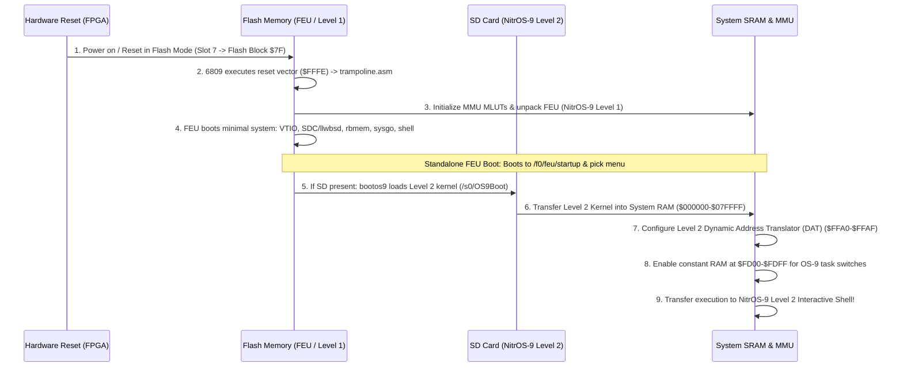
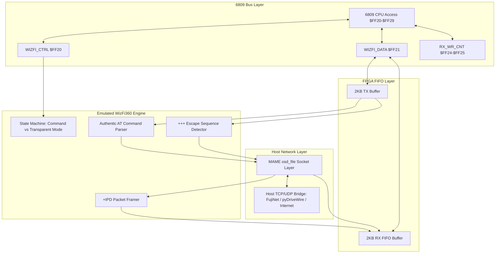

# Wildbits Jr2 (6809 Core) Technical Reference & Architecture Specification

---

## 1. Overview & System Specifications

The **Wildbits Jr2** (formerly known as the **Foenix F256 Jr2** / **JrJr**) is a modern retrocomputing platform powered by an FPGA-centric architecture. When loaded with the **FNX6809** firmware core, the system pairs a Motorola 6809 CPU core with the **TinyVicky II** graphics engine, a hardware Memory Management Unit (MMU), integrated audio synthesizers, high-speed DMA, an integer math coprocessor, and rich peripheral interfaces.

```
+----------------------------------------------------------------------------------------+
|                                 WILDBITS JR2 (FNX6809)                                 |
+----------------------------------------------------------------------------------------+
|  [6809 CPU @ 6.29 MHz] <---> [MMU (4x MLUTs + DAT)] <---> [512KB SRAM / 512KB Flash]   |
|            |                                                |                          |
|            v                                                v                          |
|  [TinyVicky II Video]                              [System I/O & Bus]                  |
|  - 80x30 / 80x60 Text (8x8 glyphs, DBL_Y/X)        - Dual SPI SD Card Ports            |
|  - 3x 256-Color Bitmaps (320x240 / 320x200)        - WizFi360 2KB Hardware FIFOs       |
|  - 3x Scrolling Tilemaps (8x8 / 16x16)             - 16550 UART Serial Port            |
|  - 64x Hardware Sprites (8x8 to 32x32)             - PS/2 Keyboard & Mouse Ports       |
|  - 4x Graphics CLUTs + 2x Text CLUTs               - bq4802 Real-Time Clock (RTC)      |
|  - Hardware Grayscale Mouse Cursor                 - WDC 65C22 VIA / Joysticks         |
|  - Line Interrupts & Counters (SOL/SOF)            - Dual PSG + Dual SID Audio         |
+----------------------------------------------------------------------------------------+
```

### Key Specifications
* **CPU:** Motorola 6809 soft core (FNX6809, Big Endian) running inside a Xilinx Artix-7 FPGA (XC7A35T), clocked at 6.29 MHz (1/4th of the 25.175 MHz video dot clock oscillator; configured in MAME via `XTAL(25'175'000)` with internal ÷ 4).
* **System Bus:** 21-bit physical address bus addressing up to 2 MB of physical address space.
* **CPU Address Space:** 16-bit (64 KB) paged into eight 8 KB slots via 4 hardware Look-Up Tables (MLUTs).
* **System RAM:** 512 KB onboard high-speed SRAM (Physical Blocks `$00 - $3F`, physical `0x000000 - 0x07FFFF`).
* **Flash ROM:** 512 KB onboard non-volatile Flash ROM (Physical Blocks `$40 - $7F`, physical `0x080000 - 0x0FFFFF`). Contains the Level 1 First Execution Unit (FEU), Flash disk `/f0`, and bootloader.
* **Video Controller:** **TinyVicky II** outputting DVI/VGA at 60 Hz (640 × 480 text, 320 × 240 graphics) or 70 Hz (640 × 400 text, 320 × 200 graphics).
* **Graphics Engines:** 
  * Character text matrix (80 × 30, 80 × 60, 40 × 30, or 40 × 60) with dual font sets (2 KB each) and per-cell foreground/background palette attributes.
  * 3 full-screen 256-color bitmapped planes (320 × 200 or 320 × 240).
  * 3 hardware scrolling tilemap layers supporting 8 × 8 or 16 × 16 tiles across 8 concurrent tile sets.
  * 64 hardware sprites (8 × 8, 16 × 16, 24 × 24, or 32 × 32) with 4 display layers.
  * 4 graphics Color Look-Up Tables (CLUTs), each with 256 24-bit RGB colors.
  * Dedicated text Foreground and Background Color Look-Up Tables (16 colors each).
  * Hardware Gamma correction look-up tables (Red, Green, Blue).
  * Hardware grayscale mouse cursor (16 × 16).
* **Audio Subsystem:**
  * Dual **SN76489** Programmable Sound Generators (PSGs) emulated in FPGA (stereo or mono 8-voice mode).
  * Dual **MOS 6581 / 8580** Sound Interface Devices (SIDs) (6 analog/synth voices with filters).
  * **WM8776** Audio CODEC and 24-bit DAC for master mixing, equalization, and volume control.
  * **SAM2695** General MIDI hardware synthesizer interface with FIFO.
* **Storage & Peripheral Interfaces:**
  * Dual SPI SD Card controllers (SD, SDHC, SDXC). Port 0 (`$FE90`) external, Port 1 (`$FF00`) internal.
  * High-speed **WizFi360** (WIZnet WiFi) module interface backed by dual 2 KB hardware FIFOs (`$FF20-$FF29`).
  * **16550** compatible UART (RS-232 serial) at `$FE60-$FE67`.
  * PS/2 Keyboard and Mouse controllers at `$FE50-$FE54`.
  * **WDC 65C22** Versatile Interface Adapter (VIA) driving dual Atari-style DE-9 joystick ports and user GPIO.
  * NES / SNES gamepad shift-register interface at `$FE80-$FE8F`.
  * **bq4802** Real-Time Clock (RTC) with battery backup at `$FE40-$FE4F`.
  * Commodore IEC serial bus port (1541/1571/1581 compatible).
  * USB-C debug & flash programming interface (FTDI FT4232H bridge).
* **Hardware Acceleration:**
  * Direct Memory Access (DMA) engine supporting 1D linear fill/copy and 2D rectangular block copy/fill with programmable source/destination strides.
  * Hardware Integer Math Coprocessor (16 × 16 → 32-bit unsigned multiplication, 32 / 16 → 16-bit unsigned division/remainder, and 32-bit addition).

---

## 2. Memory Architecture & MMU

### 2.1 Physical Address Space (21-bit / 2 MB)

The 21-bit physical address bus maps the following resources:

| Physical Address Range | Size | Physical 8KB Blocks | Description |
| :--- | :--- | :--- | :--- |
| `0x000000 - 0x07FFFF` | 512 KB | Blocks `$00 - $3F` | System SRAM (Graphics, Program, and Data) |
| `0x080000 - 0x0FFFFF` | 512 KB | Blocks `$40 - $7F` | Flash ROM (Boot Kernels, FEU, Flash Disk `/f0`) |
| `0x100000 - 0x13FFFF` | 256 KB | Blocks `$80 - $9F` | Expansion RAM (Optional) |
| `0x140000 - 0x1FFFFF` | 768 KB | Blocks `$A0 - $FF` | Reserved / Dedicated Video and Audio Block Buffers |

#### Dedicated Video & Audio Physical Blocks:
* **Block `$C0` (`0x180000`):** TinyVicky registers, Gamma correction tables, Mouse cursor bitmap, Sprite registers, and Text Mode CLUTs (FG CLUT at `$1700`, BG CLUT at `$1740`).
* **Block `$C1` (`0x182000`):** Font Set 0 (`$0000-$07FF`), Font Set 1 (`$0800-$0FFF`), Graphics CLUTs 0–3 (`$1000–$1FFF`).
* **Block `$C2` (`0x184000`):** Text Matrix character memory (80 columns × 60 rows = 4,800 bytes).
* **Block `$C3` (`0x186000`):** Text Matrix color attribute memory (High nibble = Foreground palette index 0..15, Low nibble = Background palette index 0..15).
* **Block `$C4` (`0x188000`):** Audio Synthesizer registers: SID Left (`$0000`), SID Right (`$0080`), PSG Left (`$0200`), PSG Right (`$0208`).

---

### 2.2 CPU Logical Address Map (64 KB)

The 6809 sees eight 8 KB slots:

| CPU Slot | Logical Address Range | Default Mapping | Function |
| :--- | :--- | :--- | :--- |
| **Slot 0** | `$0000 - $1FFF` | Physical Block via active MLUT | Program / User RAM |
| **Slot 1** | `$2000 - $3FFF` | Physical Block via active MLUT | Program / User RAM |
| **Slot 2** | `$4000 - $5FFF` | Physical Block via active MLUT | Program / User RAM (used by `rbmem` work window) |
| **Slot 3** | `$6000 - $7FFF` | Physical Block via active MLUT | Program / User RAM |
| **Slot 4** | `$8000 - $9FFF` | Physical Block via active MLUT | Program / User RAM |
| **Slot 5** | `$A000 - $BFFF` | Physical Block via active MLUT | Program / User RAM |
| **Slot 6** | `$C000 - $DFFF` | Physical Block via active MLUT | Program / User RAM |
| **Slot 7** | `$E000 - $FFFF` | High RAM / ROM + System I/O | System Kernel, I/O Page (`$FE00-$FFFF`), Vectors |

---

### 2.3 6809 MMU Control Registers (`$FFA0 - $FFAF`)

The MMU registers are located at the top of memory in Slot 7:

```
$FFA0: MMU_MEM_CTRL (R/W)
       Bit 7: EDIT_EN   - 1 = Enable MLUT editing at $FFA8-$FFAF; 0 = Normal RAM access
       Bit 5..4: EDIT_LUT - Selects which MLUT (0..3) is mapped to $FFA8-$FFAF for editing
       Bit 1..0: ACT_LUT  - Selects which MLUT (0..3) is currently active for CPU address translation

$FFA1: MMU_IO_CTRL (R/W)
       Bit 0: Enable internal constant RAM at $FD00-$FDFF (used by NitrOS-9 Level 2 kernel)
       Bit 1: Enable internal RAM at $FFF0-$FFFF for hardware vectors (overrides ROM vectors)

$FFA8 - $FFAF: MMU Slot Mapping Registers (when EDIT_EN = 1)
       $FFA8: Slot 0 Mapping (Physical 8KB block number 0..255 for $0000-$1FFF)
       $FFA9: Slot 1 Mapping (Physical 8KB block number 0..255 for $2000-$3FFF)
       $FFAA: Slot 2 Mapping (Physical 8KB block number 0..255 for $4000-$5FFF)
       $FFAB: Slot 3 Mapping (Physical 8KB block number 0..255 for $6000-$7FFF)
       $FFAC: Slot 4 Mapping (Physical 8KB block number 0..255 for $8000-$9FFF)
       $FFAD: Slot 5 Mapping (Physical 8KB block number 0..255 for $A000-$BFFF)
       $FFAE: Slot 6 Mapping (Physical 8KB block number 0..255 for $C000-$DFFF)
       $FFAF: Slot 7 Mapping (Physical 8KB block number 0..255 for $E000-$FFFF)
```

---

## 3. Memory-Mapped I/O Register Map (`$FE00 - $FFFF`)

| Address Range | Device / Subsystem | Functionality |
| :--- | :--- | :--- |
| **`$FE00`** | `SYS0` (R/W) | **System Control 0:**<br>• Write: `[7:RESET, 5:CAP_EN, 4:BUZZ, 3:L1, 2:L0, 1:SD_L, 0:PWR_L]`<br>• Read: `[6:SD_WP, 5:SD_CD, 4:BUZZ, 3:L1, 2:L0, 1:SD_L, 0:PWR_L]` |
| **`$FE01`** | `SYS1` (R/W) | **System Control 1:**<br>`[7..6:L1_RATE, 5..4:L0_RATE, 3:SID_ST, 2:PSG_ST, 1:L1_MN, 0:L0_MN]` |
| **`$FE02`** | `RST0` (R/W) | Write `$DE` to arm software reset |
| **`$FE03`** | `RST1` (R/W) | Write `$AD` to arm software reset |
| **`$FE07`** | `MID` (R) | **Machine ID:** Bits 5..0 = `0x1A` (F256 Jr2 6809 core) |
| **`$FE08 - $FE09`** | `PCBID0..1` (R) | ASCII PCB ID ("B0") |
| **`$FE0A - $FE0F`** | `CHIP_VER` (R) | TinyVicky BCD version and chip numbers |
| **`$FE10 - $FE13`** | `OKB` (R/W) | Optical Keyboard Registers (K2 model) |
| **`$FE20 - $FE2F`** | `INTC` (R/W) | **Interrupt Controller (4 Groups × 4 Registers):**<br>• `$FE20-$FE23`: `PENDING_0..3` (R: active, W: clear)<br>• `$FE24-$FE27`: `POLARITY_0..3`<br>• `$FE28-$FE2B`: `EDGE_0..3`<br>• `$FE2C-$FE2F`: `MASK_0..3` (1 = masked, 0 = enabled) |
| **`$FE30 - $FE37`** | `TIMER0` (R/W) | **24-bit Timer 0 (25.175 MHz Dot Clock):**<br>• `$FE30`: `T0_CTR` (W: `[3:UP, 2:LD, 1:CLR, 0:EN]`) / `T0_STAT` (R: `[0:EQ]`)<br>• `$FE31-$FE33`: `T0_VAL` (24-bit value low/mid/high)<br>• `$FE34`: `T0_CMP_CTR` (`[1:RELD, 0:RECLR]`)<br>• `$FE35-$FE37`: `T0_CMP` (24-bit target compare value) |
| **`$FE38 - $FE3F`** | `TIMER1` (R/W) | **24-bit Timer 1 (Frame/VBLANK Clock):**<br>• `$FE38`: `T1_CTR` / `T1_STAT`<br>• `$FE39-$FE3B`: `T1_VAL` (24-bit)<br>• `$FE3C`: `T1_CMP_CTR`<br>• `$FE3D-$FE3F`: `T1_CMP` (24-bit) |
| **`$FE40 - $FE4F`** | `RTC` (R/W) | **bq4802 Real-Time Clock:**<br>Seconds, Minutes, Hours, Day, DOW, Month, Year, Century, Alarms, Rates, Enables, Flags, Control (`UTI`, `STOP`, `12/24`, `DSE`) |
| **`$FE50 - $FE54`** | `PS/2` (R/W) | **PS/2 Keyboard & Mouse Controller:**<br>• `$FE50`: `PS2_CTRL` (`[5:MCLR, 4:KCLR, 3:M_WR, 1:K_WR]`)<br>• `$FE51`: `PS2_OUT`<br>• `$FE52`: `KBD_IN` (FIFO data)<br>• `$FE53`: `MS_IN` (FIFO data)<br>• `$FE54`: `PS2_STAT` (`[7:K_AK, 6:K_NK, 5:M_AK, 4:M_NK, 1:MEMP, 0:KEMP]`) |
| **`$FE60 - $FE67`** | `UART` (R/W) | **16550 UART:** `RXD`/`TXR`, `IER`, `ISR`/`FCR`, `LCR`, `MCR`, `LSR`, `MSR`, `SPR`, `DLL`, `DLH` |
| **`$FE70 - $FE72`** | `CODEC` (R/W) | **WM8776 Audio CODEC:**<br>• `$FE70`: `CmdLo`<br>• `$FE71`: `CmdHi` (Register 7-bit + Data bit 8)<br>• `$FE72`: Status (R: `BUSY`) / Control (W: `START`) |
| **`$FE80 - $FE8F`** | `NES/SNES` (R/W)| NES/SNES Gamepad shift-register interface |
| **`$FE90 - $FE91`** | `SDC0` (R/W) | **External SPI SD Card Port 0:**<br>• `$FE90`: Status/Control (`[7:SPI_BUSY, 1:SPI_CLK, 0:CS_EN]`)<br>• `$FE91`: `SPI_DATA` |
| **`$FEA0 - $FEA8`** | `MOUSE` (R/W) | **Hardware Mouse Cursor:**<br>• `$FEA0`: `MS_MEN` (`[1:MODE, 0:ENABLE]`)<br>• `$FEA2-$FEA3`: `MS_X` (16-bit X position)<br>• `$FEA4-$FEA5`: `MS_Y` (16-bit Y position)<br>• `$FEA6-$FEA8`: `PS2_BYTE_0..2` |
| **`$FEB0 - $FEBF`** | `VIA0` (R/W) | **WDC 65C22 VIA 0:**<br>`IORB`, `IORA`, `DDRB`, `DDRA`, `T1CL/H`, `T1LL/H`, `T2CL/H`, `SR`, `ACR`, `PCR`, `IFR`, `IER`, `IORA2` |
| **`$FEC0 - $FED7`** | `DMA` (R/W) | **TinyVicky DMA Controller:**<br>• `$FEC0`: `DMA_CTRL` (`[7:START, 3:INT_EN, 2:FILL, 1:2D, 0:ENABLE]`)<br>• `$FEC1`: `DMA_STATUS` (R: `BUSY`) / `DMA_DATA_2_WRITE` (W: Fill byte)<br>• `$FEC4-$FEC6`: 24-bit Source Address (`SA_H`, `SA_M`, `SA_L`)<br>• `$FEC8-$FECA`: 24-bit Dest Address (`DA_H`, `DA_M`, `DA_L`)<br>• `$FECD-$FECF`: 24-bit 1D Size (`DZ_L`, `DZ_M`, `DZ_H`)<br>• `$FED0-$FED3`: 2D Size (`WIDTH_H/L`, `HEIGHT_H/L`)<br>• `$FED4-$FED7`: 2D Strides (`SRC_STRIDE_H/L`, `DST_STRIDE_H/L`) |
| **`$FEE0 - $FEFB`** | `MATH` (R/W) | **Hardware Integer Math Coprocessor:**<br>• `$FEE0-$FEE3`: `MULU_A_H/L`, `MULU_B_H/L` → `$FEF0-$FEF3`: `MULU_HH/HL/LH/LL` (16 × 16 → 32-bit)<br>• `$FEE4-$FEE7`: `DIVU_DEN_H/L`, `DIVU_NUM_H/L` → `$FEF4-$FEF5`: `QUOU_H/L`, `$FEF6-$FEF7`: `REMU_H/L` (32 / 16 → 16-bit)<br>• `$FEE8-$FEEF`: `ADD_A_HH..LL`, `ADD_B_HH..LL` → `$FEF8-$FEFB`: `ADD_R_HH..LL` (32-bit Add) |
| **`$FF00 - $FF01`** | `SDC1` (R/W) | **Internal SPI SD Card Port 1:** Status/Control, Data |
| **`$FF20 - $FF29`** | `WIZFI` (R/W) | **WizFi360 Hardware FIFO Bridge:**<br>• `$FF20`: `CtrlReg` (`[3:TxEmpty, 2:RxEmpty, 1:Reset, 0:Rate]`)<br>• `$FF21`: `DataReg` (TX push / RX pop)<br>• `$FF22-$FF23`: `RxD_RD_Cnt` (16-bit)<br>• `$FF24-$FF25`: `RxD_WR_Cnt` (16-bit Available RX Bytes)<br>• `$FF26-$FF27`: `TxD_RD_Cnt` (16-bit)<br>• `$FF28-$FF29`: `TxD_WR_Cnt` (16-bit) |
| **`$FF30 - $FF35`** | `SAM2695` (R/W)| **SAM2695 MIDI Synth Interface:**<br>• `$FF30`: Status (`[2:Tx_empty, 1:Rx_empty]`)<br>• `$FF31`: FIFO Data Port<br>• `$FF32-$FF33`: `RXD_COUNT_LOW/HI`<br>• `$FF34-$FF35`: `TXD_COUNT_LOW/HI` |
| **`$FFA0 - $FFAF`** | `MMU` (R/W) | MMU Memory Control, I/O Control, Slot 0..7 Mapping |
| **`$FFB0 - $FFBF`** | `VIA1` (R/W) | WDC 65C22 VIA 1 (K2 model keyboard) |
| **`$FFC0 - $FFDF`** | `VICKY` (R/W) | **TinyVicky II Video Registers:**<br>• `$FFC0`: `MASTER_CTRL_0` (`[6:GAMMA, 5:SPRITE, 4:TILE, 3:BITMAP, 2:GRAPH, 1:OVRLY, 0:TEXT]`)<br>• `$FFC1`: `MASTER_CTRL_1` (`[5:FON_SET, 4:FON_OVLY, 3:MON_SLP, 2:DBL_Y, 1:DBL_X, 0:CLK_70]`)<br>• `$FFC2-$FFC3`: `LAYER_CTRL_0/1`<br>• `$FFC4-$FFC9`: Border Control (`ENABLE`, `SCROLL_X`, `B/G/R`, `WIDTH`, `HEIGHT`)<br>• `$FFCD-$FFCF`: Graphics Background Color (`B, G, R`)<br>• `$FFD0-$FFD7`: Text Cursor Control (`ENABLE`, `FLASH_DIS`, `RATE`, `CCH`, `CCO`, `CURX`, `CURY`)<br>• `$FFD8-$FFDB`: Line IRQ Control & Raster Beam Counters (`RAST_COL`, `RAST_ROW`) |
| **`$FFF0 - $FFFF`** | `VECTORS` (R/W)| **6809 Hardware Interrupt / Reset Vectors:**<br>• `$FFF0-$FFF1`: Reserved<br>• `$FFF2-$FFF3`: `SWI3`<br>• `$FFF4-$FFF5`: `SWI2`<br>• `$FFF6-$FFF7`: `FIRQ`<br>• `$FFF8-$FFF9`: `IRQ`<br>• `$FFFA-$FFFB`: `SWI`<br>• `$FFFC-$FFFD`: `NMI`<br>• `$FFFE-$FFFF`: `RESET` |

---

## 4. TinyVicky II Video Graphics Architecture

### 4.1 Master Control & Text Scaling

TinyVicky II text mode geometry is governed by **Master Control Register 1 (`$FFC1`)**:

* **Bit 2 (`DBL_Y` = `$04`):** Doubles character height (16 scanlines per character row).
  * When `DBL_Y = 1`: **30 rows** in 60Hz (480 / 16) or **25 rows** in 70Hz (400 / 16).
  * When `DBL_Y = 0`: **60 rows** in 60Hz (480 / 8) or **50 rows** in 70Hz (400 / 8).
* **Bit 1 (`DBL_X` = `$02`):** Doubles character width (16 pixels per character column).
  * When `DBL_X = 1`: **40 columns** (640 / 16).
  * When `DBL_X = 0`: **80 columns** (640 / 8).
* **Bit 0 (`CLK_70` = `$01`):** Selects 70Hz refresh rate (400 vertical scanlines) instead of standard 60Hz (480 scanlines).
* **Hardware Default:** On boot, the system initializes to **80 columns × 30 rows** (`DBL_Y = 1`, `DBL_X = 0`, `m_vky_mstr_ctrl_1 = 0x04`).

### 4.2 Text Color Palette Architecture

Unlike standard VGA, TinyVicky separates text foreground and background color lookups into dedicated hardware tables located in **Block `$C0`**:

* **Foreground CLUT:** Block `$C0` at offset `$1700` (`$1700 + fg_idx * 4`)
* **Background CLUT:** Block `$C0` at offset `$1740` (`$1740 + bg_idx * 4`)
* **Color Entry Format (4 bytes):** `[Blue, Green, Red, Alpha / Reserved]`
* **Authentic NitrOS-9 Colors:**
  * Foreground `Index 7` = **Yellow** (`R=$FF, G=$FF, B=$00`)
  * Background `Index 10` (`0x0A`) = **Purple** (`R=$4F, G=$00, B=$80`)
  * Default Character Attribute Byte = `0x7A` (Yellow on Purple)

### 4.3 Hardware Text Cursor Registers (`$FFD0 - $FFD7`)

* **`$FFD0` (`VKY_TXT_CURSOR_CTRL_REG`):**
  * Bit 0 = Cursor Enable
  * Bit 1 = Flash / Blink Enable
  * Bit 2 = 0: Character Invert Mode, 1: Line Cursor Mode
* **`$FFD2` (`VKY_TXT_CURSOR_CHAR_REG`):** Cursor Glyph (e.g. `'_'` or block)
* **`$FFD3` (`VKY_TXT_CURSOR_COLR_REG`):** Cursor text attribute byte
* **`$FFD4-$FFD5` (`VKY_TXT_CURSOR_X_REG_H/L`):** Column coordinate (0..79)
* **`$FFD6-$FFD7` (`VKY_TXT_CURSOR_Y_REG_H/L`):** Row coordinate (0..29 or 0..59)
* **Rendering:** Character cell inversion at `(CUR_X, CUR_Y)` flashing at a 30Hz rate when blink is enabled.

---

## 5. Interrupt Structure

The Interrupt Controller maps 32 interrupt sources across 4 groups of 8:

```
Group 0 ($FE20 / $FE2C):
  Bit 0: INT_VKY_SOF     - TinyVicky Start of Frame (VBLANK: 60Hz or 70Hz)
  Bit 1: INT_VKY_SOL     - TinyVicky Start of Line (Raster line comparator match)
  Bit 2: INT_PS2_KBD     - PS/2 Keyboard byte received in FIFO
  Bit 3: INT_PS2_MOUSE   - PS/2 Mouse byte received in FIFO
  Bit 4: INT_TIMER_0     - Timer 0 reached compare target (25.175MHz base)
  Bit 5: INT_TIMER_1     - Timer 1 reached compare target (Frame base)
  Bit 6: INT_DMA0        - DMA transfer complete
  Bit 7: INT_CARTRIDGE   - Expansion cartridge IRQ

Group 1 ($FE21 / $FE2D):
  Bit 0: INT_UART        - 16550 UART TX/RX event
  Bit 4: INT_RTC         - bq4802 RTC periodic or alarm event
  Bit 5: INT_VIA0        - WDC 65C22 VIA 0 event (Timer/CB1/CB2)
  Bit 6: INT_VIA1        - VIA 1 event (K2 keyboard)
  Bit 7: INT_SDC_INS     - SD card inserted/removed

Group 2 ($FE22 / $FE2E):
  Bit 0: IEC_DATA_i      - IEC Data line transition
  Bit 1: IEC_CLK_i       - IEC Clock line transition
  Bit 2: IEC_ATN_i       - IEC Attention line transition
  Bit 3: IEC_SREQ_i      - IEC Service Request transition
  Bit 4: INT_COP         - Copper network chip IRQ
  Bit 5: INT_WIFI_EXT    - External WiFi IRQ

Group 3 ($FE23 / $FE2F):
  Bit 0: INT_WIFI        - WizFi360 RX FIFO not empty
  Bit 1: IEC_MIDI        - SAM2695 MIDI RX FIFO not empty
  Bit 2: IEC_OPT_KBD     - K2 Optical Keyboard IRQ
```

* **Power-On State:** All mask registers `m_int_mask[0..3]` power on as `0xFF` (all IRQs masked). Software unmasks specific interrupt lines via `$FE2C-$FE2F`.

---

## 6. Boot Architecture: Stage 1 (FEU) & Stage 2 (Level 2)



### 6.1 Stage 1: The FEU (First Execution Unit) in Flash Memory

The onboard 512KB Flash ROM (`0x080000 - 0x0FFFFF`, Physical Blocks `$40 - $7F`) hosts the **First Execution Unit (FEU)** in its upper 64 KB:

| FEU Component | Filename | Size | Flash Blocks (8KB) | Physical Blocks | Flash Offset | Function |
| :--- | :--- | :--- | :--- | :--- | :--- | :--- |
| **`/f0` Flash Disk** | `f0.dsk` | 40 KB (5 blocks) | `$38, $39, $3A, $3B, $3C` | `$78, $79, $7A, $7B, $7C` | `0x70000 - 0x79FFF` | RBF filesystem (10 tracks × 16 sectors) containing `/f0/feu/startup`, utilities, and `pick` menu. |
| **FEU Booter** | `booter` | 24 KB (3 blocks) | `$3D, $3E, $3F` | `$7D, $7E, $7F` | `0x7A000 - 0x7FFFF` | Level 1 Kernel (`krn`, `krnp2`, `init`), drivers (`vtio`, `keydrv_ps2`, `rbmem`, `llwbsd`), `sysgo`, and reset vector trampoline (`$FFF0`). |

#### Building the FEU ROM Set:
```bash
export NITROS9DIR=/path/to/nitros9
make -C $NITROS9DIR/recipes/wildbits/feu PLATFORM=jr2
mkdir -p roms/wbjr2
cp $NITROS9DIR/recipes/wildbits/feu/{booter,f0.dsk} roms/wbjr2/
```

> [!NOTE]
> MAME declares `f0.dsk` and `booter` with `NO_DUMP` in `ROM_START(wbjr2)`, allowing ROMs to be rebuilt frequently during development without CRC mismatch warnings.

#### Standalone Boot Behavior:
When run without an SD card (`./mame wbjr2 -window -skip_gameinfo`):
1. The 6809 boots at `$FFFE` into `trampoline.asm`, unpacking Level 1 NitrOS-9 into RAM.
2. `SysGo` tries mounting `/c0` (Cartridge), `/s0` (SD Card), and falls back to **`/f0` (Flash Disk)**.
3. `SysGo` executes `/f0/feu/startup`, displays system banner and `wbinfo`, and launches the interactive `pick` menu (`o: Boot OS-9, d: Debugger, s: Shell, r: Reset`).

### 6.2 Stage 2: NitrOS-9 Level 2 from SD Card
When an SD card with a bootable Level 2 filesystem (`/s0/OS9Boot`) is attached (`./mame wbjr2 -window -skip_gameinfo -hard $NITROS9DIR/recipes/wildbits/l2/l2_wildbitsjr2.dsk`):
1. FEU booter runs `bootos9 /s0/OS9Boot`.
2. `bootos9` loads the multi-module Level 2 kernel into RAM blocks `$00..$3F`.
3. The MMU configures Level 2 DAT mapping via `$FFA0` and enables the **`$FD00-$FDFF` constant RAM window** via `$FFA1` bit 0.
4. Level 2 `SysGo` starts `startup` (which initializes utilities and the WizFi360 driver via `iniz wz`) and launches the interactive `Shell+ v2.2a` prompt `{TERM|02}/dd:`.

#### Building the bootable SD Card image:
```bash
export NITROS9DIR=/path/to/nitros9
make -C $NITROS9DIR/recipes/wildbits/l2 PLATFORM=jr2
# Pad image to a standard SD card capacity greater than the file (e.g. 4M, 8M, 16M, 32M, 64M)
truncate -s 4M $NITROS9DIR/recipes/wildbits/l2/l2_wildbitsjr2.dsk
```

> [!IMPORTANT]
> **SD Card Image Sizing:** MAME's SPI SD card controller validates disk images against standard SD/SDHC capacity structures (which require power-of-two or 512KB-aligned sector counts). ToolShed (`os9 copy`) creates sparse/unpadded images with non-standard byte counts as files are added. Always use `truncate -s <size>` to pad the `.dsk` image to the next standard SD card size larger than the actual file (e.g. `4M` for default builds, or `8M`, `16M`, `32M`, etc., if additional packages/files are added).

---

## 7. WizFi360 Wi-Fi Hardware Subsystem & Emulation Architecture

### 7.1 Hardware Architecture

The Wildbits Jr2 integrates a **WIZnet WizFi360-PA** Wi-Fi module connected to the 6809 bus via dedicated FPGA hardware FIFOs:

```
+---------------+           +--------------------+           +---------------+
|   6809 CPU    | <=======> |  Dual 2KB FIFOs    | <=======> |   WizFi360    |
| ($FF20-$FF29) |           |  (FPGA Hardware)   |  (UART)   | Wi-Fi Module  |
+---------------+           +--------------------+           +---------------+
```

### 7.2 Register Map (`$FF20 - $FF29`)

| Address | Name | Access | Function |
| :--- | :--- | :--- | :--- |
| **`$FF20`** | `WIZFI_CTRL` | R/W | **Control / Status Register:**<br>• Bit 3: `TxEmpty` (1 = TX FIFO is empty)<br>• Bit 2: `RxEmpty` (1 = RX FIFO is empty, no incoming bytes)<br>• Bit 1: `Reset` (Write 1 to assert reset line; write 0 to release)<br>• Bit 0: `Rate` (Baud rate select: 0 = 115200 bps, 1 = 921600 bps) |
| **`$FF21`** | `WIZFI_DATA` | R/W | **FIFO Data Port:**<br>• Write: Pushes byte into 2KB TX FIFO (or streams to socket in transparent mode)<br>• Read: Pops byte from 2KB RX FIFO |
| **`$FF22-$FF23`** | `WIZFI_RX_RD_CNT` | R | 16-bit RX FIFO Read Pointer |
| **`$FF24-$FF25`** | `WIZFI_RX_WR_CNT` | R | **16-bit Available RX Bytes Count** (High byte at `$FF24`, Low byte at `$FF25`). Crucial for driver `RxFCheck` polling. |
| **`$FF26-$FF27`** | `WIZFI_TX_RD_CNT` | R | 16-bit TX FIFO Read Pointer |
| **`$FF28-$FF29`** | `WIZFI_TX_WR_CNT` | R | 16-bit TX FIFO Write Pointer |

* **Interrupt Architecture & Polling:** On the Wildbits Jr2, the physical WizFi FPGA FIFO does not assert a standalone interrupt line; instead, the NitrOS-9 `wizfi.asm` device driver uses **Timer 0** (`INT_TIMER_0` on **Interrupt Group 0, Bit 4**; `$FE20` pending, `$FE2C` mask) as a high-speed periodic ticker to service and poll the FIFO status registers (`$FF24-$FF25`).

---

### 7.3 NitrOS-9 Software & Script Interactions

The WizFi360 interface is utilized across multiple software layers in NitrOS-9 Level 2:

1. **Driver Initialization (`iniz wz` / `startup`):**
   * Configures Timer 0 at 11.52 kHz (`TRATE = 2185` cycles on 25.175 MHz dot clock) and unmasks `INT_TIMER_0`.
   * Pulses hardware reset via `$FF20`, synchronizes with `AT\r\n` $\rightarrow$ `OK\r\n`, disables echo (`ATE0`), sets station mode (`AT+CWMODE=1`), and enables multi-connection mode (`AT+CIPMUX=1`).
2. **Wi-Fi Router Configuration (`SCRIPTS/wizcon`):**
   * Configures persistent station parameters (`AT+CWMODE_DEF=1`, `AT+CWDHCP_DEF=1,1`, `AT+CWJAP_DEF="ssid","pass"`).
   * Verifies IP assignment via `AT+CIPSTA_CUR?`.
3. **Connection Status Monitoring (`SCRIPTS/wizstat`):**
   * Queries station IP configuration (`AT+CIPSTA_CUR?`) and connection status (`AT+CIPSTATUS`).
4. **FujiNet / DriveWire over Wi-Fi (`SCRIPTS/fncon` & `CMDS/fndiscon`):**
   * `fncon`: Configures single connection mode (`AT+CIPMUX=0`), enables transparent transmission mode (`AT+CIPMODE=1`), establishes a TCP socket (`AT+CIPSTART="TCP","192.168.1.100",65504`), enters raw stream mode (`AT+CIPSEND`), and runs `fnstatus` / DriveWire DWoW.
   * `fndiscon.as`: Uses 1-second guard delay, sends `+++` escape sequence, waits for transition back to command mode, executes `AT+CIPCLOSE`, and pulses hardware reset to clear FIFOs.
5. **Telnet Server & Multi-Channel Services (`SCRIPTS/wizsv1`, `SCRIPTS/wizsv4`, `SCRIPTS/wizout*`):**
   * Configures TCP servers via `AT+CIPSERVER` / `AT+CIPSERVERMAXCONN` / `AT+CIPSTO` for telnet daemon login (`TSMON`) and outgoing TCP connections.
6. **MQTT Client Engine (`SCRIPTS/mpub`, `SCRIPTS/mqtt_*`):**
   * Interacts with WizFi360 built-in MQTT client commands (`AT+MQTTSET`, `AT+MQTTTOPIC`, `AT+MQTTCON`, `AT+MQTTPUB`, `AT+MQTTSUB`, `AT+MQTTDIS`).

---

### 7.4 Emulation Architecture & Implementation Strategy



#### Strategic Dual-Layer Networking Design:
* **Pre-Configured NVRAM State (Out-of-the-Box Operation):** On physical hardware, once Wi-Fi credentials have been saved to flash via `AT+CWJAP_DEF`, the WizFi360 retains them across reboots and automatically joins the network on power-up. MAME emulates this by booting with `m_wizfi_wifi_connected = true` and emitting the authentic auto-connect sequence (`ready` $\rightarrow$ `WIFI CONNECTED` $\rightarrow$ `WIFI GOT IP`), allowing drivers and networking tools to function immediately.
* **Full Dynamic Reconfigurability:** The emulator fully executes all configuration commands (`AT+CWJAP_DEF`, `AT+CWMODE_DEF`, `AT+CWDHCP_DEF`, `AT+CWQAP`), updating the active SSID and network state dynamically.
* **Transparent Host Socket Bridging:** When TCP/UDP connections are opened (`AT+CIPSTART`), MAME creates non-blocking sockets using its native `osd_file` TCP abstraction (`socket.host:port`), seamlessly connecting to host FujiNet servers (`192.168.1.100:65504` or `127.0.0.1:65504`) and remote internet hosts.

---

### 7.5 Hardware Verification & Response Specification

The emulation has been directly verified against the physical WIZnet WizFi360 hardware on the Wildbits Jr2:

1. **Firmware Release & SDK Metadata (`AT+GMR`):**
   ```text
   AT version:1.1.2.0(Apr 12 2023 08:08:36)
   SDK version:3.2.0(a0ffff9f)
   compile time:Apr 12 2023 08:08:36

   OK
   ```
2. **Hardware MAC & Vendor OUI Formatting (`AT+CIFSR`, `AT+CIPSTAMAC_CUR?`, `AT+CIPAPMAC_CUR?`):**
   * Station MAC: `00:08:dc:6b:e3:36` (lowercase hexadecimal with WIZnet vendor prefix `00:08:dc`).
   * SoftAP MAC: `02:08:dc:6b:e3:36` (locally administered MAC).
   * `AT+CIFSR` output:
     ```text
     +CIFSR:STAIP,"192.168.1.100"
     +CIFSR:STAMAC,"00:08:dc:6b:e3:36"

     OK
     ```
3. **Query Response Formatting (`_CUR`, `_DEF`, standard):**
   * `AT+UART_CUR?` / `AT+UART_DEF?` $\rightarrow$ `+UART_CUR:115200,8,1,0,0\r\nOK\r\n` (no extra blank line).
   * `AT+CWMODE_DEF?` $\rightarrow$ `+CWMODE_DEF:1\r\n\r\nOK\r\n`.
   * `AT+CWDHCP_DEF?` $\rightarrow$ `+CWDHCP_DEF:3\r\nOK\r\n`.
   * `AT+CIPMUX?` $\rightarrow$ `+CIPMUX:0\r\n\r\nOK\r\n`.
   * `AT+CIPMODE?` $\rightarrow$ `+CIPMODE:0\r\n\r\nOK\r\n`.
   * `AT+SYSSTORE?` $\rightarrow$ `ERROR\r\n` (unsupported command on WizFi360 W600 firmware).
4. **Hardware Reset Transition (`$FF20` Bit 1: $1 \rightarrow 0$) and `AT+RST`:**
   * Emits the power-on auto-connect sequence:
     ```text
     ready
     WIFI CONNECTED
     WIFI GOT IP
     ```
5. **Connection State Reporting (`AT+CIPSTATUS`):**
   * `STATUS:2` when associated with AP and IP obtained.
   * `STATUS:3` with `+CIPSTATUS:<id>,"TCP","<host>",<remote_port>,5000,0` when socket is connected.
   * `STATUS:5` when disconnected from Wi-Fi.

---

### 7.6 Transparent Streaming, `+++` Escape, & Packet Framing

1. **Transparent Transmission Mode (`CIPMODE=1` & `AT+CIPSEND`):**
   * Initiated via `AT+CIPSEND` $\rightarrow$ prompts with `\r\nOK\r\n\r\n> `.
   * Subsequent writes to `$FF21` stream directly to the open host socket without AT buffering.
   * Incoming socket bytes are pushed raw into `m_wizfi_rx_fifo`.
2. **`+++` Escape Sequence Detection:**
   * Detects 3 consecutive `+` characters with quiet guard delays.
   * Switches from transparent data streaming back to command mode without severing the TCP session.
3. **Normal Mode Packet Framing (`CIPMODE=0`):**
   * `AT+CIPSEND=<len>` $\rightarrow$ prompts with `\r\nOK\r\n> `, buffers `<len>` bytes, and confirms with `\r\nRecv <len> bytes\r\n\r\nSEND OK\r\n`.
   * Incoming data from socket is formatted as `\r\n+IPD,<link_id>,<len>:<data>` (or `\r\n+IPD,<len>:<data>` for single mode).

---

### 7.7 Interrupt Architecture, Timing Fidelity & Emulation Scheduling

A critical architectural distinction between physical FPGA hardware and discrete software emulators occurs in high-frequency interrupt scheduling:

#### 1. Physical Hardware Timing:
* **The 25.175 MHz Hardware Timer:** The Artix-7 FPGA implements a 24-bit up-counter incrementing at the 25.175 MHz dot clock. When `wizfi.asm` programs `TRATE = 2185` (to match 115200 baud), the timer reaches compare match every $2185 \div 4 = \mathbf{546\text{ CPU cycles}}$ at 6.29 MHz ($11,520\text{ ticks/sec}$).
* **Continuous Hardware Concurrency:** On real silicon, the 6809 CPU and FPGA timer operate concurrently in continuous physical time. The NitrOS-9 ISR (`iService`) executes $\approx 220\text{ cycles}$ to poll the FIFO, clears `INT_PENDING_0` ($FE20), and returns via `RTI`. The CPU is physically guaranteed $326\text{ clean cycles}$ of user instruction execution before the next flip-flop transition.

#### 2. The Emulated Timeslice Backlog & Interrupt Starvation Cascade:
* **Discrete Timeslice Scheduling:** Software emulators like MAME execute CPU instructions in discrete slices rather than continuous nanoseconds.
* **Interrupt Overhead vs. Period:** 6809 interrupt entry (12-byte register push), vector fetch from `$FFF8`, OS-9 kernel `F$IRQ` table lookup, `iService` execution, and `RTI` require $\approx 220-260\text{ CPU cycles}$. At $546\text{ cycles/tick}$, IRQ processing consumes nearly $50\%$ of total CPU throughput.
* **The Starvation Cascade:** When a command like `echo AT>/wz` writes to `/wz`, the WizFi module generates a response (`\r\nOK\r\n`) into the hardware FIFO. Because `echo` only opens the device for write, no process reads the FIFO. In `iService`, `vpr_stat` is set and unread data remains in the FIFO. If the emulator fires Timer 0 at the raw 11.52 kHz rate, any slight scheduler backlog or multi-cycle instruction burst causes the timer to expire repeatedly. Every `RTI` immediately encounters an already-expired timer event, trapping the CPU in a continuous `IRQ` $\rightarrow$ `ISR` $\rightarrow$ `RTI` loop. This completely starves foreground processes (the Shell) and drops PS/2 keyboard events.

#### 3. Emulation Timing Workaround & Fidelity Analysis:
* **1 kHz Scheduling Period Floor:** In MAME's `timer0_tick` and `timer_w`, Timer 0 compare intervals are clamped to a minimum period of **1 ms (1 kHz maximum frequency)**:
  ```cpp
  attotime period = attotime::from_hz(25'175'000) * m_t0_cmp;
  if (period < attotime::from_hz(1000))
      period = attotime::from_hz(1000);
  m_timer0->adjust(period);
  ```
* **Fidelity Impact:**
  * **Registers & Protocol:** All hardware registers (`$FE30-$FE37`, `$FF20-$FF29`), compare registers, status flags (`T0_STAT`), and interrupt pending bits operate identically to physical hardware.
  * **Throughput & Responsiveness:** 1,000 polls per second provides sub-millisecond response latency for all AT commands and Wi-Fi packets while reducing CPU polling overhead from $\approx 50\%$ to $\approx 2\%$.
  * **System Health:** Boots reliably through `startup` (`iniz wz`), cleanly executes shell commands, and ensures interactive typing remains 100% responsive.
* **Clean State Machine:** Removed all artificial, out-of-band `set_irq` calls from FIFO pushing and socket reading routines; `INT_TIMER_0` is driven strictly by the Timer 0 compare engine.

---

## 8. Current MAME Implementation Status

| Subsystem | Hardware Emulated | Status |
| :--- | :--- | :--- |
| **6809 CPU Core** | Motorola 6809 @ 6.29 MHz | **Completed & Verified** |
| **MMU Subsystem** | 4x MLUTs, DAT banking, Constant RAM (`$FD00`), Vector RAM (`$FFF0`) | **Completed & Verified** |
| **Flash ROM & FEU** | Full 64KB FEU (`f0.dsk` @ `$70000`, `booter` @ `$7A000`) | **Completed & Verified** (Standalone Level 1 boot) |
| **SPI SD Card** | SDC0 shift register, MISO/MOSI, SDHC image boot | **Completed & Verified** (Level 2 boot from `/s0`) |
| **Interrupt Controller**| 4 Groups × 8 sources, dynamic masking & polarity | **Completed & Verified** |
| **24-bit Timers** | Timer 0 (25.175 MHz dot clock) and Timer 1 (Frame) | **Completed & Verified** |
| **TinyVicky Text Video**| 80x30 / 80x60, DBL_Y/X scaling, dual fonts, FG/BG CLUTs | **Completed & Verified** (Yellow on Purple) |
| **Hardware Cursor** | TinyVicky cursor registers `$FFD0-$FFD7`, 30Hz blink | **Completed & Verified** |
| **PS/2 Keyboard** | Host matrix mapped to PS/2 Set 2 scan codes (make/break) | **Completed & Verified** (Interactive typing) |
| **WizFi360 Wi-Fi** | Dual 2KB FIFOs, AT Command Engine, Transparent Mode, Socket Bridge | **Completed & Verified** (Verified against physical hardware: firmware v1.1.2.0, WIZnet MAC formatting, auto-connect reset banner, transparent streaming, `+++` escape detector, `+IPD` packet framing, and host BSD/POSIX socket bridge for NitrOS-9 driver and FujiNet/DriveWire) |
| **TinyVicky Bitmaps** | Bitmaps 0..2 (320x240, 256-color) | *Planned* |
| **TinyVicky Tilemaps**| Tilemaps 0..2 with smooth scrolling | *Planned* |
| **TinyVicky Sprites** | 64 hardware sprites with 4 composite layers | *Planned* |
| **Audio Synthesizers** | Dual PSG (SN76489) + Dual SID (MOS 6581) + WM8776 CODEC | *Planned* |


