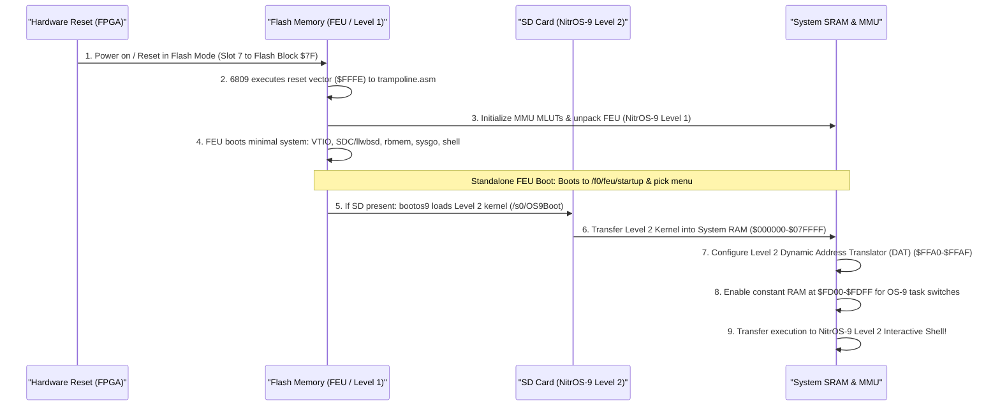
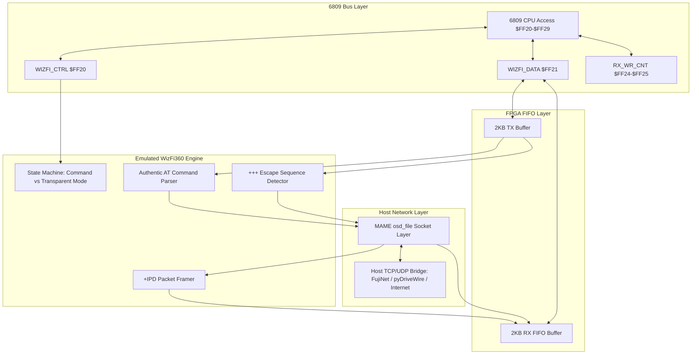
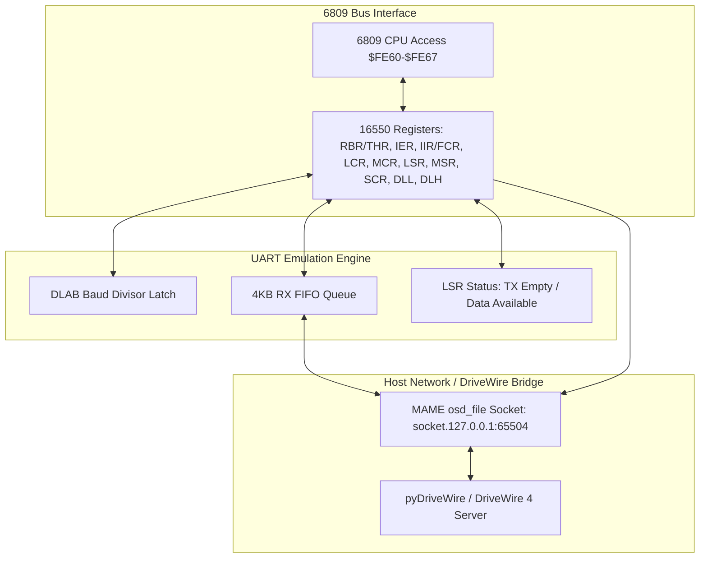
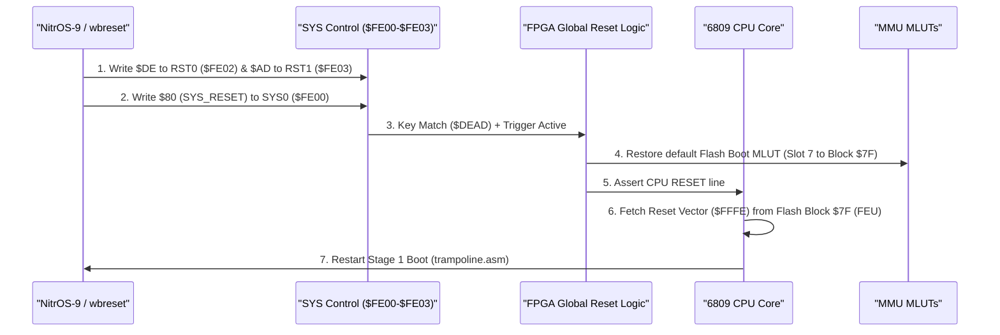

# Wildbits Jr2 (6809 Core) Technical Reference & Architecture Specification

---

## 1. Overview & System Specifications

The **Wildbits Jr2** (formerly known as the **Foenix F256 Jr2** / **JrJr**) is a modern retrocomputing platform powered by an FPGA-centric architecture. When loaded with the **FNX6809** firmware core, the system pairs a Motorola 6809 CPU core with the **TinyVicky II** graphics engine, a hardware Memory Management Unit (MMU), integrated audio synthesizers, high-speed DMA, an integer math coprocessor, and rich peripheral interfaces.

```
+----------------------------------------------------------------------------------------+
|                                 WILDBITS JR2 (FNX6809)                                 |
+----------------------------------------------------------------------------------------+
|  [6809 CPU @ 6.29 MHz] <---> [MMU (4x MLUTs + DAT)] <---> [512KB SRAM / 512KB Flash]   |
|            |                                                |                          |
|            v                                                v                          |
|  [TinyVicky II Video]                              [System I/O & Bus]                  |
|  - 80x30 / 80x60 Text (8x8 glyphs, DBL_Y/X)        - Dual SPI SD Card Ports            |
|  - 3x 256-Color Bitmaps (320x240 / 320x200)        - WizFi360 2KB Hardware FIFOs       |
|  - 3x Scrolling Tilemaps (8x8 / 16x16)             - 16550 UART Serial Port (BAUDCE)   |
|  - 128x Hardware Sprites (8x8 to 32x32, 8 bpp)     - Dual Cartridge Ports (/c0, /c1)   |
|  - 4x Graphics CLUTs + 2x Text CLUTs               - PS/2 Keyboard & Mouse Ports       |
|  - Hardware Grayscale Mouse Cursor                 - bq4802 Real-Time Clock (RTC)      |
|  - Line Interrupts & Counters (SOL/SOF)            - WDC 65C22 VIA / Joysticks         |
+----------------------------------------------------------------------------------------+
```

### Key Specifications
* **CPU:** Motorola 6809 soft core (FNX6809, Big Endian) running inside a Xilinx Artix-7 FPGA (XC7A35T), clocked at 6.29 MHz (1/4th of the 25.175 MHz video dot clock oscillator; configured in MAME via `XTAL(25'175'000)` with internal ÷ 4). Optional DIP-switchable turbo stretch mode runs at ~1.4x speed.
* **System Bus:** 21-bit physical address bus addressing up to 2 MB of physical address space.
* **CPU Address Space:** 16-bit (64 KB) paged into eight 8 KB slots via 4 hardware Look-Up Tables (MLUTs).
* **System RAM:** 512 KB onboard high-speed SRAM (Physical Blocks `$00 - $3F`, physical `0x000000 - 0x07FFFF`).
* **Flash ROM:** 512 KB onboard non-volatile Flash ROM (Physical Blocks `$40 - $7F`, physical `0x080000 - 0x0FFFFF` of the SST39VF chip). Contains the Level 1 First Execution Unit (FEU), `/f0` flash volume, and user flash drive `/f1`.
* **Expansion Cartridge:** Cartridge decode at Physical Blocks `$80 - $9F` (256 KB window) supporting `/c0` (based at `$80`) and `/c1` (based at `$90`), sharing the external bus and shaped write strobe with onboard flash.
* **Video Controller:** **TinyVicky II** outputting DVI/VGA at 60 Hz (640 × 480 text, 320 × 240 graphics) or 70 Hz (640 × 400 text, 320 × 200 graphics).
* **Graphics Engines:** 
  * Character text matrix (80 × 30, 80 × 60, 40 × 30, or 40 × 60) with dual font sets (2 KB each) and per-cell foreground/background palette attributes.
  * 3 full-screen 256-color bitmapped planes (320 × 200 or 320 × 240).
  * 3 hardware scrolling tilemap layers supporting 8 × 8 or 16 × 16 tiles across 8 concurrent tile sets.
  * 128 hardware sprites (8 × 8, 16 × 16, 24 × 24, or 32 × 32) at 8 bpp indexed color through 4 graphics CLUTs, line-buffered and scanned 127 down to 0 per scanline pair (sprite 0 composites on top).
  * 4 graphics Color Look-Up Tables (CLUTs), each with 256 24-bit RGB colors (stored as 32-bit `[Blue, Green, Red, Alpha]` entries).
  * Dedicated text Foreground and Background Color Look-Up Tables (16 colors each).
  * Hardware Gamma correction look-up tables (Red, Green, Blue).
  * Hardware grayscale mouse cursor (16 × 16).
* **Audio Subsystem:**
  * Triple **SN76489** Programmable Sound Generators (PSGs) emulated in FPGA (Left at `$0200`, Center/Mono at `$0208`, Right at `$0210` in Block `$C4`; software-configurable stereo/mono via `SYS1`).
  * Triple **MOS 6581 / 8580** Sound Interface Devices (SIDs) (Left at `$0000`, Center/Mono at `$0080`, Right at `$0100` in Block `$C4`; 9 synth voices with multi-mode analog filters).
  * **WM8776** Audio CODEC and 24-bit DAC at `$FE70-$FE72` for master mixing, equalization, and volume control.
  * **SAM2695** General MIDI hardware synthesizer interface with FIFO at `$FF30-$FF35`.
  * Hardware System Buzzer on `SYS0` (`$FE00` bit 4).
* **Storage & Peripheral Interfaces:**
  * Dual SPI SD Card controllers (SD, SDHC, SDXC). Port 0 (`$FE90`) external, Port 1 (`$FF00`) internal.
  * High-speed **WizFi360** (WIZnet WiFi) module interface backed by dual 2 KB hardware FIFOs (`$FF20-$FF29`).
  * **16550** compatible UART (RS-232 serial) at `$FE60-$FE67` with 22.1184 MHz BAUDCE exact baud generator (Divisor 5 = 230,400 baud).
  * PS/2 Keyboard and Mouse controllers at `$FE50-$FE54`.
  * **WDC 65C22** Versatile Interface Adapter (VIA) driving dual Atari-style DE-9 joystick ports and user GPIO.
  * NES / SNES gamepad shift-register interface at `$FE80-$FE8F`.
  * **bq4802** Real-Time Clock (RTC) with battery backup at `$FE40-$FE4F`.
  * Commodore IEC serial bus port at `$FE80` (1541/1571/1581 compatible; optional NMI routing).
  * Hardware Configuration DIP Switches at `$FF90` (Turbo stretch mode, Gamma, and Boot modes).
  * USB-C debug & flash programming interface (FTDI FT4232H bridge).
* **Hardware Acceleration:**
  * Direct Memory Access (DMA) engine supporting 1D linear fill/copy and 2D rectangular block copy/fill with programmable source/destination strides at `$FEC0-$FED7`.
  * Hardware Integer Math Coprocessor (16 × 16 → 32-bit unsigned multiplication, 32 / 16 → 16-bit unsigned division/remainder, and 32-bit addition) at `$FEE0-$FEFB`.

---

### 1.2 Hardware Distinctions: Wildbits Jr2 vs. Wildbits K2

While both machines share the core TinyVicky II video engine, the FNX6809 CPU core, and the NitrOS-9 operating system, the physical **Wildbits Jr2** possesses distinct hardware characteristics that differentiate it from the **Wildbits K2**:

| Feature / Subsystem | Wildbits Jr2 (Physical Target) | Wildbits K2 (Companion Machine) |
| :--- | :--- | :--- |
| **Physical Enclosure** | Compact desktop console unit | Integrated keyboard computer (wedge case) |
| **Primary Keyboard** | **PS/2 Keyboard** (`$FE50-$FE54`, Group 0 bit 2) | **Optical Keyboard** (`$FE10-$FE16`, Group 3 bit 2) |
| **Hardware Typematic Repeat** | None (software-paced in OS / PS/2 controller) | Hardware typematic engine in FPGA (`$FE14-$FE16`) |
| **Secondary VIA (`VIA1` at `$FFB0`)**| **Unpopulated** (VIA0 only at `$FEB0`) | Unpopulated on K2; present on older F256K mechanical models |
| **Blocks `$80–$9F` Decode** | **External Cartridge Port** (`/c0` @ `$80`, `/c1` @ `$90`) | **Internal Expansion SRAM** (256 KB at `$10_0000–$13_FFFF`) |
| **Network Interfaces** | **WizFi360 Wi-Fi only** (dual 2KB FIFOs at `$FF20-$FF29`) | **Dual:** WizFi360 Wi-Fi **+** WIZnet W6100 10/100 Ethernet |
| **Machine ID Register (`$FE07`)** | **`$1A`** (26 decimal: Jr2 6809 core) | **`$16`** (22 decimal: K2 6809 core) |
| **External Bus Write Strobe** | **Shared single `WE` line** (Flash, Cartridge, RTC); shaped 45ns pulse in turbo | Dedicated / separate write lines; uses raw CPU strobe |
| **Physical Flash Chip** | SST39VF040 (512 KB physical, ID `$BFD7`) | SST39VF1681 (2 MB physical, 512 KB visible, ID `$BFC9`) |
| **Status Indicators** | Discrete LEDs (`SYS0`/`SYS1`: Power, SD, L0, L1) | RGB programmable LEDs (`$FE06`, `$FE07-$FE0F`) |

> [!IMPORTANT]
> **Emulator Scope Enforcement:** The MAME emulator driver `wbjr2` specifically emulates the **Wildbits Jr2**. It must NOT instantiate the optical keyboard scanner, W6100 Ethernet, or internal expansion SRAM at `$80–$9F`. It must expose the PS/2 keyboard/mouse interface, the dual cartridge ports, the shared bus write strobe behavior, and report `$1A` in Machine ID register `$FE07`.

---

## 2. Memory Architecture & MMU

### 2.1 Physical Address Space (21-bit / 2 MB)

The 21-bit physical address bus maps the following resources:

| Physical Address Range | Size | Physical 8KB Blocks | Region Type | Description |
| :--- | :--- | :--- | :--- | :--- |
| `0x000000 - 0x07FFFF` | 512 KB | Blocks `$00 - $3F` | **System SRAM** | System & process memory, video framebuffers (VKY fetches from same RAM). |
| `0x080000 - 0x0EFFFF` | 448 KB | Blocks `$40 - $77` | **Flash (`/f1`)** | User flash drive (`rbmem`, R/W with DQ6 toggle erase/program polling). |
| `0x0F0000 - 0x0F9FFF` | 40 KB  | Blocks `$78 - $7C` | **Flash (`/f0`)** | FEU read-only RBF system volume (blocks `$38–$3C` in flash chip). |
| `0x0FA000 - 0x0FFFFF` | 24 KB  | Blocks `$7D - $7F` | **Flash (Booter)** | Power-on booter (`booter_0..2`); Block `$7F` holds reset vector at `$FFFE`. |
| `0x100000 - 0x13FFFF` | 256 KB | Blocks `$80 - $9F` | **Cartridge / EXRAM** | Jr2: Cartridge port `/c0` (base `$80`) and `/c1` (base `$90`); K2: Expansion RAM. |
| `0x140000 - 0x17FFFF` | 256 KB | Blocks `$A0 - $BF` | *No decode* | Unmapped entry patterns with no bus behind them. |
| `0x180000 - 0x189FFF` | 40 KB  | Blocks `$C0 - $C4` | **Sectored I/O Pages** | Relocatable VICKY internal device and register pages. |
| `0x18A000 - 0x1FFFFF` | 472 KB | Blocks `$C5 - $FF` | *No decode* | Unmapped space. |

> [!NOTE]
> **Flash Visibility Constraint:** Although the physical SST39VF flash chip is 2 MB, only **512 KB** is visible to the 6809 MMU: the FPGA drives 19 address bits (6 block bits + 13 offset bits), and lines A19/A20 do not leave the FPGA.

#### Dedicated Sectored I/O Blocks (`$C0–$C4`):
* **Block `$C0` (`0x180000`):** `GAMMA_BLK` / `TEXT_LUT_BLK` / `BITMAP_BLK` / `SPRITE_BLK` — Relocatable TinyVicky register block:
  * `$0000 - $02FF`: Gamma correction lookup tables (Blue `$0000`, Green `$0100`, Red `$0200`).
  * `$0400 - $05FF`: Hardware grayscale mouse cursor bitmap (16 × 16).
  * `$1000 - $1013`: Bitmap plane control registers & 24-bit physical start addresses (`BM0`, `BM1`, `BM2`).
  * `$1100 - $119F`: Tilemap plane registers (`TL0`, `TL1`, `TL2`) and 8 tile set base address registers (`$1180–$119F`).
  * `$1300 - $16FF`: **128 Hardware Sprite Attribute Records** (8 bytes each, Big-Endian).
  * `$1700 - $177F`: Text Mode Palettes (Foreground CLUT at `$1700`, Background CLUT at `$1740`).
* **Block `$C1` (`0x182000`):** `FONT_BLK` & `GRAPH_LUT_BLK`:
  * `$0000 - $0FFF`: Dual 2 KB font banks (Font Set 0 at `$0000-$07FF`, Font Set 1 at `$0800-$0FFF`).
  * `$1000 - $1FFF`: **4 Graphics CLUTs** (LUT0–3, 256 colors × 4 bytes `[Blue, Green, Red, Alpha]`).
* **Block `$C2` (`0x184000`):** Text Matrix character memory (80 columns × 60 rows = 4,800 bytes).
* **Block `$C3` (`0x186000`):** Text Matrix color attribute memory (80 columns × 60 rows = 4,800 bytes; High nibble = Foreground palette 0..15, Low nibble = Background palette 0..15).
* **Block `$C4` (`0x188000`):** Audio Synthesizer internal registers:
  * `$0000 - $001F`: `SIDL` (MOS 6581/8580 Left Channel, 29 registers).
  * `$0080 - $009F`: `SIDM` (MOS 6581/8580 Center / Mono Channel).
  * `$0100 - $011F`: `SIDR` (MOS 6581/8580 Right Channel).
  * `$0200 - $0207`: `PSGL` (SN76489 Left Channel, 4 voices).
  * `$0208 - $020F`: `PSGM` (SN76489 Center / Mono Channel).
  * `$0210 - $0217`: `PSGR` (SN76489 Right Channel).

---

### 2.2 CPU Logical Address Map & Fixed Overrides (64 KB)

The 6809 logical space is divided into eight 8 KB slots. An inhibit decode term (`RAM_Access_Inhibit`) in the FPGA overrides MMU translation for fixed I/O and switchable constant RAM:

| Logical Address | Class | Size | Function / Description |
| :--- | :--- | :--- | :--- |
| **`$0000 - $FCFF`** | MMU Translated | 63.25 KB | Translated via active MLUT (`Slots 0–6` and lower 7 KB of `Slot 7`). |
| **`$FD00 - $FDFF`** | Constant RAM | 256 B | **Dedicated internal RAM page.** Enabled when `$FFA1[0] = 1`. Supersedes MMU translation across all tasks and LUTs. Holds kernel always-mapped routines. When `$FFA1[0] = 0` (reset state), passes through to MMU. |
| **`$FE00 - $FEFF`** | Fixed I/O | 256 B | **Always mapped fixed I/O.** Bypasses MMU translation in all tasks (system control, interrupt controller, timers, RTC, PS/2, UART, VIA0, DMA). |
| **`$FF00 - $FF9F`** | Fixed I/O | 160 B | **Always mapped fixed I/O.** SDC1, WizFi360 FIFOs (`$FF20-$FF29`), SAM2695 MIDI (`$FF30-$FF35`). |
| **`$FFA0 - $FFAF`** | MMU Registers | 16 B | MMU control (`$FFA0`), I/O control (`$FFA1`), and Slot mapping registers (`$FFA8–$FFAF`). |
| **`$FFB0 - $FFEF`** | Fixed I/O | 64 B | **Always mapped fixed I/O.** VIA1 and TinyVicky master video control registers (`$FFC0–$FFDF`). |
| **`$FFF0 - $FFFF`** | Constant RAM / Vectors | 16 B | **Dedicated internal vector RAM.** Enabled when `$FFA1[1] = 1`. Supersedes MMU translation to provide fast, task-independent 6809 interrupt vectors (`SWI3`..`RESET`). When `$FFA1[1] = 0` (reset state), vectors fetch from MMU space (Flash Block `$7F`). |

#### Properties of Constant RAM Pages (`$FD00` and `$FFF0`):
1. **Universal Visibility:** When enabled via `$FFA1`, they sit at identical logical addresses in every task and every MLUT without moving or hiding during task switches.
2. **Warm Retention:** Reset clears the enable bits in `$FFA1` (falling back to Flash/MMU space), but their RAM contents are preserved across resets until power-off.
3. **Read/Write Override:** When enabled, all CPU reads and writes access the internal constant RAM; memory behind the window is completely masked.

---

### 2.3 6809 MMU Control Registers & Slot-Entry Encoding

The MMU registers are mapped at `$FFA0 - $FFAF`:

```
$FFA0: MMU_MEM_CTRL (R/W)
       Bits 7..6: Unused
       Bits 5..4: EDIT_LUT - Selects which MLUT (0..3) is read/written at $FFA8-$FFAF
       Bits 3..2: Unused
       Bits 1..0: ACT_LUT  - Selects which MLUT (0..3) is active for CPU translation

$FFA1: MMU_IO_CTRL (R/W)
       Bit 0: Enable internal constant RAM at $FD00-$FDFF (NitrOS-9 Level 2 kernel routines)
       Bit 1: Enable internal vector RAM at $FFF0-$FFFF (Overrides ROM/Flash vectors)

$FFA8 - $FFAF: MMU Slot Mapping Registers (accesses EDIT_LUT selected by $FFA0[5:4])
       $FFA8: Slot 0 Mapping ($0000 - $1FFF)
       $FFA9: Slot 1 Mapping ($2000 - $3FFF)
       $FFAA: Slot 2 Mapping ($4000 - $5FFF) -- Communal Work Window
       $FFAB: Slot 3 Mapping ($6000 - $7FFF)
       $FFAC: Slot 4 Mapping ($8000 - $9FFF)
       $FFAD: Slot 5 Mapping ($A000 - $BFFF)
       $FFAE: Slot 6 Mapping ($C000 - $DFFF)
       $FFAF: Slot 7 Mapping ($E000 - $FFFF)
```

#### Slot-Entry Target Encoding (Written to `$FFA8–$FFAF`):

| Entry High Bits | Target Region | Block Range | Physical Target |
| :--- | :--- | :--- | :--- |
| `00xx xxxx` | **System RAM** | `$00–$3F` | 512 KB onboard SRAM |
| `01xx xxxx` | **Flash Window** | `$40–$7F` | 512 KB Flash ROM window (`/f1`, `/f0`, booter) |
| `100x xxxx` | **Expansion / Cartridge** | `$80–$9F` | 256 KB Cartridge (`/c0` at `$80`, `/c1` at `$90`) |
| `1100 0xxx` | **Sectored I/O Pages** | `$C0–$C4` | TinyVicky registers, CLUTs, VRAM, and sound |

> [!IMPORTANT]
> **The Slot-2 Communal Work Window (`$4000–$5FFF`):**
> In NitrOS-9 Level 2, `Slot 2` is reserved as a temporary mapping window for drivers (`rbmem` maps flash blocks, `mousedrv` maps sprite page `$C0`, `vtio` maps video pages). Drivers borrowing Slot 2 must mask interrupts (`orcc #IntMasks`), save the existing mapping, perform the transfer, and restore the original slot mapping before unmasking.

---

### 2.4 Boot Trampoline & Kernel Staging Architecture

When changing MMU mappings during boot or reboot, code cannot execute from a slot whose mapping is being pulled out from underneath it. The platform uses a dedicated two-stage hand-off:

1. **The Trampoline at `$0600` (`RELOC_ADDR`):**
   * Block `$00` contains system globals and is mapped into `Slot 0` (`$0000–$1FFF`) in every task.
   * `bootos9` (and the FEU's `os9boot`) copies a small relocatable stub to `$0600` in Block 0 and jumps to it.
   * Running safely from `$0600`, the stub resets MMU slots 0–7 to identity (Blocks `$00–$07`) and jumps to the kernel entry point (`Bt.Start = $EE00`).
2. **Kernel Staging Blocks `(8-n)..7`:**
   * An n-block bootfile (`OS9Boot`, currently n = 4, Blocks `$04–$07`) is staged in the upper RAM blocks below Block 8.
   * The kernel (`krn`) is anchored as the final module exactly 4,096 bytes before the end of the bootfile, landing cleanly at `$EE00` in Slot 7.
3. **Ghost-Test Memory Sizing:**
   * At startup, `krn` does not use a hardcoded table; it writes a marker across successively doubled block numbers (8, 16, 32, 64...) until the write aliases back to Block 0, dynamically discovering the 64 blocks (512 KB) recorded in `D.MemSz`.

---

## 3. Memory-Mapped I/O Register Map (`$FE00 - $FFFF`)

| Address Range | Device / Subsystem | Functionality |
| :--- | :--- | :--- |
| **`$FE00`** | `SYS0` (R/W) | **System Control 0:**<br>• Write: `[7:RESET, 5:CAP_EN, 4:BUZZ, 3:L1, 2:L0, 1:SD_L, 0:PWR_L]`<br>• Read: `[6:SD_WP, 5:SD_CD, 4:BUZZ, 3:L1, 2:L0, 1:SD_L, 0:PWR_L]` |
| **`$FE01`** | `SYS1` (R/W) | **System Control 1:**<br>`[7..6:L1_RATE, 5..4:L0_RATE, 3:SID_ST, 2:PSG_ST, 1:L1_MN, 0:L0_MN]` |
| **`$FE02`** | `RST0` (R/W) | Write `$DE` to arm software reset |
| **`$FE03`** | `RST1` (R/W) | Write `$AD` to arm software reset |
| **`$FE07`** | `MID` (R) | **Machine ID:** Bits 5..0 = `0x1A` (F256 Jr2 6809 core) |
| **`$FE08 - $FE09`** | `PCBID0..1` (R) | ASCII PCB ID ("B0") |
| **`$FE0A - $FE0F`** | `CHIP_VER` (R) | TinyVicky BCD version and chip numbers |
| **`$FE10 - $FE13`** | `OKB` (R/W) | Optical Keyboard Registers (K2 model only; unpopulated on Jr2) |
| **`$FE20 - $FE2F`** | `INTC` (R/W) | **Interrupt Controller (4 Groups × 4 Registers):**<br>• `$FE20-$FE23`: `PENDING_0..3` (R: active, W: clear)<br>• `$FE24-$FE27`: `POLARITY_0..3`<br>• `$FE28-$FE2B`: `EDGE_0..3`<br>• `$FE2C-$FE2F`: `MASK_0..3` (1 = masked, 0 = enabled) |
| **`$FE30 - $FE37`** | `TIMER0` (R/W) | **24-bit Timer 0 (25.175 MHz Dot Clock):**<br>• `$FE30`: `T0_CTR` (W: `[3:UP, 2:LD, 1:CLR, 0:EN]`) / `T0_STAT` (R: `[0:EQ]`)<br>• `$FE31-$FE33`: `T0_VAL` (24-bit value low/mid/high)<br>• `$FE34`: `T0_CMP_CTR` (`[1:RELD, 0:RECLR]`)<br>• `$FE35-$FE37`: `T0_CMP` (24-bit target compare value) |
| **`$FE38 - $FE3F`** | `TIMER1` (R/W) | **24-bit Timer 1 (Frame/VBLANK Clock):**<br>• `$FE38`: `T1_CTR` / `T1_STAT`<br>• `$FE39-$FE3B`: `T1_VAL` (24-bit)<br>• `$FE3C`: `T1_CMP_CTR`<br>• `$FE3D-$FE3F`: `T1_CMP` (24-bit) |
| **`$FE40 - $FE4F`** | `RTC` (R/W) | **bq4802 Real-Time Clock:**<br>Seconds, Minutes, Hours, Day, DOW, Month, Year, Century, Alarms, Rates, Enables, Flags, Control (`UTI`, `STOP`, `12/24`, `DSE`). Shared external bus (raw strobe). |
| **`$FE50 - $FE54`** | `PS/2` (R/W) | **PS/2 Keyboard & Mouse Controller (Jr2 Primary Keyboard):**<br>• `$FE50`: `PS2_CTRL` (`[5:MCLR, 4:KCLR, 3:M_WR, 1:K_WR]`)<br>• `$FE51`: `PS2_OUT`<br>• `$FE52`: `KBD_IN` (FIFO data)<br>• `$FE53`: `MS_IN` (FIFO data)<br>• `$FE54`: `PS2_STAT` (`[7:K_AK, 6:K_NK, 5:M_AK, 4:M_NK, 1:MEMP, 0:KEMP]`) |
| **`$FE60 - $FE67`** | `UART` (R/W) | **16550 UART (BAUDCE 22.1184 MHz Clocking):**<br>`RXD`/`TXR`, `IER`, `ISR`/`FCR`, `LCR`, `MCR`, `LSR`, `MSR`, `SPR`, `DLL`, `DLH` (Divisor 5 = 230,400 baud) |
| **`$FE70 - $FE72`** | `CODEC` (R/W) | **WM8776 Audio CODEC:**<br>• `$FE70`: `CmdLo`<br>• `$FE71`: `CmdHi` (Register 7-bit + Data bit 8)<br>• `$FE72`: Status (R: `BUSY`) / Control (W: `START`) |
| **`$FE80 - $FE8F`** | `IEC / NES` (R/W)| **Commodore IEC Serial Bus & NES/SNES Gamepad:**<br>• `$FE80`: IEC Bus Control/Data (DATA, CLK, ATN, SREQ; drives Group 2 IRQ / optional NMI)<br>• `$FE81-$FE8F`: NES/SNES Gamepad shift-register interface |
| **`$FE90 - $FE91`** | `SDC0` (R/W) | **External SPI SD Card Port 0:**<br>• `$FE90`: Status/Control (`[7:SPI_BUSY, 1:SPI_CLK, 0:CS_EN]`)<br>• `$FE91`: `SPI_DATA` |
| **`$FEA0 - $FEA8`** | `MOUSE` (R/W) | **Hardware Mouse Cursor:**<br>• `$FEA0`: `MS_MEN` (`[1:MODE (0:host, 1:hardware PS/2), 0:ENABLE]`)<br>• `$FEA2-$FEA3`: `MS_X` (16-bit X position)<br>• `$FEA4-$FEA5`: `MS_Y` (16-bit Y position)<br>• `$FEA6-$FEA8`: `PS2_BYTE_0..2` |
| **`$FEB0 - $FEBF`** | `VIA0` (R/W) | **WDC 65C22 VIA 0:**<br>`IORB` (Joystick Port 0), `IORA` (Joystick Port 1), `DDRB`, `DDRA`, `T1CL/H`, `T1LL/H`, `T2CL/H`, `SR`, `ACR`, `PCR`, `IFR`, `IER`, `IORA2` |
| **`$FEC0 - $FED7`** | `DMA` (R/W) | **TinyVicky DMA Controller:**<br>• `$FEC0`: `DMA_CTRL` (`[7:START, 3:INT_EN, 2:FILL, 1:2D, 0:ENABLE]`)<br>• `$FEC1`: `DMA_STATUS` (R: `BUSY`) / `DMA_DATA_2_WRITE` (W: Fill byte)<br>• `$FEC4-$FEC6`: 24-bit Source Address (`SA_H`, `SA_M`, `SA_L`)<br>• `$FEC8-$FECA`: 24-bit Dest Address (`DA_H`, `DA_M`, `DA_L`)<br>• `$FECD-$FECF`: 24-bit 1D Size (`DZ_L`, `DZ_M`, `DZ_H`)<br>• `$FED0-$FED3`: 2D Size (`WIDTH_H/L`, `HEIGHT_H/L`)<br>• `$FED4-$FED7`: 2D Strides (`SRC_STRIDE_H/L`, `DST_STRIDE_H/L`) |
| **`$FEE0 - $FEFB`** | `MATH` (R/W) | **Hardware Integer Math Coprocessor:**<br>• `$FEE0-$FEE3`: `MULU_A_H/L`, `MULU_B_H/L` → `$FEF0-$FEF3`: `MULU_HH/HL/LH/LL` (16 × 16 → 32-bit)<br>• `$FEE4-$FEE7`: `DIVU_DEN_H/L`, `DIVU_NUM_H/L` → `$FEF4-$FEF5`: `QUOU_H/L`, `$FEF6-$FEF7`: `REMU_H/L` (32 / 16 → 16-bit)<br>• `$FEE8-$FEEF`: `ADD_A_HH..LL`, `ADD_B_HH..LL` → `$FEF8-$FEFB`: `ADD_R_HH..LL` (32-bit Add) |
| **`$FF00 - $FF01`** | `SDC1` (R/W) | **Internal SPI SD Card Port 1:** Status/Control, Data |
| **`$FF20 - $FF29`** | `WIZFI` (R/W) | **WizFi360 Hardware FIFO Bridge:**<br>• `$FF20`: `CtrlReg` (`[3:TxEmpty, 2:RxEmpty, 1:Reset, 0:Rate]`)<br>• `$FF21`: `DataReg` (TX push / RX pop)<br>• `$FF22-$FF23`: `RxD_RD_Cnt` (16-bit)<br>• `$FF24-$FF25`: `RxD_WR_Cnt` (16-bit Available RX Bytes)<br>• `$FF26-$FF27`: `TxD_RD_Cnt` (16-bit)<br>• `$FF28-$FF29`: `TxD_WR_Cnt` (16-bit) |
| **`$FF30 - $FF35`** | `SAM2695` (R/W)| **SAM2695 MIDI Synth Interface:**<br>• `$FF30`: Status (`[2:Tx_empty, 1:Rx_empty]`)<br>• `$FF31`: FIFO Data Port<br>• `$FF32-$FF33`: `RXD_COUNT_LOW/HI`<br>• `$FF34-$FF35`: `TXD_COUNT_LOW/HI` |
| **`$FF90`** | `DIP_SW` (R) | **Hardware Configuration DIP Switches:**<br>• Bit 7: `SW_GAMMA_ON` (Hardware Gamma enable default)<br>• Bit 6: `SW_USER2` (Turbo stretch mode ~1.4x enable)<br>• Bits 5..4: `SW_USER1..0` (User-defined DIP switches)<br>• Bits 3..0: `SW_BOOT_MODE3..0` (Hardware boot source select) |
| **`$FFA0 - $FFAF`** | `MMU` (R/W) | MMU Memory Control, I/O Control, Slot 0..7 Mapping |
| **`$FFB0 - $FFBF`** | `VIA1` (R/W) | WDC 65C22 VIA 1 (F256K mechanical keyboard; unpopulated on Jr2) |
| **`$FFC0 - $FFDF`** | `VICKY` (R/W) | **TinyVicky II Video Registers:**<br>• `$FFC0`: `MASTER_CTRL_0` (`[6:GAMMA, 5:SPRITE, 4:TILE, 3:BITMAP, 2:GRAPH, 1:OVRLY, 0:TEXT]`)<br>• `$FFC1`: `MASTER_CTRL_1` (`[5:FON_SET, 4:FON_OVLY, 3:MON_SLP, 2:DBL_Y, 1:DBL_X, 0:CLK_70]`)<br>• `$FFC2-$FFC3`: `LAYER_CTRL_0/1`<br>• `$FFC4-$FFC9`: Border Control (`ENABLE`, `SCROLL_X`, `B/G/R`, `WIDTH`, `HEIGHT`)<br>• `$FFCD-$FFCF`: Graphics Background Color (`B, G, R`)<br>• `$FFD0-$FFD7`: Text Cursor Control (`ENABLE`, `FLASH_DIS`, `RATE`, `CCH`, `CCO`, `CURX`, `CURY`)<br>• `$FFD8-$FFDB`: Line IRQ Control & Raster Beam Counters (`RAST_COL`, `RAST_ROW`) |
| **`$FFF0 - $FFFF`** | `VECTORS` (R/W)| **6809 Hardware Interrupt / Reset Vectors:**<br>• `$FFF0-$FFF1`: Reserved<br>• `$FFF2-$FFF3`: `SWI3`<br>• `$FFF4-$FFF5`: `SWI2`<br>• `$FFF6-$FFF7`: `FIRQ`<br>• `$FFF8-$FFF9`: `IRQ`<br>• `$FFFA-$FFFB`: `SWI`<br>• `$FFFC-$FFFD`: `NMI`<br>• `$FFFE-$FFFF`: `RESET` |

---

## 4. TinyVicky II Video Graphics Architecture

### 4.1 Master Control & Text Scaling

TinyVicky II text mode geometry is governed by **Master Control Register 1 (`$FFC1`)**:

* **Bit 2 (`DBL_Y` = `$04`):** Doubles character height (16 scanlines per character row).
  * When `DBL_Y = 1`: **30 rows** in 60Hz (480 / 16) or **25 rows** in 70Hz (400 / 16).
  * When `DBL_Y = 0`: **60 rows** in 60Hz (480 / 8) or **50 rows** in 70Hz (400 / 8).
* **Bit 1 (`DBL_X` = `$02`):** Doubles character width (16 pixels per character column).
  * When `DBL_X = 1`: **40 columns** (640 / 16).
  * When `DBL_X = 0`: **80 columns** (640 / 8).
* **Bit 0 (`CLK_70` = `$01`):** Selects 70Hz refresh rate (400 vertical scanlines) instead of standard 60Hz (480 scanlines).
* **Hardware Default:** On boot, the system initializes to **80 columns × 30 rows** (`DBL_Y = 1`, `DBL_X = 0`, `m_vky_mstr_ctrl_1 = 0x04`).

### 4.2 Text Color Palette Architecture

Unlike standard VGA, TinyVicky separates text foreground and background color lookups into dedicated hardware tables located in **Block `$C0`**:

* **Foreground CLUT:** Block `$C0` at offset `$1700` (`$1700 + fg_idx * 4`)
* **Background CLUT:** Block `$C0` at offset `$1740` (`$1740 + bg_idx * 4`)
* **Color Entry Format (4 bytes):** `[Blue, Green, Red, Alpha / Reserved]`
* **Authentic NitrOS-9 Colors:**
  * Foreground `Index 7` = **Yellow** (`R=$FF, G=$FF, B=$00`)
  * Background `Index 10` (`0x0A`) = **Purple** (`R=$4F, G=$00, B=$80`)
  * Default Character Attribute Byte = `0x7A` (Yellow on Purple)

### 4.3 Hardware Text Cursor Registers (`$FFD0 - $FFD7`)

* **`$FFD0` (`VKY_TXT_CURSOR_CTRL_REG`):**
  * Bit 0 = Cursor Enable
  * Bit 1 = Flash / Blink Enable
  * Bit 2 = 0: Character Invert Mode, 1: Line Cursor Mode
* **`$FFD2` (`VKY_TXT_CURSOR_CHAR_REG`):** Cursor Glyph (e.g. `'_'` or block)
* **`$FFD3` (`VKY_TXT_CURSOR_COLR_REG`):** Cursor text attribute byte
* **`$FFD4-$FFD5` (`VKY_TXT_CURSOR_X_REG_H/L`):** Column coordinate (0..79)
* **`$FFD6-$FFD7` (`VKY_TXT_CURSOR_Y_REG_H/L`):** Row coordinate (0..29 or 0..59)
* **Rendering:** Character cell inversion at `(CUR_X, CUR_Y)` flashing at a 30Hz rate when blink is enabled.

### 4.4 TinyVicky II Hardware Sprite Engine (128 Sprites)

TinyVicky II features a line-buffered **128-sprite hardware engine** designed for the 6809 core. It is verified across both K2 and Jr2 platforms (`v8_rc7`+).

#### 1. Pipeline & Scanning Characteristics:
* **Line-Buffered Architecture:** The engine is line-buffered (not framebuffered). The display operates at 640×480 with pixels doubled from a 320×240 coordinate space, so the engine fetches sprite data once per scanline pair during horizontal blanking.
* **Scan Priority:** On odd scanlines, the master video scheduler invokes `Sprite_State_Machine.v`. The engine walks all 128 attribute records **from sprite 127 down to sprite 0**. Because sprite 0 is processed last into the line buffer, **sprite 0 has highest display priority and wins all overlaps**.
* **Line Hit Detection:** For each enabled sprite, a line hit occurs when:
  `Sprite_Y <= (scanline / 2 + 32) < Sprite_Y + height`
  Disabled sprites skip in ~3 clock cycles; scanning 128 disabled sprites takes under 4 µs.
* **Compositing & Transparency:** During even scanlines, the line buffer merges with text, bitmap, and tile layers. Pixel index 0 is transparent; non-zero indices look up colors in the sprite's designated graphics CLUT.

#### 2. Master Control Register (`$FFC0`):
Master Control Register 0 (`$FFC0`) is fixed I/O, accessible in all maps:
* **Bit 0 (`$01`):** `Text_Mode_En` (Text layer enable)
* **Bit 1 (`$02`):** `Text_Overlay` (Text background transparent over graphics)
* **Bit 2 (`$04`):** `Graph_Mode_En` (**Graphics pipeline master enable — required for sprites!**)
* **Bit 3 (`$08`):** `Bitmap_En` (Bitmap plane enable)
* **Bit 4 (`$10`):** `TileMap_En` (Tilemap plane enable)
* **Bit 5 (`$20`):** `Sprite_En` (**Sprite layer enable**)
* **Bit 6 (`$40`):** `GAMMA_En` (Gamma correction LUT enable)
* **Bit 7 (`$80`):** `Disable_Vid` (Blank video output; grants full bus bandwidth to CPU)

> Enabling text overlay, graphics, and sprites is configured with `$FFC0 = $27` (or `$2F` with bitmaps).

#### 3. Sprite Attribute Block (VICKY Page `$C0`, Offsets `$1300–$16FF`):
The 128 attribute records reside in dual-port BRAM inside sectored I/O Page `$C0`. Mapping Page `$C0` into `Slot 2` (`$FFAA = $C0`) makes the attribute block accessible at CPU addresses `$5300–$56FF`:

| Sprites | Page Offset | CPU Logical (Slot 2) | Record n Address |
| :--- | :--- | :--- | :--- |
| **0 – 31** | `$1300 - $13FF` | `$5300 - $53FF` | `$5300 + 8 * n` |
| **32 – 63** | `$1400 - $14FF` | `$5400 - $54FF` | `$5400 + 8 * (n - 32)` |
| **64 – 95** | `$1500 - $15FF` | `$5500 - $55FF` | `$5500 + 8 * (n - 64)` |
| **96 – 127** | `$1600 - $16FF` | `$5600 - $56FF` | `$5600 + 8 * (n - 96)` |

#### 4. The 8-Byte Attribute Record Format (Big-Endian):
All multi-byte pointer and coordinate fields are stored high-byte first (standard 6809 big-endian order):

```
+0: CTRL
    Bit 0:    Sprite Enable (1 = enabled, 0 = disabled)
    Bits 2:1: Graphics CLUT Select (00 = LUT0, 01 = LUT1, 10 = LUT2, 11 = LUT3)
    Bits 4:3: Pixel Depth (00 = 8 bpp indexed)
    Bits 6:5: Sprite Size (00 = 32x32, 01 = 24x24, 10 = 16x16, 11 = 8x8)
+1: ADDR_H   - Physical pixel RAM address bits 23..16
+2: ADDR_M   - Physical pixel RAM address bits 15..8
+3: ADDR_L   - Physical pixel RAM address bits 7..0
+4: X_POS_H  - X coordinate bits 15..8
+5: X_POS_L  - X coordinate bits 7..0
+6: Y_POS_H  - Y coordinate bits 15..8
+7: Y_POS_L  - Y coordinate bits 7..0
```

| Size Bits `CTRL[6:5]` | Sprite Dimensions | Typical `CTRL` (LUT0, Enabled) |
| :--- | :--- | :--- |
| `00` | 32 × 32 | `$01` |
| `01` | 24 × 24 | `$21` |
| `10` | 16 × 16 | `$41` |
| `11` | 8 × 8 | `$61` |

* **Pixel Data Addressing:** Pointer points to physical 24-bit SRAM address (`Block * $2000 + Offset`), stored row-major at 1 byte per pixel.
* **Graphics CLUTs (Page `$C1`, Offsets `$1000–$1FFF`):** Four 256-color palettes sharing Page `$C1` with fonts. Each entry is 4 bytes ordered `[Blue, Green, Red, Alpha]`:
  * `LUT0`: `$1000–$13FF` (Entry i at `$1000 + 4 * i`)
  * `LUT1`: `$1400–$17FF` (Entry i at `$1400 + 4 * i`)
  * `LUT2`: `$1800–$1BFF` (Entry i at `$1800 + 4 * i`)
  * `LUT3`: `$1C00–$1FFF` (Entry i at `$1C00 + 4 * i`)

#### 5. Coordinate System & Off-Screen Margins:
Sprite coordinates operate in a **32-pixel offset border space** allowing sprites to smoothly scroll entirely off any screen edge:
* **Coordinate (0, 0):** Top-left of off-screen margin.
* **Visible Top-Left:** (32, 32).
* **Visible Bottom-Right:** (351, 271) (for 320 x 240 display area).
* **Screen Center (for 8 x 8 sprite):** X = 32 + (320 - 8) / 2 = 188 (`$00BC`), Y = 32 + (240 - 8) / 2 = 148 (`$0094`).

---

### 4.5 TinyVicky II 256-Color Bitmap Graphics Engine (`BM0`, `BM1`, `BM2`)

TinyVicky II supports three independent full-screen **256-color bitmapped planes** (`BM0`, `BM1`, `BM2`) capable of displaying at 320×240 (60 Hz standard) or 320×200 (70 Hz mode).

#### 1. Bitmap Plane Registers (VICKY Page `$C0`, Offsets `$1000–$1013`):
The bitmap control and framebuffer start address registers reside in sectored I/O Page `$C0`:

| Bitmap Plane | Register | Page `$C0` Offset | CPU Logical (Slot 2) | Function / Bit Field |
| :--- | :--- | :--- | :--- | :--- |
| **Bitmap 0** | `TyVKY_BM0_CTRL_REG` | `$1000` | `$5000` | Bit 0: `BM0_Ctrl` (1 = Enable), Bits 2..1: `LUT Select` (`$02` = LUT0, `$04` = LUT1) |
| | `BM0_START_ADDY_H` | `$1001` | `$5001` | Framebuffer physical address bits 23..16 |
| | `BM0_START_ADDY_M` | `$1002` | `$5002` | Framebuffer physical address bits 15..8 |
| | `BM0_START_ADDY_L` | `$1003` | `$5003` | Framebuffer physical address bits 7..0 |
| **Bitmap 1** | `TyVKY_BM1_CTRL_REG` | `$1008` | `$5008` | Bit 0: `BM1_Ctrl` (1 = Enable), Bits 2..1: `LUT Select` (`$02` = LUT0, `$04` = LUT1) |
| | `BM1_START_ADDY_H/M/L` | `$1009-$100B` | `$5009-$500B` | Framebuffer physical address 23..0 |
| **Bitmap 2** | `TyVKY_BM2_CTRL_REG` | `$1010` | `$5010` | Bit 0: `BM2_Ctrl` (1 = Enable), Bits 3..1: `LUT Select` (`$02` = LUT0, `$04` = LUT1, `$08` = LUT2) |
| | `BM2_START_ADDY_H/M/L` | `$1011-$1013` | `$5011-$5013` | Framebuffer physical address 23..0 |

#### 2. Master Enable & Compositing:
* Bitmaps are enabled globally via **Master Control Register 0 (`$FFC0`)**:
  * Bit 3 (`$08`): `Bitmap_En`
  * Bit 2 (`$04`): `Graph_Mode_En` (must be enabled for any graphics pipeline)
* Each pixel is an 8-bit index into the selected Graphics CLUT (located in Page `$C1` at `$1000–$1FFF`).
* Color index `0` represents a transparent pixel, allowing background layers, lower bitmaps, or text backgrounds to show through.

---

### 4.6 TinyVicky II Hardware Scrolling Tilemap Engine (`TL0`, `TL1`, `TL2`)

TinyVicky II features three hardware scrolling tilemap layers (`TL0`, `TL1`, `TL2`) capable of independently scrolling large virtual playfields in hardware with sub-pixel and per-pixel smoothness.

#### 1. Tilemap Control & Scroll Registers (Page `$C0`, Offsets `$1100–$1123`):
Each tilemap layer is configured via a 12-byte register block:

* **Layer 0 (`TL0`):** Page offset `$1100–$110B` (Logical `$5100–$510B` when Page `$C0` in Slot 2)
* **Layer 1 (`TL1`):** Page offset `$110C–$1117` (Logical `$510C–$5117`)
* **Layer 2 (`TL2`):** Page offset `$1118–$1123` (Logical `$5118–$5123`)

For each layer k (0, 1, or 2):
* `+0`: `TLk_CONTROL_REG`
  * Bit 0: `TILE_Enable` (1 = layer enabled)
  * Bits 3..1: `LUT Select` (Graphics CLUT 0..3)
  * Bit 4: `TILE_SIZE` (`0` = 16 × 16 pixel tiles, `1` = 8 × 8 pixel tiles)
* `+1..+3`: `TLk_START_ADDY_L/M/H` — 24-bit physical RAM pointer to tilemap matrix data.
* `+4..+5`: `TLk_MAP_X_SIZE_L/H` — 16-bit virtual tilemap matrix width.
* `+6..+7`: `TLk_MAP_Y_SIZE_L/H` — 16-bit virtual tilemap matrix height.
* `+8..+9`: `TLk_MAP_X_POS_L/H` — 16-bit horizontal scroll offset in pixels.
* `+10..+11`: `TLk_MAP_Y_POS_L/H` — 16-bit vertical scroll offset in pixels.

#### 2. Tile Graphic Sets (Page `$C0`, Offsets `$1180–$119F`):
TinyVicky supports up to **8 concurrent tile graphics sets** (`Tile Set 0..7`). Each set is assigned a 24-bit physical base address pointer in system SRAM:
* `TILE_MAP_ADDY0` (`$1180–$1183`): 24-bit base address (`L, M, H`) + configuration byte.
* `TILE_MAP_ADDY1` (`$1184–$1187`) through `TILE_MAP_ADDY7` (`$119C–$119F`).

---

### 4.7 TinyVicky II Gamma Correction & Mouse Cursor Subsystem

#### 1. Hardware Gamma Correction Lookup Tables (Page `$C0`, Offsets `$0000–$02FF`):
TinyVicky provides dedicated hardware Gamma correction tables to equalize color response between analog RGB/VGA and DVI/HDMI outputs:
* **Blue Gamma Table:** Page `$C0` offsets `$0000 - $00FF` (256 8-bit correction values).
* **Green Gamma Table:** Page `$C0` offsets `$0100 - $01FF` (256 8-bit correction values).
* **Red Gamma Table:** Page `$C0` offsets `$0200 - $02FF` (256 8-bit correction values).
* **Activation:** Enabled via Master Control Register 0 (`$FFC0` bit 6, `GAMMA_En = $40`) or DIP switch 7 (`SW_GAMMA_ON`).

#### 2. Hardware Mouse Cursor Engine:
* **Cursor Bitmap (Page `$C0`, Offsets `$0400–$05FF`):** Dedicated 16 × 16 pixel cursor graphic stored at 2 bits per pixel (or 8 bpp grayscale) allowing customizable hardware pointers without software sprite overhead.
* **Cursor Control Registers (`$FEA0–$FEA8` in Fixed I/O):**
  * `$FEA0` (`MS_MEN`): Bit 0 = Cursor Visible, Bit 1 = Mode (`0` = Host CPU updates coordinates, `1` = Hardware auto-tracks PS/2 mouse packets directly from `$FE53`).
  * `$FEA2-$FEA3`: 16-bit Mouse X position.
  * `$FEA4-$FEA5`: 16-bit Mouse Y position.
  * `$FEA6-$FEA8`: Raw PS/2 mouse packet bytes.

---

## 5. Interrupt Structure

The Interrupt Controller (`IRQ_Controller_Jr.v`) manages 32 hardware interrupt lines grouped into four 8-bit channels (`Group 0–3`):

```
Group 0 ($FE20 / $FE2C) -- Core System:
  Bit 0: INT_VKY_SOF     - TinyVicky Start of Frame (60Hz / 70Hz OS Clock Tick)
  Bit 1: INT_VKY_SOL     - TinyVicky Start of Line (Raster Scanline Comparator Match)
  Bit 2: INT_PS2_KBD     - PS/2 Keyboard Event Pulse
  Bit 3: INT_PS2_MOUSE   - PS/2 Mouse Event Pulse
  Bit 4: INT_TIMER_0     - Timer 0 Reached Target (25.175MHz base)
  Bit 5: INT_TIMER_1     - Timer 1 Reached Target (Frame base)
  Bit 6: INT_DMA0        - DMA Controller Transfer Complete
  Bit 7: INT_CARTRIDGE   - Cartridge Slot IRQ Line (CRT_IRQn)

Group 1 ($FE21 / $FE2D) -- Peripherals:
  Bit 0: INT_UART        - 16550 UART Event (COM1 TX/RX Ready)
  Bit 1: INT_VKY_INT2    - TinyVicky Interrupt 2
  Bit 2: INT_VKY_INT3    - TinyVicky Interrupt 3
  Bit 3: INT_VKY_INT4    - TinyVicky Interrupt 4
  Bit 4: INT_RTC         - bq4802 RTC Periodic / Alarm Event
  Bit 5: INT_VIA0        - WDC 65C22 VIA 0 Event (Joysticks / Timers)
  Bit 6: INT_VIA1        - 65C22 VIA 1 Event (F256K mechanical keyboard; unpopulated on Jr2)
  Bit 7: INT_SDC_INS     - SD Card Inserted (SDC_IRQ[2])

Group 2 ($FE22 / $FE2E) -- IEC Bus & External Modules:
  Bit 0: IEC_DATA_i      - Commodore IEC Serial Bus DATA Input Transition
  Bit 1: IEC_CLK_i       - Commodore IEC Serial Bus CLK Input Transition
  Bit 2: IEC_ATN_i       - Commodore IEC Serial Bus ATN Input Transition
  Bit 3: IEC_SREQ_i      - Commodore IEC Serial Bus SREQ Input Transition
  Bit 4: INT_ETHERNET    - Ethernet Module IRQ (W6100 on K2; unpopulated on Jr2)
  Bit 5: INT_WIFI_PIN    - WizFi360 Module Hardware IRQ Pin (Module status)
  Bit 6: INT_HDMI        - HDMI Encoder Interrupt Pin
  Bit 7: Constant 0      - Unused

Group 3 ($FE23 / $FE2F) -- FIFO Events:
  Bit 0: INT_WIZFI_RX    - WizFi360 RX FIFO Non-Empty (NEW_Rx_FIFO_WIFI_Sync)
  Bit 1: INT_MIDI_RX     - SAM2695 MIDI RX FIFO Non-Empty
  Bit 2: INT_OPT_KBD     - Optical Keyboard FIFO Non-Empty (K2 optical keyboard only; unpopulated on Jr2)
  Bit 3: INT_WIZNET_FIFO - WizNet Ethernet FIFO Event (W6100 Ethernet on K2; unpopulated on Jr2)
  Bit 4: INT_MIDI_VS_RX  - MIDI Synth VS RX FIFO Non-Empty
  Bit 5: INT_WIZFI_TX    - WizFi360 TX FIFO Drained to Empty (NEW_Tx_FIFO_WIFI_Sync)
  Bit 6..7: Constant 0   - Unused
```

#### Interrupt Controller Operating Rules (`IRQ_Controller_Jr.v`):
1. **Unconditional Latching:** The pending latch operates as `pending <= pending | irq_event`. Interrupt events latch into `PENDING` registers unconditionally, regardless of mask state.
2. **Masking:** The `MASK` register (`$FE2C-$FE2F`) only gates propagation to the CPU's hardware IRQ line (`interrupt = pending & ~mask`).
3. **Write-1-to-Clear (W1C):** Writing a `1` bit to a `PENDING` register clears that pending event; writing `0` leaves it unchanged. Reading is side-effect-free.
4. **Power-On Reset Defaults:**
   * `POLARITY` (`$FE24-$FE27`) = `$00` (falling edge trigger)
   * `EDGE` (`$FE28-$FE2B`) = `$FF` (edge-sensitive mode)
   * `MASK` (`$FE2C-$FE2F`) = `$FF` (all 32 lines masked)
   * `PENDING` (`$FE20-$FE23`) = `$00` (all cleared)
5. **Soft Reset Retention:** Interrupt controller registers reset **only on cold FPGA reset**. A software reboot (`wbreset`) preserves existing mask and pending states, which is why the NitrOS-9 Level 2 kernel initialization actively masks and clears all four groups at startup.
6. **IEC NMI Routing:** When hardware strap `IEC_NMI_IRQn_i` is pulled low, Group 2 bits 0–3 also assert the 6809 Non-Maskable Interrupt (`NMI`).

---

## 6. Boot Architecture: Stage 1 (FEU) & Stage 2 (Level 2)



### 6.1 Stage 1: The FEU (First Execution Unit) in Flash Memory

The onboard 512KB Flash ROM (`0x080000 - 0x0FFFFF`, Physical Blocks `$40 - $7F`) hosts the **First Execution Unit (FEU)** in its upper 64 KB:

| FEU Component | Filename | Size | Flash Blocks (8KB) | Physical Blocks | Flash Offset | Function |
| :--- | :--- | :--- | :--- | :--- | :--- | :--- |
| **`/f0` Flash Disk** | `f0.dsk` | 40 KB (5 blocks) | `$38, $39, $3A, $3B, $3C` | `$78, $79, $7A, $7B, $7C` | `0x70000 - 0x79FFF` | RBF filesystem (10 tracks × 16 sectors) containing `/f0/feu/startup`, utilities, and `pick` menu. |
| **FEU Booter** | `booter` | 24 KB (3 blocks) | `$3D, $3E, $3F` | `$7D, $7E, $7F` | `0x7A000 - 0x7FFFF` | Level 1 Kernel (`krn`, `krnp2`, `init`), drivers (`vtio`, `keydrv_ps2`, `rbmem`, `llwbsd`), `sysgo`, and reset vector trampoline (`$FFF0`). |

#### Building the FEU ROM Set:
```bash
export NITROS9DIR=/path/to/nitros9
make -C $NITROS9DIR/recipes/wildbits/feu PLATFORM=jr2
mkdir -p roms/wbjr2
cp $NITROS9DIR/recipes/wildbits/feu/{booter,f0.dsk} roms/wbjr2/
```

> [!NOTE]
> MAME declares `f0.dsk` and `booter` with `NO_DUMP` in `ROM_START(wbjr2)`, allowing ROMs to be rebuilt frequently during development without CRC mismatch warnings.

#### Standalone Boot Behavior:
When run without an SD card (`./mame wbjr2 -window -skip_gameinfo`):
1. The 6809 boots at `$FFFE` into `trampoline.asm`, unpacking Level 1 NitrOS-9 into RAM.
2. `SysGo` tries mounting `/c0` (Cartridge), `/s0` (SD Card), and falls back to **`/f0` (Flash Disk)**.
3. `SysGo` executes `/f0/feu/startup`, displays system banner and `wbinfo`, and launches the interactive `pick` menu (`o: Boot OS-9, d: Debugger, s: Shell, r: Reset`).

### 6.2 Stage 2: NitrOS-9 Level 2 from SD Card
When an SD card with a bootable Level 2 filesystem (`/s0/OS9Boot`) is attached (`./mame wbjr2 -window -skip_gameinfo -hard $NITROS9DIR/recipes/wildbits/l2/l2_wildbitsjr2.dsk`):
1. FEU booter runs `bootos9 /s0/OS9Boot`.
2. `bootos9` loads the multi-module Level 2 kernel into RAM blocks `$00..$3F`.
3. The MMU configures Level 2 DAT mapping via `$FFA0` and enables the **`$FD00-$FDFF` constant RAM window** via `$FFA1` bit 0.
4. Level 2 `SysGo` starts `startup` (which initializes utilities and the WizFi360 driver via `iniz wz`) and launches the interactive `Shell+ v2.2a` prompt `{TERM|02}/dd:`.

#### Building the bootable SD Card image:
```bash
export NITROS9DIR=/path/to/nitros9
make -C $NITROS9DIR/recipes/wildbits/l2 PLATFORM=jr2
# Pad image to a standard SD card capacity greater than the file (e.g. 4M, 8M, 16M, 32M, 64M)
truncate -s 4M $NITROS9DIR/recipes/wildbits/l2/l2_wildbitsjr2.dsk
```

> [!IMPORTANT]
> **SD Card Image Sizing:** MAME's SPI SD card controller validates disk images against standard SD/SDHC capacity structures (which require power-of-two or 512KB-aligned sector counts). ToolShed (`os9 copy`) creates sparse/unpadded images with non-standard byte counts as files are added. Always use `truncate -s <size>` to pad the `.dsk` image to the next standard SD card size larger than the actual file (e.g. `4M` for default builds, or `8M`, `16M`, `32M`, etc., if additional packages/files are added).

---

## 7. WizFi360 Wi-Fi Hardware Subsystem & Emulation Architecture

### 7.1 Hardware Architecture

The Wildbits Jr2 integrates a **WIZnet WizFi360-PA** Wi-Fi module connected to the 6809 bus via dedicated FPGA hardware FIFOs:

```
+---------------+           +--------------------+           +---------------+
|   6809 CPU    | <=======> |  Dual 2KB FIFOs    | <=======> |   WizFi360    |
| ($FF20-$FF29) |           |  (FPGA Hardware)   |  (UART)   | Wi-Fi Module  |
+---------------+           +--------------------+           +---------------+
```

### 7.2 Register Map (`$FF20 - $FF29`)

| Address | Name | Access | Function |
| :--- | :--- | :--- | :--- |
| **`$FF20`** | `WIZFI_CTRL` | R/W | **Control / Status Register:**<br>• Bit 3: `TxEmpty` (1 = TX FIFO is empty)<br>• Bit 2: `RxEmpty` (1 = RX FIFO is empty, no incoming bytes)<br>• Bit 1: `Reset` (Write 1 to assert reset line; write 0 to release)<br>• Bit 0: `Rate` (Baud rate select: 0 = 115200 bps, 1 = 921600 bps) |
| **`$FF21`** | `WIZFI_DATA` | R/W | **FIFO Data Port:**<br>• Write: Pushes byte into 2KB TX FIFO (or streams to socket in transparent mode)<br>• Read: Pops byte from 2KB RX FIFO |
| **`$FF22-$FF23`** | `WIZFI_RX_RD_CNT` | R | 16-bit RX FIFO Read Pointer |
| **`$FF24-$FF25`** | `WIZFI_RX_WR_CNT` | R | **16-bit Available RX Bytes Count** (High byte at `$FF24`, Low byte at `$FF25`). Crucial for driver `RxFCheck` polling. |
| **`$FF26-$FF27`** | `WIZFI_TX_RD_CNT` | R | 16-bit TX FIFO Read Pointer |
| **`$FF28-$FF29`** | `WIZFI_TX_WR_CNT` | R | 16-bit TX FIFO Write Pointer |

* **Hardware Interrupt Architecture:** In the FPGA core (`IRQ_Controller_Jr.v`), the WizFi FIFO lines are wired to **Interrupt Group 3** (`$FE23` pending, `$FE2F` mask):
  * **Bit 0 (`INT_WIZFI_RX`):** Asserts when the 2 KB RX FIFO transitions from empty to non-empty (`NEW_Rx_FIFO_WIFI_Sync`).
  * **Bit 5 (`INT_WIZFI_TX`):** Asserts when the 2 KB TX FIFO drains to empty (`NEW_Tx_FIFO_WIFI_Sync`).
* **Driver Architecture Evolution:**
  * **Legacy Implementation:** Earlier NitrOS-9 `wizfi.asm` drivers used **Timer 0** (`INT_TIMER_0` on Group 0, bit 4) at 11.52 kHz as a high-speed periodic poller to check available bytes (`$FF24-$FF25`).
  * **Hardened Implementation (`wb/wizfi_tx_packets`, CRC `$E1BEA2`):** Completely eliminates Timer 0 reliance, freeing Timer 0 for other uses! The modern driver utilizes a repeating 1-tick **`F$VIRQ`** on the 60 Hz system clock (`TickSvc`) to batch socket TX bytes into ~16.7 ms coalesced `AT+CIPSEND` bursts, early flushing when the ring fills beyond threshold (`TXTHRESH = 192` bytes), filtering incoming payload from AT responses via `HsPop`, and maintaining four independent 32-byte circular receive queues in the status table.

---

### 7.3 NitrOS-9 Software & Script Interactions

The WizFi360 interface is utilized across multiple software layers in NitrOS-9 Level 2:

1. **Driver Initialization (`iniz wz` / `startup`):**
   * Configures Timer 0 at 11.52 kHz (`TRATE = 2185` cycles on 25.175 MHz dot clock) and unmasks `INT_TIMER_0`.
   * Pulses hardware reset via `$FF20`, synchronizes with `AT\r\n` → `OK\r\n`, disables echo (`ATE0`), sets station mode (`AT+CWMODE=1`), and enables multi-connection mode (`AT+CIPMUX=1`).
2. **Wi-Fi Router Configuration (`SCRIPTS/wizcon`):**
   * Configures persistent station parameters (`AT+CWMODE_DEF=1`, `AT+CWDHCP_DEF=1,1`, `AT+CWJAP_DEF="ssid","pass"`).
   * Verifies IP assignment via `AT+CIPSTA_CUR?`.
3. **Connection Status Monitoring (`SCRIPTS/wizstat`):**
   * Queries station IP configuration (`AT+CIPSTA_CUR?`) and connection status (`AT+CIPSTATUS`).
4. **FujiNet / DriveWire over Wi-Fi (`SCRIPTS/fncon` & `CMDS/fndiscon`):**
   * `fncon`: Configures single connection mode (`AT+CIPMUX=0`), enables transparent transmission mode (`AT+CIPMODE=1`), establishes a TCP socket (`AT+CIPSTART="TCP","192.168.1.100",65504`), enters raw stream mode (`AT+CIPSEND`), and runs `fnstatus` / DriveWire DWoW.
   * `fndiscon.as`: Uses 1-second guard delay, sends `+++` escape sequence, waits for transition back to command mode, executes `AT+CIPCLOSE`, and pulses hardware reset to clear FIFOs.
5. **Telnet Server & Multi-Channel Services (`SCRIPTS/wizsv1`, `SCRIPTS/wizsv4`, `SCRIPTS/wizout*`):**
   * Configures TCP servers via `AT+CIPSERVER` / `AT+CIPSERVERMAXCONN` / `AT+CIPSTO` for telnet daemon login (`TSMON`) and outgoing TCP connections.
6. **MQTT Client Engine (`SCRIPTS/mpub`, `SCRIPTS/mqtt_*`):**
   * Interacts with WizFi360 built-in MQTT client commands (`AT+MQTTSET`, `AT+MQTTTOPIC`, `AT+MQTTCON`, `AT+MQTTPUB`, `AT+MQTTSUB`, `AT+MQTTDIS`).

---

### 7.4 Emulation Architecture & Implementation Strategy



#### Strategic Dual-Layer Networking Design:
* **Pre-Configured NVRAM State (Out-of-the-Box Operation):** On physical hardware, once Wi-Fi credentials have been saved to flash via `AT+CWJAP_DEF`, the WizFi360 retains them across reboots and automatically joins the network on power-up. MAME emulates this by booting with `m_wizfi_wifi_connected = true` and emitting the authentic auto-connect sequence (`ready` → `WIFI CONNECTED` → `WIFI GOT IP`), allowing drivers and networking tools to function immediately.
* **Full Dynamic Reconfigurability:** The emulator fully executes all configuration commands (`AT+CWJAP_DEF`, `AT+CWMODE_DEF`, `AT+CWDHCP_DEF`, `AT+CWQAP`), updating the active SSID and network state dynamically.
* **Transparent Host Socket Bridging:** When TCP/UDP connections are opened (`AT+CIPSTART`), MAME creates non-blocking sockets using its native `osd_file` TCP abstraction (`socket.host:port`), seamlessly connecting to host FujiNet servers (`192.168.1.100:65504` or `127.0.0.1:65504`) and remote internet hosts.

---

### 7.5 Hardware Verification & Response Specification

The emulation has been directly verified against the physical WIZnet WizFi360 hardware on the Wildbits Jr2:

1. **Firmware Release & SDK Metadata (`AT+GMR`):**
   ```text
   AT version:1.1.2.0(Apr 12 2023 08:08:36)
   SDK version:3.2.0(a0ffff9f)
   compile time:Apr 12 2023 08:08:36

   OK
   ```
2. **Hardware MAC & Vendor OUI Formatting (`AT+CIFSR`, `AT+CIPSTAMAC_CUR?`, `AT+CIPAPMAC_CUR?`):**
   * Station MAC: `00:08:dc:6b:e3:36` (lowercase hexadecimal with WIZnet vendor prefix `00:08:dc`).
   * SoftAP MAC: `02:08:dc:6b:e3:36` (locally administered MAC).
   * `AT+CIFSR` output:
     ```text
     +CIFSR:STAIP,"192.168.1.100"
     +CIFSR:STAMAC,"00:08:dc:6b:e3:36"

     OK
     ```
3. **Query Response Formatting (`_CUR`, `_DEF`, standard):**
   * `AT+UART_CUR?` / `AT+UART_DEF?` → `+UART_CUR:115200,8,1,0,0\r\nOK\r\n` (no extra blank line).
   * `AT+CWMODE_DEF?` → `+CWMODE_DEF:1\r\n\r\nOK\r\n`.
   * `AT+CWDHCP_DEF?` → `+CWDHCP_DEF:3\r\nOK\r\n`.
   * `AT+CIPMUX?` → `+CIPMUX:0\r\n\r\nOK\r\n`.
   * `AT+CIPMODE?` → `+CIPMODE:0\r\n\r\nOK\r\n`.
   * `AT+SYSSTORE?` → `ERROR\r\n` (unsupported command on WizFi360 W600 firmware).
4. **Hardware Reset Transition (`$FF20` Bit 1: 1 → 0) and `AT+RST`:**
   * Emits the power-on auto-connect sequence:
     ```text
     ready
     WIFI CONNECTED
     WIFI GOT IP
     ```
5. **Connection State Reporting (`AT+CIPSTATUS`):**
   * `STATUS:2` when associated with AP and IP obtained.
   * `STATUS:3` with `+CIPSTATUS:<id>,"TCP","<host>",<remote_port>,5000,0` when socket is connected.
   * `STATUS:5` when disconnected from Wi-Fi.

---

### 7.6 Transparent Streaming, `+++` Escape, & Packet Framing

1. **Transparent Transmission Mode (`CIPMODE=1` & `AT+CIPSEND`):**
   * Initiated via `AT+CIPSEND` → prompts with `\r\nOK\r\n\r\n> `.
   * Subsequent writes to `$FF21` stream directly to the open host socket without AT buffering.
   * Incoming socket bytes are pushed raw into `m_wizfi_rx_fifo`.
2. **`+++` Escape Sequence Detection:**
   * Detects 3 consecutive `+` characters with quiet guard delays.
   * Switches from transparent data streaming back to command mode without severing the TCP session.
3. **Normal Mode Packet Framing (`CIPMODE=0`):**
   * `AT+CIPSEND=<len>` → prompts with `\r\nOK\r\n> `, buffers `<len>` bytes, and confirms with `\r\nRecv <len> bytes\r\n\r\nSEND OK\r\n`.
   * Incoming data from socket is formatted as `\r\n+IPD,<link_id>,<len>:<data>` (or `\r\n+IPD,<len>:<data>` for single mode).

---

### 7.7 Interrupt Architecture, Timing Fidelity & Emulation Scheduling

A critical architectural distinction between physical FPGA hardware and discrete software emulators occurs in high-frequency interrupt scheduling:

#### 1. Physical Hardware Timing:
* **The 25.175 MHz Hardware Timer:** The Artix-7 FPGA implements a 24-bit up-counter incrementing at the 25.175 MHz dot clock. When `wizfi.asm` programs `TRATE = 2185` (to match theoretical single-byte arrival time at 115200 baud), the timer reaches compare match every 2185 ÷ 4 = **546 CPU cycles** at 6.29 MHz (11,521.7 ticks/sec).
* **Hardware Differences Between K2 and Jr2:**
  * **Wildbits K2 (`$16`):** Features a dedicated, event-driven hardware interrupt (`INT_WIZFI` on Group 3) that only triggers when bytes are present in the FIFO. The driver uses `iThrottle` to mask interrupts when the buffer is full and unmasks on read. Background CPU utilization is < 1%.
  * **Wildbits Jr2 (`$1A`):** Does not have the hardware Wi-Fi interrupt line populated. Instead, it relies on continuous background polling via Timer 0 (`INT_TIMER_0` on Group 0).

#### 2. The High-Frequency Polling Cascade:
* **NitrOS-9 Interrupt Overhead:** The 6809 interrupt entry (12-byte register push, vector fetch from `$FFF8`), kernel `krn.asm` `XIRQ` mapping, `clock.asm` `DoPoll` loop, `ioman.asm` `IRQPoll` table traversal, `wizfi.asm` `iService` execution, and `RTI` require ≈ 406 CPU cycles per tick.
* **CPU Starvation at 11.52 kHz:** At 546 cycles/tick, IRQ dispatch consumes ≈ 75% of total 6809 CPU cycles. During boot (`startup`), when the OS performs hundreds of SPI SD card sector reads (`llwbsd`), interrupting the CPU every 35 instructions drops disk and foreground throughput to a crawl, appearing as a hang on console.

#### 3. Emulation Timing Optimization (1 kHz Scheduling Floor):
* **1 kHz Scheduling Period Floor:** In MAME's `timer0_tick` and `timer_w`, Timer 0 compare intervals are clamped to a minimum period of **1 ms (1 kHz maximum frequency)**:
  ```cpp
  attotime period = attotime::from_hz(25'175'000) * m_t0_cmp;
  if (period < attotime::from_hz(1000))
      period = attotime::from_hz(1000); // 1 ms clamp
  m_timer0->adjust(period);
  ```
* **Fidelity & Performance Impact:**
  * **Registers & Protocol:** All hardware registers (`$FE30-$FE37`, `$FF20-$FF29`), compare registers, status flags (`T0_STAT`), and interrupt pending bits operate identically to physical hardware.
  * **Zero Data Loss:** The WizFi360 hardware FIFO holds 2,048 bytes (2KB). At 115,200 baud, at most ≈ 11.5 bytes arrive per millisecond, which easily buffers without overrun.
  * **Throughput & Responsiveness:** Reduces IRQ overhead from ≈ 75% to ≈ 6.5%, giving > 93% CPU capacity to the shell and disk drivers, enabling instant boots and zero-latency keyboard typing.

---

### 7.8 16550 UART Serial & DriveWire Emulation

The Wildbits Jr2 features a physical 16550-compatible UART mapped at `$FE60-$FE67`. This interface connects via USB-C to provide high-speed serial communications and **DriveWire** virtual storage and networking.

#### 1. Hardware Baud Generator & BAUDCE Clocking:
* **The 25.175 MHz Baud Deviation Problem:** In early cores, the 16550 baud generator ran directly from the 25.175 MHz video dot clock. The closest integer divisor to 230,400 baud was 6, which produced **224,777 baud (-2.4% error)**. While marginally within 8N1 tolerance for short bursts, sustained transfers under `/x1` accumulated bit drift, causing framing errors and random `#244` (`E$Read`) errors that cascaded into driver desynchronization.
* **Exact 22.1184 MHz Baud Reference (`BAUDCE`, Core `v8_rc3`+):** Modern FPGA cores incorporate a fractional clock-enable (`BAUDCE`) that synthesizes an exact **22.1184 MHz** clock for the UART's baud rate generator:
  ```
  Baud = 22,118,400 / (16 * Divisor)
  ```
  With divisor **5** (`DLL = 5, DLH = 0`):
  ```
  Baud = 22,118,400 / 80 = 230,400 baud (0.0% error)
  ```
* **Core & Driver Pairing:** The hardened NitrOS-9 serial driver (`dwinit_wildbits_serial.asm`) writes divisor **5** (matching `v8_rc3`+ cores).

#### 2. DriveWire Protocol & Driver Hardening (`wildbits-drivewire-hardening.md`):
* **Bounded TX Drain:** `DWWrite` bounds the transmitter-empty wait (~65k iterations) inside masked sections, preventing infinite machine hangs if transmission stalls.
* **Framing Slip Prevention (`ReadAbort`):** On a failed sector read, the driver transmits a deliberately erroneous checksum and drains the status byte so the DriveWire 4 server stays in sync rather than interpreting the next command's opcode as checksum bytes.
* **Hardware FIFO Purge (`PurgeRX`):** On any failed transaction, `PurgeRX` strobes the 16550 `FCR` RX-FIFO reset bit to clear FIFO state that could otherwise become wedged by overrun, and listens with a stretched window (~200–350 ms) to absorb server Java GC scheduler stalls.
* **Stale Stream Purge Before Retry:** The hardened `rbdw` ($252) driver purges the receive queue before retrying an `OP_REREADEX`, preventing a client from locking into a 1-transaction-lagged stream.



#### Emulated Register Behaviors:
* **`$FE60` (RBR / THR / DLL):**
  * When `LCR[7] (DLAB) = 0`: Reading `RBR` pops the next byte from the 4KB RX FIFO; writing `THR` transmits the byte directly to the host socket.
  * When `LCR[7] (DLAB) = 1`: Reading/writing accesses `DLL` (Baud Divisor Latch Low byte).
* **`$FE61` (IER / DLH):**
  * When `LCR[7] (DLAB) = 0`: Interrupt Enable Register (`IER`).
  * When `LCR[7] (DLAB) = 1`: Baud Divisor Latch High byte (`DLH`).
* **`$FE62` (IIR / FCR):**
  * Reading `IIR` returns `$04` when data is available in the RX FIFO, `$01` when idle.
  * Writing `FCR` with bit 1 set clears the RX FIFO queue.
* **`$FE63` (LCR):** Line Control Register governing word length, stop bits, parity, and the DLAB state.
* **`$FE64` (MCR):** Modem Control Register.
* **`$FE65` (LSR):** Line Status Register. Returns `$60` (Transmitter Empty and Transmitter Holding Register Empty) combined with bit 0 (`$01`, Data Ready) when bytes are waiting in the RX FIFO.
* **`$FE66` (MSR):** Modem Status Register. Returns `$B0` (DSR, CTS, and DCD asserted).
* **`$FE67` (SCR):** Scratchpad register.

#### Automatic Host Socket Bridging:
* When the 16550 UART registers are accessed, MAME automatically opens a non-blocking TCP socket to `socket.127.0.0.1:65504` (the default port for `pyDriveWire`).
* This enables out-of-the-box bootstrapping of NitrOS-9 Level 1 (`l1dw`) and Level 2 (`l2dw`) directly from pyDriveWire via `bootos9 /x0/OS9Boot` in FEU.

### 7.9 System Control & Software Reset Architecture (`$FE00 - $FE03`)

The Wildbits Jr2 hardware incorporates a protected software reset mechanism to allow operating systems and utilities (such as `wbreset`) to perform a clean, cold system reboot without physical power cycling.



#### Register Interface:
* **`$FE02` (`RST0`):** Software Reset Key Byte 0. Must be armed with `$DE`.
* **`$FE03` (`RST1`):** Software Reset Key Byte 1. Must be armed with `$AD`.
* **`$FE00` (`SYS0`):** System Control Register 0. Writing bit 7 (`SYS_RESET` = `$80`) when `RST0 == $DE` and `RST1 == $AD` asserts the global hardware reset signal (`rst_n`).

#### Physical Hardware vs. MAME Emulation Alignment:
* **Physical Hardware:** The FPGA reset logic holds the 6809 CPU core in reset, resets all MMU MLUT mapping registers back to power-on defaults (where Slot 7 maps to high Flash ROM block `$7F`), clears peripheral FIFO queues/controllers, and restarts CPU execution at `$FFFE` pointing into the FEU `trampoline.asm`.
* **MAME Emulation:** In [`src/mame/wildbits/wildbits_jr2.cpp`](file:///Users/richardlucente/development/git/mame/src/mame/wildbits/wildbits_jr2.cpp), `sys0_w()` detects the `$DEAD` sentinel and invokes `machine().schedule_hard_reset()`. This cleanly schedules a full platform reset cycle, reinitializing all device registers, clearing VRAM/MMU maps, and resetting the 6809 CPU to reload the reset vector from `$FFFE`, maintaining exact parity with physical hardware execution.

---

### 7.10 Hardware Integer Math Coprocessor Architecture (`$FEE0 - $FEFB`)

The Wildbits Jr2 incorporates an integer math accelerator inside the Artix-7 FPGA providing hardware-accelerated 16×16 multiplication, division with remainder, and 32-bit addition:

```
+---------------------------------------------------------------------------------------+
|                    HARDWARE INTEGER MATH COPROCESSOR ($FEE0 - $FEFB)                 |
+---------------------------------------------------------------------------------------+
|  Operands (Write):                                  Results (Combinational Read):     |
|  - $FEE0-$FEE1: MULU_A (16-bit)                     - $FEF0-$FEF3: MULU_RES (32-bit)  |
|  - $FEE2-$FEE3: MULU_B (16-bit)                                                       |
|  - $FEE4-$FEE5: DIVU_DEN (16-bit Divisor)           - $FEF4-$FEF5: QUOU_RES (16-bit)  |
|  - $FEE6-$FEE7: DIVU_NUM (16-bit Dividend)          - $FEF6-$FEF7: REMU_RES (16-bit)  |
|  - $FEE8-$FEEB: ADD_A (32-bit)                      - $FEF8-$FEFB: ADD_RES (32-bit)   |
|  - $FEEC-$FEEF: ADD_B (32-bit)                                                        |
+---------------------------------------------------------------------------------------+
```

#### Register Interface & Big-Endian Alignment:
* **`$FEE0-$FEE3` → `$FEF0-$FEF3` (Unsigned 16×16 → 32-bit Multiplication):**
  * `MULU_A` (`$FEE0` High, `$FEE1` Low) and `MULU_B` (`$FEE2` High, `$FEE3` Low).
  * Product available immediately at `$FEF0-$FEF3` (`HH`, `HL`, `LH`, `LL`).
  * 6809 assembly: `STD $FEE0` / `STD $FEE2` → `LDD $FEF0` / `LDX $FEF2`.
* **`$FEE4-$FEE7` → `$FEF4-$FEF7` (Unsigned 16/16 → 16-bit Quotient & Remainder):**
  * `DIVU_DEN` (`$FEE4-$FEE5`) and `DIVU_NUM` (`$FEE6-$FEE7`).
  * `QUOU_RES` at `$FEF4-$FEF5` and `REMU_RES` at `$FEF6-$FEF7`.
  * **Divide-by-Zero Guard:** When denominator = 0, hardware and emulation return saturated quotient (`$FFFF`) and remainder = numerator with zero host exceptions.
* **`$FEE8-$FEEF` → `$FEF8-$FEFB` (Unsigned 32-bit Addition):**
  * `ADD_A` (`$FEE8-$FEEB`) + `ADD_B` (`$FEEC-$FEEF`) → `ADD_RES` (`$FEF8-$FEFB`) with carry propagation.

---

### 7.11 TinyVicky Raster Beam Counters & Line Interrupt Architecture (`$FFD8 - $FFDB`)

TinyVicky II provides real-time raster beam tracking and a programmable scanline comparator interrupt (`INT_VKY_SOL` on Interrupt Group 0, bit 1):

```
+---------------------------------------------------------------------------------------+
|                    RASTER BEAM TRACKING & LINE INTERRUPTS ($FFD8 - $FFDB)             |
+---------------------------------------------------------------------------------------+
|  Read:                                              Write:                            |
|  - $FFD8-$FFD9: RAST_COL (0..799 Dot Clock Beam X)  - $FFD8-$FFD9: LINE_CMP (0..524) |
|  - $FFDA-$FFDB: RAST_ROW (0..524 Scanline Beam Y)   (Triggers INT_VKY_SOL at target)  |
+---------------------------------------------------------------------------------------+
```

#### Operating Characteristics:
* **Continuous Beam Monitoring:** Reading `RAST_ROW` (`$FFDA-$FFDB`) returns the current active vertical scanline (0..479 in 60Hz mode, 0..399 in 70Hz mode, advancing through VBLANK to 524 before frame reset). `RAST_COL` (`$FFD8-$FFD9`) returns the horizontal dot clock pixel position (0..799).
* **Event-Driven Line Interrupt Scheduling:** Writing `LINE_CMP` (`$FFD8-$FFD9`) programs a hardware comparator target. When the raster beam reaches the target scanline, `INT_VKY_SOL` (`Group 0, bit 1`) is asserted.
* **Multi-Split / Raster Synchronized Effects:** Mid-frame dynamic reprogramming allows multiple split-screen raster interrupts per frame (e.g., palette changes, scrolling splits, or status bars).
* **Zero-Overhead Idle State:** When unprogrammed (`LINE_CMP = $FFFF`), the emulation timer is disabled (`attotime::never`), ensuring zero CPU overhead while preserving jitter-free beam position reads.

---

### 7.12 Flash & Cartridge Bus Architecture & Write Strobe Policy (`v8_rc6`+)

The Jr2's external memory and peripheral bus exhibits a unique shared-strobe hardware topology that directly impacts Flash and Cartridge programming:

#### 1. The Shared External Write Strobe:
* **Three Clients, One Strobe:** On the Wildbits Jr2, a single external write strobe line (`WE`) connects to three distinct physical devices:
  1. Onboard Flash ROM (SST39VF040, MMU Blocks `$40–$7F`)
  2. Cartridge Port (decodes through MMU EXRAM select at Blocks `$80–$9F`, mapped as `/c0` at `$80` and `/c1` at `$90`)
  3. Real-Time Clock (bq4802, mapped in fixed I/O at `$FE40–$FE4F`)

#### 2. Turbo Mode Write Strobe Shaping (`v8_rc5` / `v8_rc6`):
* **The Turbo Timing Defect:** When running in hardware Turbo stretch mode (~1.4x), standard CPU write cycles are shortened (24 ticks instead of 32). While reads use a stable output-enable (`OE`), raw CPU write strobes violated the minimum write-pulse width and setup times of the SST39VF040 flash chip, causing command-sequence writes to silently bounce. When the flash command sequence bounced, the chip failed to enter ID mode (reading raw array bytes instead of `$BFD7`), causing flash formats and writes to complete instantly with no error while writing nothing to the array.
* **Shaped Frame-Timed WE Pulse (`v8_rc6`+):** In `CFP95139AJR2_Top.v` and `TyVKy2K2turbo_MMU_FNX6809.v`, the FPGA generates a dedicated, frame-timed WE pulse:
  * Active low from tick 19 to 27 of a 32-tick write frame (45 ns pulse width, chip minimum 40 ns, with 65 ns address/CS setup).
  * The shaped pulse applies symmetrically to **both Flash (`$40–$7F`) and Cartridge (`$80–$9F`)** write frames.
  * **RTC Selects Pass Raw Strobe:** The bq4802 RTC requires RDY-inserted stretched cycles; it is bypassed from the fixed 45 ns pulse and receives the raw CPU strobe.

#### 3. Erase & Programming Polling (DQ6 Toggle):
* The SST39 sector erase requires 18 ms typical to 25 ms maximum. Rather than guessing with cycle-counting CPU delay loops (which break across stock and turbo clocks), the hardened `rbmem.asm` driver implements **hardware DQ6 toggle bit polling**. While an internal erase or program is active, successive reads of data bit 6 alternate state. When two consecutive reads return identical values, the operation is guaranteed complete by the silicon itself.

---

### 7.13 Audio Subsystem Architecture (Triple PSG, Triple SID, CODEC, MIDI Synth)

The Wildbits Jr2 features a hybrid chiptune and digital audio architecture integrating programmable sound generators, analog synthesizer models, an intelligent master CODEC, and General MIDI:

#### 1. Internal Synthesizers (VICKY Page `$C4`, Offsets `$0000–$021F`):
When Page `$C4` is mapped into a CPU slot (e.g. `Slot 2` via `$FFAA = $C4`, appearing at `$4000–$5FFF`):
* **Triple MOS 6581 / 8580 Sound Interface Devices (SIDs):**
  * `SIDL` (Left Channel): Page offset `$0000 - $001F` (29 registers: 3 synth voices, multi-mode filter, volume).
  * `SIDM` (Center / Mono Channel): Page offset `$0080 - $009F`.
  * `SIDR` (Right Channel): Page offset `$0100 - $011F`.
  * Total of 9 analog/synth voices with programmable waveforms (Triangle, Sawtooth, Variable Pulse, Noise), ADSR envelopes, ring modulation, and sync.
* **Triple Texas Instruments SN76489 Programmable Sound Generators (PSGs):**
  * `PSGL` (Left Channel): Page offset `$0200 - $0207` (3 square wave tone channels + 1 periodic/white noise channel).
  * `PSGM` (Center / Mono Channel): Page offset `$0208 - $020F`.
  * `PSGR` (Right Channel): Page offset `$0210 - $0217`.
  * Total of 12 tone and noise voices.
* **Stereo / Mono Channel Routing:** System Control Register 1 (`$FE01`) configures stereo panning:
  * Bit 3 (`SYS_SID_ST`): 1 = Route SIDL to Left and SIDR to Right; 0 = Mono mix (all channels centered).
  * Bit 2 (`SYS_PSG_ST`): 1 = Route PSGL to Left and PSGR to Right; 0 = Mono mix.

#### 2. WM8776 Master Audio CODEC & Mixer (`$FE70 - $FE72` in Fixed I/O):
* The Wolfson Microelectronics **WM8776** stereo audio CODEC provides 24-bit DAC output, master analog attenuation, equalization, and volume control.
* **Registers:**
  * `$FE70` (`CODECCmdLo`): Low 8 bits of command word.
  * `$FE71` (`CODECCmdHi`): High bits of command word (7-bit register address + MSB data bit 8).
  * `$FE72` (`CODECStat` / `CODECCtrl`): Write `1` to strobe command transmission (`START`); Read bit 7 for `BUSY` status.

#### 3. SAM2695 General MIDI Hardware Synthesizer (`$FF30 - $FF35`):
* The Dream SAM2695 Single-Chip Synthesizer provides standard GM instrument banks with digital reverb and chorus.
* Connected via dedicated FPGA hardware FIFOs:
  * `$FF30` (`MIDI_STATUS`): Read status flags (`Bit 1` = `Rx_empty`, `Bit 2` = `Tx_empty`).
  * `$FF31` (`MIDI_FIFO_DATA`): Read and write MIDI byte data port.
  * `$FF32-$FF33` (`MIDI_RXD_COUNT_LOW/HI`): 16-bit count of bytes available in RX FIFO.
  * `$FF34-$FF35` (`MIDI_TXD_COUNT_LOW/HI`): 16-bit count of bytes remaining in TX FIFO.
  * Generates `INT_MIDI_RX` on Interrupt Group 3, bit 1 when incoming MIDI data arrives.

#### 4. Hardware System Buzzer:
* Simple audio alerts and keyclicks are generated via System Control Register 0 (`$FE00` bit 4, `SYS_BUZZ`), toggling a piezo transducer directly without audio engine initialization.

---

### 7.14 TinyVicky Direct Memory Access (DMA) Engine (`$FEC0 - $FED7`)

The FPGA implements a high-speed hardware DMA engine capable of executing linear memory copies, rectangular 2D block blits, and fast pattern fills across the entire 2 MB physical address space without CPU intervention.

#### 1. Register Interface (Fixed I/O `$FEC0–$FED7`):
* **`$FEC0` (`DMA_CTRL_REG`):**
  * Bit 0 (`$01`): `DMA_Enable` — Master engine enable.
  * Bit 1 (`$02`): `1D_2D` — Mode select (`0` = 1D linear, `1` = 2D rectangular block).
  * Bit 2 (`$04`): `Fill` — Transfer type (`0` = Memory-to-memory copy, `1` = Solid pattern fill).
  * Bit 3 (`$08`): `Int_En` — Enable completion interrupt (`INT_DMA0` on Interrupt Group 0, bit 6).
  * Bit 7 (`$80`): `Start_Trf` — Write `1` to initiate the DMA transfer.
* **`$FEC1` (`DMA_STATUS_REG` / `DMA_DATA_2_WRITE`):**
  * Read: Bit 7 (`$80` = `DMA_STATUS_TRF_IP`) indicates transfer in progress (`1` = Busy, `0` = Idle/Complete).
  * Write: Fill value byte written to memory during fill operations.
* **`$FEC4 - $FEC6` (`DMA_SOURCE_ADDR_H/M/L`):** 24-bit physical source start address (`SA_H`, `SA_M`, `SA_L`).
* **`$FEC8 - $FECA` (`DMA_DEST_ADDR_H/M/L`):** 24-bit physical destination start address (`DA_H`, `DA_M`, `DA_L`).
* **`$FECD - $FECF` (`DMA_SIZE_1D_H/M/L`):** 24-bit byte count for 1D linear transfers (`DZ_H`, `DZ_M`, `DZ_L`).
* **`$FED0 - $FED1` (`DMA_SIZE_X_H/L`):** 16-bit block width (in bytes) for 2D transfers.
* **`$FED2 - $FED3` (`DMA_SIZE_Y_H/L`):** 16-bit block height (number of rows) for 2D transfers.
* **`$FED4 - $FED5` (`DMA_SRC_STRIDE_X_H/L`):** 16-bit source row stride (bytes added to source pointer at end of each row).
* **`$FED6 - $FED7` (`DMA_DST_STRIDE_Y_H/L`):** 16-bit destination row stride (bytes added to destination pointer at end of each row).

#### 2. Interrupt & Synchronization:
* When a DMA operation concludes, the engine clears `DMA_STATUS_TRF_IP` (`$FEC1[7]`) and, if enabled (`$FEC0[3] = 1`), asserts `INT_DMA0` (`Group 0, bit 6`).
* NitrOS-9 graphics utilities and `dmatest` verify synchronous polling or interrupt-driven completion.

---

### 7.15 Hardware Configuration, DIP Switches & Turbo Stretch Mode (`$FF90`)

The physical Jr2 motherboard provides hardware DIP switches read through fixed I/O register **`$FF90`** (`K2_DIP_SW.Base`):

| Bit | Mask | Name | Function / Description |
| :--- | :--- | :--- | :--- |
| **Bit 7** | `%10000000` | `SW_GAMMA_ON` | Hardware default for TinyVicky Gamma correction (`1` = Enabled on boot). |
| **Bit 6** | `%01000000` | `SW_USER2` | **Turbo Stretch Mode Enable:** When `1`, activates ~1.4x CPU turbo stretch mode. |
| **Bit 5** | `%00100000` | `SW_USER1` | General user-configurable DIP switch bit 1. |
| **Bit 4** | `%00010000` | `SW_USER0` | General user-configurable DIP switch bit 0. |
| **Bits 3..0** | `%00001111` | `SW_BOOT_MODE3..0` | Hardware boot source selection (SD card, Cartridge, Flash, DriveWire). |

#### Turbo Stretch Mode (~1.4x):
* **Operation:** In stock mode, the 6809 CPU core executes at 6.29 MHz with standard 32-tick bus frames. In Turbo stretch mode, instruction fetch frames are shortened to 24 ticks, achieving an effective CPU throughput of **~8.8 MHz (~1.4x speedup)** while keeping peripheral I/O frames at full length for timing safety.
* **Peripheral Compatibility:** The `v8_rc6`+ FPGA cores ensure that shaped write strobes (Flash, Cartridge) and fractional baud clocks (`BAUDCE`) maintain byte-identical timing geometry whether Turbo mode is active or disabled.

---

## 8. Current MAME Implementation Status

| Subsystem | Hardware Emulated | Status |
| :--- | :--- | :--- |
| **6809 CPU Core** | Motorola 6809 @ 6.29 MHz (FNX6809 core) | **Completed & Verified** |
| **MMU Subsystem** | 4x MLUTs, DAT banking, Constant RAM (`$FD00`), Vector RAM (`$FFF0`), Slot-2 work window | **Completed & Verified** |
| **System Reset (`wbreset`)** | Armed reset handshake (`$FE02=$DE`, `$FE03=$AD`, `$FE00=$80`), `schedule_hard_reset()` | **Completed & Verified** (Verified cold reboot to FEU) |
| **Flash ROM & FEU** | Full 64KB FEU (`f0.dsk` @ `$70000`, `booter` @ `$7A000`), `/f1` user flash | **Completed & Verified** (Standalone Level 1 boot) |
| **SPI SD Card** | SDC0 shift register, MISO/MOSI, SDHC image boot | **Completed & Verified** (Level 2 boot from `/s0`) |
| **16550 UART** | Serial registers `$FE60-$FE67`, BAUDCE 22.1184MHz clocking (Divisor 5 = 230,400 baud), 4KB RX FIFO, Host TCP socket bridge (`127.0.0.1:65504`) | **Completed & Verified** (Level 1 and Level 2 DriveWire boot from `/x0`) |
| **Interrupt Controller**| 4 Groups × 8 sources (`IRQ_Controller_Jr.v`), W1C latches, mask/polarity/edge | **Completed & Verified** |
| **24-bit Timers** | Timer 0 (25.175 MHz dot clock) and Timer 1 (Frame) | **Completed & Verified** |
| **TinyVicky Text Video**| 80x30 / 80x60, DBL_Y/X scaling, dual fonts, FG/BG CLUTs | **Completed & Verified** (Yellow on Purple) |
| **Hardware Cursor** | TinyVicky cursor registers `$FFD0-$FFD7`, 30Hz blink | **Completed & Verified** |
| **PS/2 Keyboard** | Host matrix mapped to PS/2 Set 2 scan codes (make/break) | **Completed & Verified** (Interactive typing) |
| **WizFi360 Wi-Fi** | Dual 2KB FIFOs, AT Command Engine, Group 3 FIFO interrupts, Transparent Mode, Socket Bridge | **Completed & Verified** (Verified against physical hardware: firmware v1.1.2.0, WIZnet MAC formatting, auto-connect reset banner, transparent streaming, `+++` escape detector, `+IPD` packet framing, and host BSD/POSIX socket bridge for NitrOS-9 driver and FujiNet/DriveWire) |
| **Math Coprocessor** | Hardware 16x16 unsigned multiplication, 32/16 division & remainder, 32-bit addition at `$FEE0-$FEFB` | **Completed & Verified** (Verified via NitrOS-9 `mathtest` suite with saturation & divide-by-zero guards) |
| **Raster Beam & Line IRQ** | TinyVicky `RAST_COL`/`RAST_ROW` beam counters and `LINE_CMP` interrupt (`INT_VKY_SOL`) at `$FFD8-$FFDB` | **Completed & Verified** (Verified via NitrOS-9 `beamtest` scanline monitor) |
| **TinyVicky Bitmaps** | Bitmaps 0..2 (320x240, 256-color) | *Planned* |
| **TinyVicky Tilemaps**| Tilemaps 0..2 with smooth scrolling | *Planned* |
| **TinyVicky Sprites** | 128 hardware sprites (8x8 to 32x32, 8 bpp) with 4 graphics CLUTs, scanned 127..0 per line pair | *Planned* |
| **TinyVicky DMA Controller** | 1D linear fill/copy and 2D stride rectangular blits at `$FEC0-$FED7` | *Planned* |
| **Audio Synthesizers** | Triple PSG (SN76489) + Triple SID (MOS 6581) + WM8776 CODEC + SAM2695 MIDI | *Planned* |

---

## 9. Primary References & Verification Sources

This architecture specification synthesizes the authoritative RTL hardware truth and field diagnostic reports maintained at the [Wildbits 6809 Resources Portal](https://nitrobotics.github.io/Wildbits/):

### 9.1 Hardware Source Truth (FPGA RTL)
* **MMU & Bus Control:**
  * `TyVKy2_MMU_Register.v` / `TyVKy2K2x1_MMU_Register.v`: MMU LUT entry encoding, active vs. edit LUT selection, constant RAM enable bits (`$FFA1`), and `RAM_Access_Inhibit` logic.
  * `TyVKy2K2turbo_MMU_FNX6809.v`: Page decodes (`$FDxx`, `$FExx`, refined `$FF00–$FF9F` / `$FFB0–$FFEF`, `$FFAx`, `$FFFx`), turbo frame timing.
  * `CFP95139AJR2_Top.v`: Top-level Jr2 bus routing, BAUDCE fractional clock enable (22.1184 MHz), and shared write strobe policy (`v8_rc6`+).
* **Interrupt Controller:**
  * `IRQ_Controller_Jr.v`: Master 32-line interrupt controller, `lirq0` 4-group concatenation (lines 153–156), W1C pending latches, edge/polarity logic, and `IEC_NMI_IRQn_i` routing.
* **TinyVicky Video & Sprites:**
  * `Sprite_State_Machine.v`: 128-sprite scan pipeline (127 down to 0), line hit comparator, 200 MHz line-buffer handoff registers (`v8_rc7`+).
  * `TinyVKY2K2_IO_Page0_Devices.v`: Sectored I/O Page `$C0` sprite attribute BRAM decoding, `RecodedAddy[9:8]` selector fix (`v8_rc7`+).
  * `TinyVickyCoreModule.v`: Master video scheduler, layer compositor, blanking intervals.

### 9.2 Operating System & Driver Implementation
* **NitrOS-9 Level 2 Kernel & Boot:**
  * `level2/modules/kernel/krn.asm`: Ghost-test memory sizing, Block 0 / kernel staging reservation, LowSub trampolines at `$0160`, `$FD00` constant RAM shadowing.
  * `level1/wildbits/cmds/bootos9.as` & `level1/wildbits/feu/os9boot.as`: Two-stage boot trampoline at `$0600` (`RELOC_ADDR`), Block 1 copy window, staging math `(8-n)..7`.
  * `level1/wildbits/modules/rbmem.asm` & `rbmemdesc.asm`: Flash (`/f0`, `/f1`) and cartridge (`/c0`, `/c1`) drivers, DQ6 toggle polling.
* **Hardened Communications Drivers:**
  * `level1/wildbits/modules/dwinit_wildbits_serial.asm`, `dwread_wildbits_serial.asm`, `dwwrite_wildbits_serial.asm`, `level1/modules/rbdw.asm`: Exact BAUDCE divisor 5 (230,400 baud), bounded TX waits, `ReadAbort` frame slip protection, `PurgeRX` hardware FIFO reset (`wildbits-drivewire-hardening.md`).
  * `level1/wildbits/modules/wizfi.asm`: 60 Hz `F$VIRQ` batching driver, early flush threshold (`TXTHRESH = 192`), `HsPop` receive isolation, and 32-byte circular channel queues (`wildbits-wizfi-hardening.md`).
  * `defs/wildbits.d`: System equates, I/O block numbers, interrupt masks.

### 9.3 Reference Packages & Parity Releases
* **Online Reference Portal:** [https://nitrobotics.github.io/Wildbits/](https://nitrobotics.github.io/Wildbits/)
* **Wildbits Jr2 Parity Package:** `parity_wildbits_jr2_v8_rc7.zip` (Built 2026-08-31 / 2026-09-01 by Roger Taylor).
* **Wildbits K2 Parity Package:** `parity_wildbits_k2_v8_rc9.zip` (Built 2026-09-01 / 2026-09-02 by Roger Taylor).
